# Looking Closer at BPF Bytecode in BPFDoor

## Metadata
* SHA256: afa8a32ec29a31f152ba20a30eb483520fe50f2dce6c9aa9135d88f7c9c511d7
    * Malware Bazaar [link](https://bazaar.abuse.ch/sample/afa8a32ec29a31f152ba20a30eb483520fe50f2dce6c9aa9135d88f7c9c511d7)

## Table of Contents

* [Family Introduction](#family-introduction)
* [BPF Introduction](#bpf)
    * [The Need for BPF](#need-bpf)
    * [Stability in BPF](#stability-bpf)
    * [eBPF vs cBPF](#ecbpf)
* [Studying the BPF Bytecode in BPFDoor](#study-bpf)
    * [Building Capstone](#build-capstone)
	* [Disassembling BPF Bytecode](#disassembling-bpf)
	* [Interpreting BPFDoor's BPF Bytecode](#interpret-bpf)
* [Summary](#summary)
* [References](#references)

## <a name="family-introduction"></a>Family Introduction

BPFDoor is a backdoor targeting Linux-based systems. It leverages Berkeley Packet Filter (BPF) technology that exists natively in Linux kernels since v2.1.75. By using low-level BPF-based packet filtering, it is able to bypass local firewalls and stealthily receive network traffic from its C2.

## <a name="bpf"></a>BPF Introduction

### <a name="need-bpf"></a>The Need for BPF

An operating system (OS) abstracts away the hardware. For example, user-space programs running on the OS do not directly interact with networking-related hardware. They do so via APIs exposed by the OS. On Linux, these are called system calls or syscalls, in short. This kind of a design results in a clear demarcation between the user-space and kernel-space.

Consider a single network packet that reaches the kernel. A user-space packet filtering program wants to look at it. In this case, the contents of the entire packet needs to be copied into user-space memory for it to be accessible by the user-space program. This incurs a cost in performance and can be expected to be significant on high-traffic systems.

With the introduction of BPF in Linux kernel v2.1.75, packet filtering can occur in kernel-space. A user-space application such as `tcpdump` could provide a filtering program (aka BPF program) which would be compiled and run completely in kernel-space in a register-based VM. This avoids the performance cost of copying the network packet into user-space.

### <a name="stability-bpf"></a>Stability in BPF

To avoid instability in kernel-space, an arbitrary BPF program cannot be provided. A number of checks are performed by the BPF in-kernel verifier. This includes tests such as verifying that the BPF program terminates, registers are initialized and the program does not contain any loops that could cause the kernel to lock up. A BPF program can successfully be loaded and executed only after it is verified.

### <a name="ecbpf"></a>eBPF vs cBPF

The original BPF, also called classic BPF (cBPF), was designed for capturing and filtering network packets that matched specific rules.

Linux kernel v3.15 then introduced extended BPF (eBPF) which was more versatile and powerful. It had a larger instruction set, leveraged 64-bit registers and more number of them. It could also be leveraged for carrying out system performance analysis.

`tcpdump`, a user-space network packet analyzer, generates cBPF bytecode but it is then translated to eBPF bytecode in recent kernels. The following is an example of cBPF instructions generated by `tcpdump` when capturing TCP traffic on port `80`. I've also added the C-style bytecode equivalent (`-dd` option in `tcpdump`) for each instruction.

```bash
$ sudo tcpdump -i wlp4s0 -d "tcp port 80"
(000) ldh      [12]                             # { 0x28, 0, 0, 0x0000000c }
(001) jeq      #0x86dd          jt 2   jf 8     # { 0x15, 0, 6, 0x000086dd }
(002) ldb      [20]                             # { 0x30, 0, 0, 0x00000014 }
(003) jeq      #0x6             jt 4   jf 19    # { 0x15, 0, 15, 0x00000006 }
(004) ldh      [54]                             # { 0x28, 0, 0, 0x00000036 }
(005) jeq      #0x50            jt 18  jf 6     # { 0x15, 12, 0, 0x00000050 }
(006) ldh      [56]                             # { 0x28, 0, 0, 0x00000038 }
(007) jeq      #0x50            jt 18  jf 19    # { 0x15, 10, 11, 0x00000050 }
(008) jeq      #0x800           jt 9   jf 19    # { 0x15, 0, 10, 0x00000800 }
(009) ldb      [23]                             # { 0x30, 0, 0, 0x00000017 }
(010) jeq      #0x6             jt 11  jf 19    # { 0x15, 0, 8, 0x00000006 }
(011) ldh      [20]                             # { 0x28, 0, 0, 0x00000014 }
(012) jset     #0x1fff          jt 19  jf 13    # { 0x45, 6, 0, 0x00001fff }
(013) ldxb     4*([14]&0xf)                     # { 0xb1, 0, 0, 0x0000000e }
(014) ldh      [x + 14]                         # { 0x48, 0, 0, 0x0000000e }
(015) jeq      #0x50            jt 18  jf 16    # { 0x15, 2, 0, 0x00000050 }
(016) ldh      [x + 16]                         # { 0x48, 0, 0, 0x00000010 }
(017) jeq      #0x50            jt 18  jf 19    # { 0x15, 0, 1, 0x00000050 }
(018) ret      #262144                          # { 0x6, 0, 0, 0x00040000 }
(019) ret      #0                               # { 0x6, 0, 0, 0x00000000 }
```

## <a name="study-bpf"></a>Studying the BPF Bytecode in BPFDoor

### <a name="build-capstone"></a>Building Capstone

Given BPF bytecode, we can use [capstone](https://github.com/capstone-engine/capstone) to disassemble it. It supports the disassembly of both cBPF and eBPF bytecode. Building `capstone` from source is simple.

```bash
$ git clone --recursive https://github.com/capstone-engine/capstone
Cloning into 'capstone'...
remote: Enumerating objects: 32768, done.
remote: Counting objects: 100% (1765/1765), done.
remote: Compressing objects: 100% (544/544), done.
remote: Total 32768 (delta 1267), reused 1649 (delta 1206), pack-reused 31003
Receiving objects: 100% (32768/32768), 50.82 MiB | 18.05 MiB/s, done.
Resolving deltas: 100% (23271/23271), done.

$ cd capstone
$ ./make.sh
$ cd bindings/python/
$ sudo make install

$ pip freeze | grep capstone
capstone==5.0.0rc2
```

### <a name="disassembling-bpf"></a>Disassembling BPF Bytecode

The following snap shows the existence of cBPF bytecode of length 240 bytes in the BPFDoor sample. The cBPF program is applied on the socket using a call to `setsockopt` with `SO_ATTACH_FILTER` option and a pointer to the cBPF bytecode.

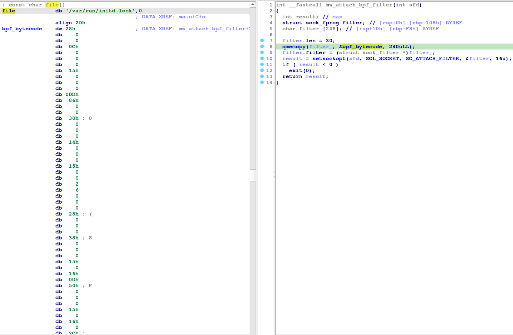

```bash
$ xxd -c 8 -g 1 bpf.o
00000000: 28 00 00 00 0c 00 00 00  (.......
00000008: 15 00 00 09 dd 86 00 00  ........
00000010: 30 00 00 00 14 00 00 00  0.......
00000018: 15 00 00 02 06 00 00 00  ........
00000020: 28 00 00 00 38 00 00 00  (...8...
00000028: 15 00 16 0d 50 00 00 00  ....P...
00000030: 15 00 16 00 2c 00 00 00  ....,...
00000038: 15 00 01 00 84 00 00 00  ........
00000040: 15 00 00 14 11 00 00 00  ........
00000048: 28 00 00 00 38 00 00 00  (...8...
00000050: 15 00 11 10 bb 01 00 00  ........
00000058: 15 00 00 11 00 08 00 00  ........
00000060: 30 00 00 00 17 00 00 00  0.......
00000068: 15 00 00 06 06 00 00 00  ........
00000070: 28 00 00 00 14 00 00 00  (.......
00000078: 45 00 0d 00 ff 1f 00 00  E.......
00000080: b1 00 00 00 0e 00 00 00  ........
00000088: 48 00 00 00 10 00 00 00  H.......
00000090: 15 00 09 00 50 00 00 00  ....P...
00000098: 15 00 08 07 bb 01 00 00  ........
000000a0: 15 00 01 00 84 00 00 00  ........
000000a8: 15 00 00 07 11 00 00 00  ........
000000b0: 28 00 00 00 14 00 00 00  (.......
000000b8: 45 00 05 00 ff 1f 00 00  E.......
000000c0: b1 00 00 00 0e 00 00 00  ........
000000c8: 48 00 00 00 10 00 00 00  H.......
000000d0: 15 00 01 00 bb 01 00 00  ........
000000d8: 15 00 00 01 16 00 00 00  ........
000000e0: 06 00 00 00 00 00 04 00  ........
000000e8: 06 00 00 00 00 00 00 00  ........
```

A BPF instruction is 8 bytes in length. I've formatted the above hex dump so that each line represents a cBPF instruction. `capstone` can be used to disassemble this bytecode.

```python
In [1]: from capstone import *

In [2]: md = Cs(CS_ARCH_BPF, CS_MODE_BPF_CLASSIC)

In [3]: with open("bpf.o", "rb") as ff:
   ...:     data = ff.read()
   ...: linenum = 0
   ...: for i in md.disasm(data, 0):
   ...:     print(f"{j}: {i.mnemonic} {i.op_str}")
   ...:     linenum += 1

0: ldh [0xc]
1: jeq 0x86dd, +0x0, +0x9
2: ldb [0x14]
3: jeq 0x6, +0x0, +0x2
4: ldh [0x38]
5: jeq 0x50, +0x16, +0xd
6: jeq 0x2c, +0x16, +0x0
7: jeq 0x84, +0x1, +0x0
8: jeq 0x11, +0x0, +0x14
9: ldh [0x38]
10: jeq 0x1bb, +0x11, +0x10
11: jeq 0x800, +0x0, +0x11
12: ldb [0x17]
13: jeq 0x6, +0x0, +0x6
14: ldh [0x14]
15: jset 0x1fff, +0xd, +0x0
```

`capstone` failed to disassemble the 17<sup>th</sup> instruction. This corresponds to the cBPF bytecode:

```
b1 00 00 00 0e 00 00 00
```

Looking at the cBPF bytecode generated by `tcpdump` earlier (see [eBPF vs cBPF](#ecbpf) section), the above bytecode corresponds to the following instruction. Perhaps, `capstone` is not yet aware of this bytecode-instruction mapping.

```
ldxb     4*([14]&0xf)
```

I removed the above `ldxb` instruction-specific bytecode from the hex dump, disassembled the remaining bytecode using `capstone` and then added the `ldxb` instruction at the appropriate position in the instruction sequence.

```
0: ldh [0xc]
1: jeq 0x86dd, +0x0, +0x9
2: ldb [0x14]
3: jeq 0x6 , +0x0, +0x2
4: ldh [0x38]
5: jeq 0x50, +0x16, +0xd
6: jeq 0x2c, +0x16, +0x0
7: jeq 0x84, +0x1, +0x0
8: jeq 0x11, +0x0, +0x14
9: ldh [0x38]
10: jeq 0x1bb, +0x11, +0x10
11: jeq 0x800, +0x0, +0x11
12: ldb [0x17]
13: jeq 0x6, +0x0, +0x6
14: ldh [0x14]
15: jset 0x1fff, +0xd, +0x0
16: ldxb 4*([14]&0xf)
17: ldh [x+0x10]
18: jeq 0x50, +0x9, +0x0
19: jeq 0x1bb, +0x8, +0x7
20: jeq 0x84, +0x1, +0x0
21: jeq 0x11, +0x0, +0x7
22: ldh [0x14]
23: jset 0x1fff, +0x5, +0x0
24: ldxb 4*([14]&0xf)
25: ldh [x+0x10]
26: jeq 0x1bb, +0x1, +0x0
27: jeq 0x16, +0x0, +0x1
28: ret 0x40000
29: ret 0x0
```


### <a name="interpret-bpf"></a>Interpreting BPFDoor's BPF Bytecode

BPFDoor attaches the cBPF program to a `AF_PACKET` socket. So, packet filtering occurs at layer 2 of the network stack. Let's look at each instruction line-by-line.

```
0: ldh [0xc]
```

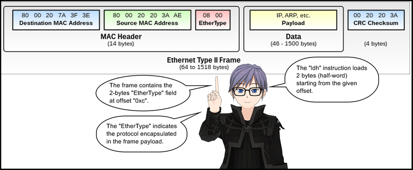

```
1: jeq 0x86dd, +0x0, +0x9
```

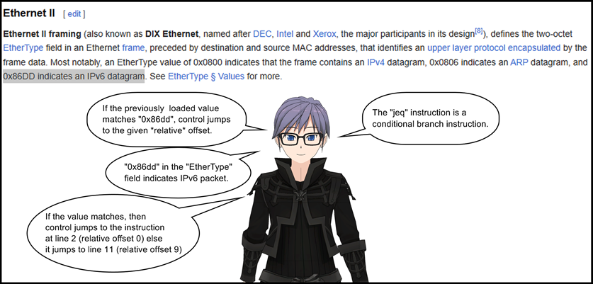

```
2: ldb [0x14]
```

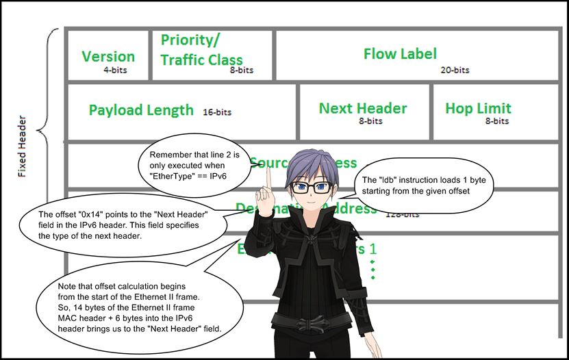

```
3: jeq 0x6 , +0x0, +0x2
```

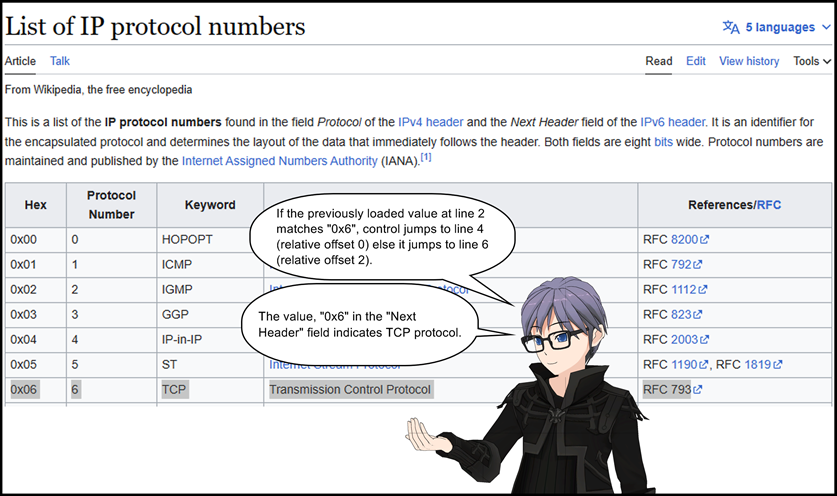

```
4: ldh [0x38]
```

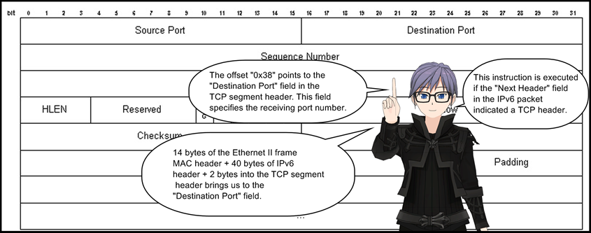

```
5: jeq 0x50, +0x16, +0xd
```

If the previously loaded value at line 4 matches `0x50`, control jumps to line 28 (relative offset `0x16`) else it jumps to line 19 (relative offset `0xd`). This instruction checks if the destination port number is `80`.

```
6: jeq 0x2c, +0x16, +0x0
```

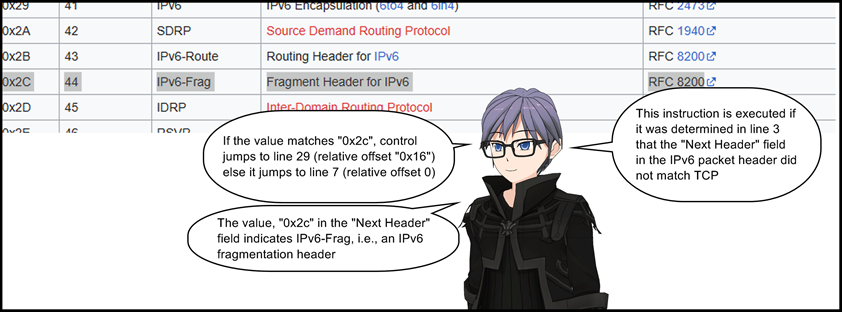

```
7: jeq 0x84, +0x1, +0x0
```

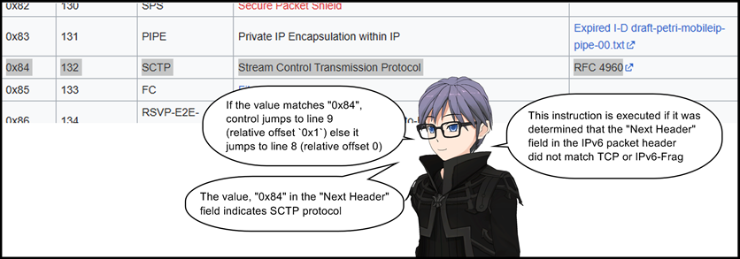

```
8: jeq 0x11, +0x0, +0x14
```

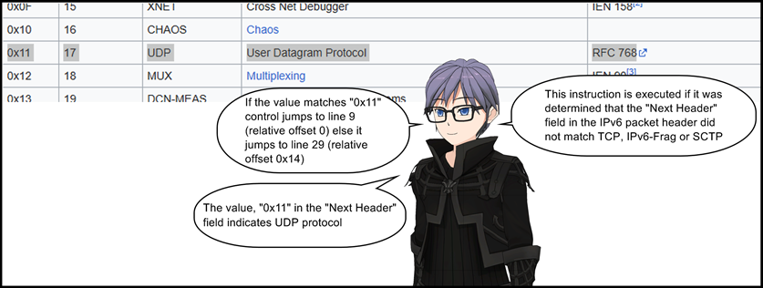

```
9: ldh [0x38]
```

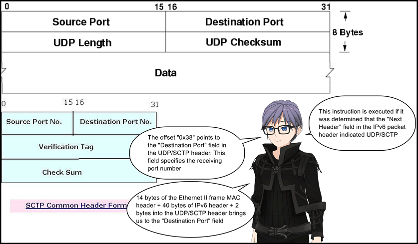

```
10: jeq 0x1bb, +0x11, +0x10
```

If the previously loaded value at line 9 matches `0x1bb`, control jumps to line 28 (relative offset `0x11`) else it jumps to line 27 (relative offset `0x10`). This instruction checks if the destination port number is `443`

```
11: jeq 0x800, +0x0, +0x11
```

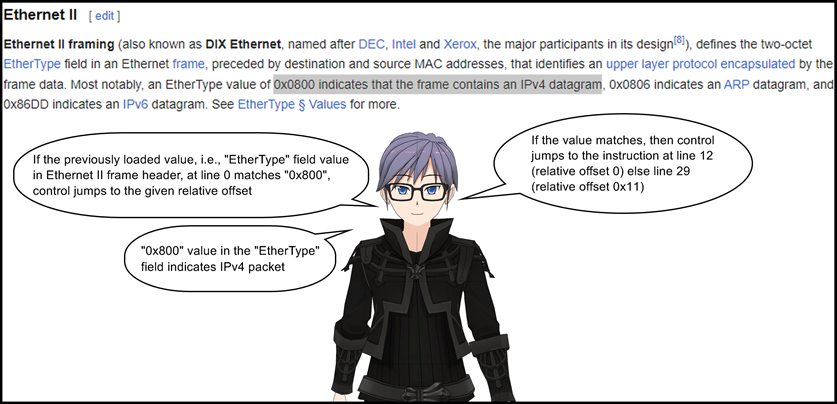

```
12: ldb [0x17]
```

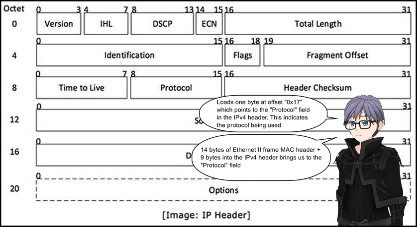

```
13: jeq 0x6, +0x0, +0x6
```

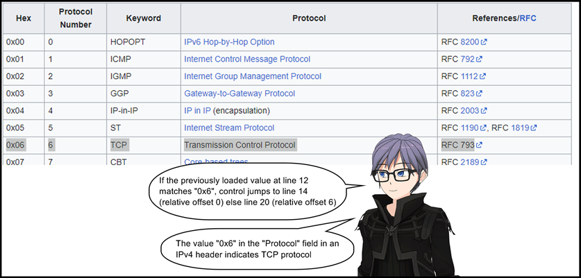

```
14: ldh [0x14]
```

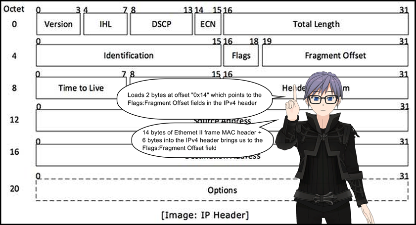

```
15: jset 0x1fff, +0xd, +0x0
```

This instruction performs a bitwise AND operation between the previously loaded value at line 14 and `0x1fff`. If the result is non-zero, control jumps to line 29 (relative offset `0xd`) else line 16 (relative offset 0). This instruction basically looks at the value of the `Fragment Offset` field. If it is non-zero, control jumps to line 29 else line 16.

```
16: ldxb 4*([14]&0xf)
```

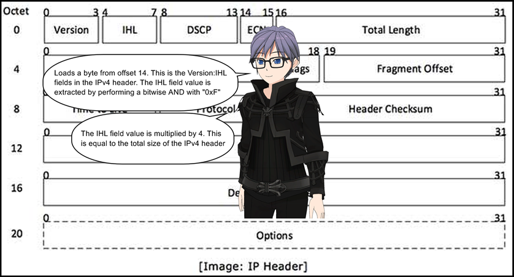

```
17: ldh [x+0x10]
```

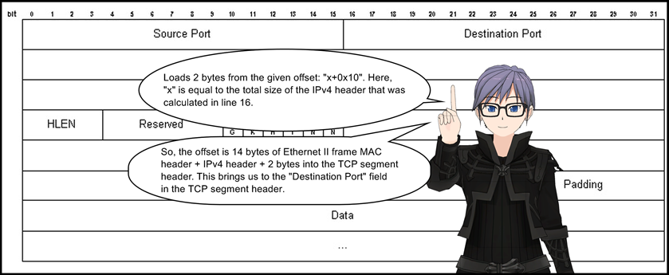

```
18: jeq 0x50, +0x9, +0x0
```

If the previously loaded value at line 17 matches `0x50`, control jumps to line 28 (relative offset `0x9`) else it jumps to line 19 (relative offset `0`). This instruction checks if the destination port number is `80`.

```
19: jeq 0x1bb, +0x8, +0x7
```

If the previously loaded value at line 17 matches `0x1bb`, control jumps to line 28 (relative offset `0x8`) else it jumps to line 27 (relative offset `0x7`). This instruction checks if the destination port number is `443`.

```
20: jeq 0x84, +0x1, +0x0
```

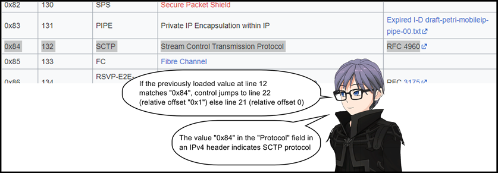

```
21: jeq 0x11, +0x0, +0x7
```

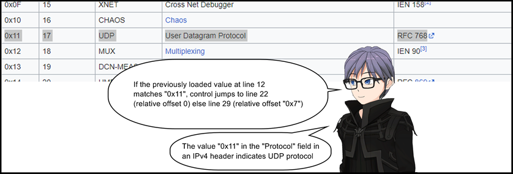

```
22: ldh [0x14]
```


```
23: jset 0x1fff, +0x5, +0x0
```

This instruction performs a bitwise AND operation between the previously loaded value at line 14 and `0x1fff`. If the result is non-zero, control jumps to line 29 (relative offset `0x5`) else line 24 (relative offset 0). This instruction basically looks at the value of the `Fragment Offset` field. If it is non-zero, control jumps to line 29 else line 24.

```
24: ldxb 4*([14]&0xf)
```


```
25: ldh [x+0x10]
```

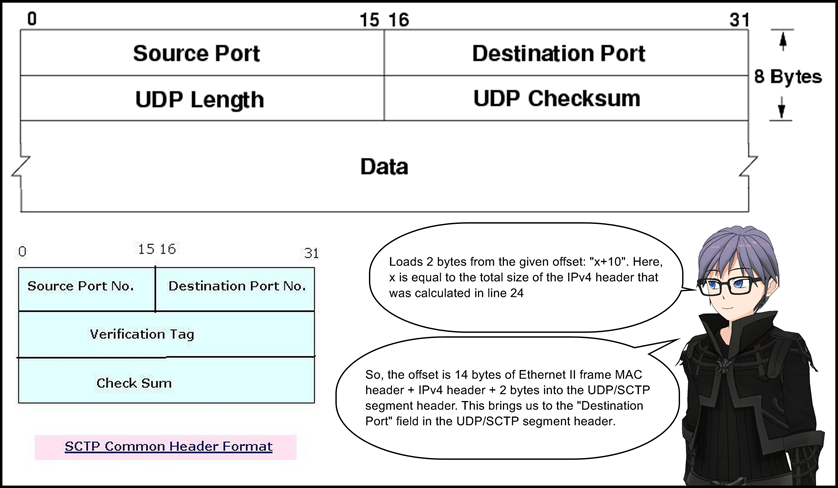

```
26: jeq 0x1bb, +0x1, +0x0
```

If the previously loaded value at line 25 matches `0x1bb`, control jumps to line 28 (relative offset `0x1`) else it jumps to line 27 (relative offset 0). This instruction checks if the destination port number is `443`.

```
27: jeq 0x16, +0x0, +0x1
```

If the previously loaded value matches `0x16`, control jumps to line 28 (relative offset 0) else it jumps to line 29 (relative offset `0x1`). This instruction checks if the destination port number is 22.


```
28: ret 0x40000
```

A non-zero return indicates a packet match.

```
29: ret 0x0
```

A zero return indicates a packet no-match.

## <a name="summary"></a>Summary

BPFDoor's cBPF bytecode filters according to the following rules:

* Match only on IPv4 or IPv6 packets.
* Match only on TCP traffic on ports 80, 443 and 22. In case of IPv4, don't match on fragmented packets. There is no TCP fragmentation over IPv6.
* Match only on UDP/SCTP traffic on ports 443 and 22. In both IPv4 and IPv6 don't match on fragmented packets.

I think DeepInstinct's [blog about BPFDoor](https://www.deepinstinct.com/blog/bpfdoor-malware-evolves-stealthy-sniffing-backdoor-ups-its-game) missed to point out that UDP traffic on only ports 443 and 22 are captured and not port 80.

```
BPFdoor guides the kernel to set up its socket to only read UDP, TCP, and SCTP traffic coming through ports 22 (ssh), 80 (http), and 443 (https).
```

The flowchart below shows the overall control flow of the BPF program:

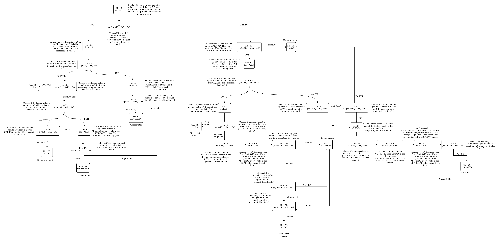

## <a name="references"></a>References

* [BPFDoor Malware Evolves – Stealthy Sniffing Backdoor Ups Its Game](https://www.deepinstinct.com/blog/bpfdoor-malware-evolves-stealthy-sniffing-backdoor-ups-its-game)
* [Capstone - GitHub](https://github.com/capstone-engine/capstone)
* [An intro to using eBPF to filter packets in the Linux kernel](https://opensource.com/article/17/9/intro-ebpf)
* [eBPF - An Overview](https://cloudyuga.guru/hands_on_lab/ebpf-intro)
* [A thorough introduction to eBPF](https://lwn.net/Articles/740157/)
* [What is the difference between BPF and eBPF?](https://stackoverflow.com/questions/72299646/what-is-the-difference-between-bpf-and-ebpf)
* [Linux Socket Filtering aka Berkeley Packet Filter (BPF)](https://www.kernel.org/doc/html/v5.18/networking/filter.html)
* [Ethernet frame](https://en.wikipedia.org/wiki/Ethernet_frame)
* [IPv6 packet](https://en.wikipedia.org/wiki/IPv6_packet)
* [Transmission Control Protocol](https://en.wikipedia.org/wiki/Transmission_Control_Protocol)
* [Internet Protocol version 6 (IPv6) Header](https://www.geeksforgeeks.org/internet-protocol-version-6-ipv6-header/)
* [List of IP protocol numbers](https://en.wikipedia.org/wiki/List_of_IP_protocol_numbers)
* [The Transmission Control Protocol](https://condor.depaul.edu/~jkristof/technotes/tcp.html)
* [UDP header.png](https://commons.wikimedia.org/wiki/File:UDP_header.png)
* [Stream control transmission protocol (SCTP)](https://www.indiastudychannel.com/resources/137235-Stream-Control-Transmission-Protocol-SCTP.aspx)
* [IPv4 - Packet Structure](https://www.tutorialspoint.com/ipv4/ipv4_packet_structure.htm)