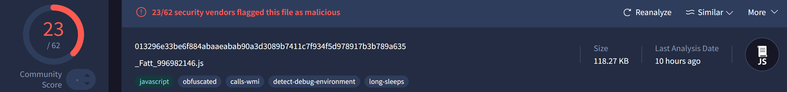
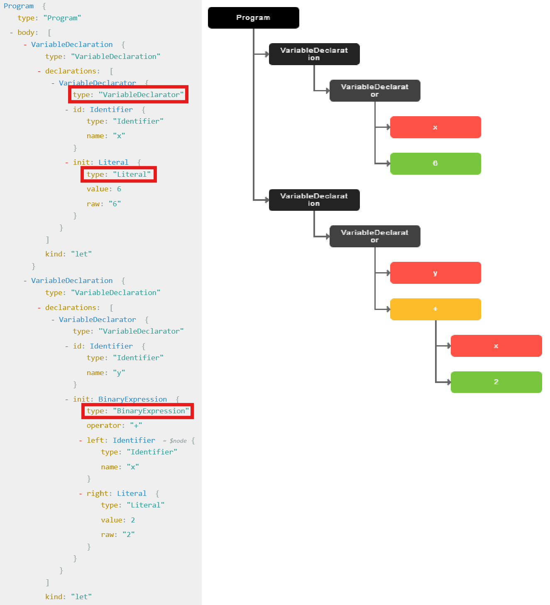
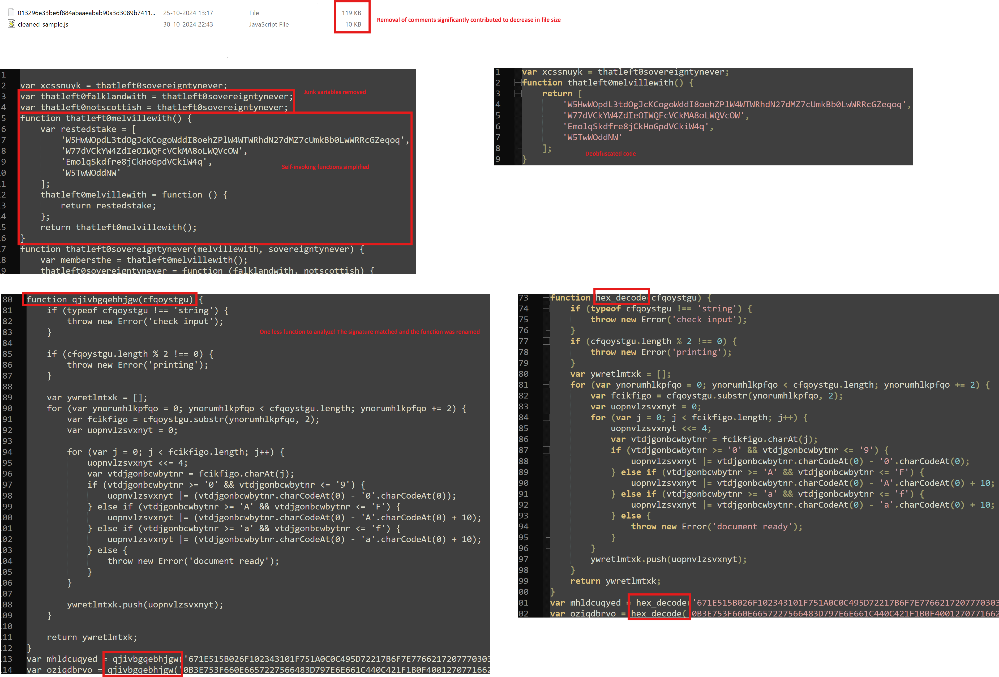

# Deobfuscating JavaScript Malware Using Abstract Syntax Trees

## Happy Diwali!

At the time of publishing this blog, it is the Hindu festival of Diwali, which symbolizes the victory of light over darkness. I wish you and your family a very happy and prosperous Diwali!


Image credits: https://i.pinimg.com/474x/ab/3a/46/ab3a46973f797165f2b2f3776405b21c.jpg

## Metadata
* [MintsLoader](https://malpedia.caad.fkie.fraunhofer.de/details/js.mints_loader) SHA256: 013296e33be6f884abaaeabab90a3d3089b7411c7f934f5d978917b3b789a635



## Table of Contents

* [Introduction](#introduction)
* [Abstract Syntax Tree](#intro-ast)
    * [Installing Prequisites](#install-prereq)
* [Deobfuscation using ASTs](#deob-ast)
    * [Remove Comment Lines](#remove-comments)
	* [Remove Unused Variables](#remove-unused-vars)
	* [Simplifying Functions](#simplify-func)
	* [Signaturizing ASTs](#sig-ast)
* [Bringing It All Together to Deobfuscate MintsLoader](#mints-deob)
* [Summary](#summary)

## <a name="introduction"></a>Introduction

Malware based on scripting languages such as VBScript and JavaScript (JS) can be heavily obfuscated. Analyzing these malware statically may take considerable time and can be, generally, a frustrating experience for analysts.

In this blog, we'll explore how abstract syntax trees (ASTs) can be leveraged to deobfuscate JS-based malware. We’ll then apply these techniques to partially deobfuscate a recently reported JS-based malware called MintsLoader.

*Disclosure: The code was generated through a LLM. I provided the ideas and directed the model to create the relevant code. Without this assistance, it would have taken me longer to codify the concept, given that I'm not deeply versed in JS.*

## <a name="intro-ast"></a>Abstract Syntax Trees

When we look at any language we understand—whether a natural language like English or a programming language like JavaScript—we can identify the individual elements that make up a sentence or statement of that language. For example, consider this English sentence:

```
I ate an apple.
```

Some people can break down this sentence into parts of speech like nouns and verbs. Others may not know each element's label but can still recognize the individual components of the sentence.

In compiler theory, each of these individual elements is called a `token`, and the process of breaking source code into tokens is known as `tokenization`, or `lexical analysis`. A token might be a mathematical operator like `+`, an identifier like a variable name, etc. Naturally, each language has its own set of tokens.

Once source code is broken into tokens, we need a way to preserve its syntactical structure. For example, it would be problematic if the structure of the sentence, `I ate an apple`, were lost during compilation.

An AST represents this syntactical structure in a tree format, with each node representing a syntactic construct in the source code. Consider the following JS source code:

```javascript
let x = 6;
let y = x + 2;
```

The figure below shows two AST visualizations. The one on the left was generated using [AST Explorer](https://astexplorer.net/), and the one on the right was generated using [JointJs](https://www.jointjs.com/demos/abstract-syntax-tree). Each node represents a syntactic construct. In this example:

* `VariableDeclarator` associates an identifier (variable name) with a value or expression.
* `Literal` represents a fixed value like a number, string, or boolean.
* `BinaryExpression` represents an expression with two operands and an operator, like addition (`+`).



And that is the extent of my knowledge about ASTs. With just this basic information, we are now capable of performing JavaScript deobfuscation.

### <a name="install-prereq"></a>Installing Prequisites

In this blog, our goal is to develop JS deobfuscation tooling, which will require certain JS libraries. I'm using a Windows 10 host and [npm](https://www.npmjs.com/) for installing these libraries.

There are 3 libraries which we need to install:

* [esprima](https://www.npmjs.com/package/esprima): a library for generating ASTs from JS code.
* [estraverse](https://www.npmjs.com/package/estraverse): a library for traversing and analyzing a given AST.
* [escodegen](https://www.npmjs.com/package/escodegen): a library for converting an AST back into source code.

```
> npm install esprima estraverse escodegen

added 5 packages, and audited 6 packages in 979ms

found 0 vulnerabilities
```

## <a name="deob-ast"></a>Deobfuscation using ASTs

### <a name="remove-comments"></a>Remove Comment Lines

Consider the following JS source code:

```javascript
// This is a comment
var x = 6;
var y = 2;
```

Our goal is to transform the source code into an AST, print the variable names, and then transform the AST back into source code. The JS code below achieves this.

```javascript
const esprima = require("esprima");
const estraverse = require("estraverse");
const escodegen = require("escodegen");
const fs = require("fs");

function print_variable_names(ast)
{
    estraverse.traverse(ast, {
        enter(node, parent)
        {
            if (node.type === "Identifier")
                console.log(node.name);
        }
    });
}

function process_js_file(input_path)
{
    // Read source code from input JS file
    const code = fs.readFileSync(input_path, "utf-8");
    console.log("Source code in file:");
    console.log(code);
    
    // Generate AST
    const ast = esprima.parseScript(code);
    
    // Print variable names by traversing AST
    console.log("\n\nVariable names:");
    print_variable_names(ast);
    
    // Generate JS source code from AST
    const cleaned_code = escodegen.generate(ast);
    console.log("\n\nSource code:");
    console.log(cleaned_code);
}

process_js_file("test.js");
```

The output of the above is shown below. An astute reader will notice that the source code generated from the AST no longer contains comments. Simply transforming JS source code into an AST and then back removes comment lines, which are often used in JS-based malware as an anti-analysis layer for obfuscation and to artificially increase file size.

```
> node .\testBuilder.js
Source code in file:
// This is a comment
var x = 6;
var y = 2;


Variable names:
x
y


Source code:
var x = 6;
var y = 2;
```

### <a name="remove-unused-vars"></a>Remove Unused Variables

Consider the JS source code below. It is obvious that the variables `y` and `z` are initialized once and never reused. This kind of code falls under the umbrella of junk code. Like comments, these kinds of junk code serve as an obfuscation layer, but they are more problematic because you must check the entire source code to ensure they haven't been referenced elsewhere.

```javascript
var x = 6;
var y = 2;
var z = x + 2;
x += 2;
```

Our goal is to transform the source code into an AST, identify unused variables, remove them from the AST, and then transform the AST back into source code. The JS code below achieves this.

```javascript
const esprima = require("esprima");
const estraverse = require("estraverse");
const escodegen = require("escodegen");
const fs = require("fs");

function find_declared_variables(ast) {
    const declared_vars = new Set();

    estraverse.traverse(ast, {
        enter(node)
        {
            // Find variable declarations and track their names
            if (node.type === "VariableDeclarator" && node.id.type === "Identifier")
                declared_vars.add(node.id.name);
        }
    });

    return declared_vars;
}

function find_used_variables(ast) {
    const used_vars = new Set();

    estraverse.traverse(ast, {
        enter(node, parent)
        {
            // Only add variables to used_vars if current node is not a declaration statement
            if (node.type === "Identifier" && !(parent && parent.type === "VariableDeclarator" && parent.id === node))
                used_vars.add(node.name);
        }
    });
    
    return used_vars;
}

function remove_unused_variables(ast, declared_vars, used_vars) {
    // unused_vars are those variables which were declared but not reused
    const unused_vars = new Set([...declared_vars].filter(var_name => !used_vars.has(var_name)));

    estraverse.replace(ast, {
        enter(node)
        {
            // Get the declaration statement
            if (node.type === "VariableDeclaration") {
                /* Remove declaration statements of unused variables and replace the current node's
                   declarations with the result */
                node.declarations = node.declarations.filter(decl => !unused_vars.has(decl.id.name));
                // If the unused variable was the only declaration, then remove the entire statement
                if (node.declarations.length === 0)
                    // Remove current node from parent array
                    return this.remove();
            }
        }
    });
}

function process_js_file(input_path)
{
    // Read source code from input JS file
    const code = fs.readFileSync(input_path, "utf-8");
    console.log("Source code in file:");
    console.log(code);
    
    // Generate AST
    const ast = esprima.parseScript(code);
    
    // Find all declared and used variables
    // Then remove unused variables based on the difference
    const declared_vars = find_declared_variables(ast);
    const used_vars = find_used_variables(ast);
    remove_unused_variables(ast, declared_vars, used_vars);
    
    // Generate JS source code from AST
    const cleaned_code = escodegen.generate(ast);
    console.log("\n\nCleaned source code:");
    console.log(cleaned_code);
}

process_js_file("test.js");
```

The output of the above is shown below. As we can see, the unused variables `y` and `z` no longer appear in the cleaned code.

```
> node .\testBuilder.js
Source code in file:
var x = 6;
var y = 2;
var z = x + 2;
x += 2;


Cleaned source code:
var x = 6;
x += 2;
```

### <a name="simplify-func"></a>Simplifying Functions

Consider the JS source code below. To someone knowledgeable in JS, it is quickly apparent that `wrapper_func()` simply returns the array stored in variable `x`. However, this is still a roundabout way of implementing the function. Like the other techniques discussed previously, it serves as an obfuscation layer, consuming more of an analyst's time.

```javascript
function wrapper_func() {
    var x = ["this", "is", "a", "wrapper"];
    wrapper_func = function () { return x; };
    return wrapper_func();
}

var x = wrapper_func();
```

Our goal is to transform the source code into an AST, simplify functions like the one above, and then transform the AST back into source code. The JS code below achieves this.

```javascript
const esprima = require("esprima");
const estraverse = require("estraverse");
const escodegen = require("escodegen");
const fs = require("fs");

function simplify_self_invoking_functions(ast) {
    estraverse.replace(ast, {
        enter(node)
        {
            // Check if a function has exactly three statements
            if (node.type === "FunctionDeclaration" && node.body.body.length === 3)
            {
                const [var_decl, self_assign, return_call] = node.body.body;

                // Check if the first statement is a variable declaration
                if (var_decl.type === "VariableDeclaration" && var_decl.declarations.length === 1)
                {
                    const var_declarator = var_decl.declarations[0];

                    /* Check if the second statement assigns the current function to a different function
                       that only returns the previously declared variable */
                    if (self_assign.type === "ExpressionStatement" &&
                        self_assign.expression.type === "AssignmentExpression" &&
                        self_assign.expression.operator === "=" &&
                        self_assign.expression.left.name === node.id.name &&
                        self_assign.expression.right.type === "FunctionExpression" &&
                        self_assign.expression.right.body.body.length === 1 &&
                        self_assign.expression.right.body.body[0].type === "ReturnStatement" &&
                        self_assign.expression.right.body.body[0].argument.name === var_declarator.id.name)
                    {
                        // Check if the third statement is a return statement that calls the modified function
                        if (return_call.type === "ReturnStatement" &&
                            return_call.argument.type === "CallExpression" &&
                            return_call.argument.callee.name === node.id.name)
                        {
                            /* All conditions have been satisfied. Simplify the current function to a
                               single return statement returning the variable's initialization value */
                            return {
                                type: "FunctionDeclaration",
                                id: node.id,
                                params: [],
                                body: {
                                    type: "BlockStatement",
                                    body: [
                                        {
                                            type: "ReturnStatement",
                                            argument: var_declarator.init,
                                        },
                                    ],
                                },
                                generator: false,
                                expression: false,
                                async: false,
                            };
                        }
                    }
                }
            }
        },
    });
}

function process_js_file(input_path)
{
    // Read source code from input JS file
    const code = fs.readFileSync(input_path, "utf-8");
    console.log("Source code in file:");
    console.log(code);
    
    // Generate AST
    const ast = esprima.parseScript(code);
    
    // Simplify self-invoking functions
    simplify_self_invoking_functions(ast);
    
    // Generate JS source code from AST
    const cleaned_code = escodegen.generate(ast);
    console.log("\n\nCleaned source code:");
    console.log(cleaned_code);
}

process_js_file("test.js");
```

The output of the above is shown below. As we can see, the obfuscated function has been simplified.

```
> node .\testBuilder.js
Source code in file:
function wrapper_func() {
    var x = ["this", "is", "a", "wrapper"];
    wrapper_func = function () { return x; };
    return wrapper_func();
}

var x = wrapper_func();


Cleaned source code:
function wrapper_func() {
    return [
        'this',
        'is',
        'a',
        'wrapper'
    ];
}
var x = wrapper_func();
```

### <a name="sig-ast"></a>Signaturizing ASTs

Consider the JS source code below. We would like to analyze the function `func_name` once and then programmatically recognize it the next time we encounter it. After analysis, I determined that `func_name` decodes a hex string into a decimal array.

```javascript
function func_name(arg) {
    if (typeof arg !== "string") {
        throw new Error("Check input");
    }

    if (arg.length % 2 !== 0) {
        throw new Error("Incorrect length");
    }

    var decimal_array = [];
    for (var i = 0; i < arg.length; i += 2) {
        var slice = arg.substr(i, 2);
        var decimal_val = 0;

        for (var j = 0; j < slice.length; j++) {
            decimal_val <<= 4;
            var c = slice.charAt(j);
            if (c >= "0" && c <= "9") {
                decimal_val |= (c.charCodeAt(0) - "0".charCodeAt(0));
            } else if (c >= "A" && c <= "F") {
                decimal_val |= (c.charCodeAt(0) - "A".charCodeAt(0) + 10);
            } else if (c >= "a" && c <= "f") {
                decimal_val |= (c.charCodeAt(0) - "a".charCodeAt(0) + 10);
            } else {
                throw new Error("Throw something");
            }
        }

		console.log(decimal_val)
        decimal_array.push(decimal_val);
    }

    return decimal_array;
}

var x = func_name("4D616C776172652026204D7573696E6773")
```

On execution, `x` will contain the below decimal array.

```
[
   77,  97, 108, 119,  97, 114,
  101,  32,  38,  32,  77, 117,
  115, 105, 110, 103, 115
]
```

Our goal is to transform the source code into an AST, identify the sequence of statements (in other words, a signature) that represents hex decoding, rename the function and its references accordingly, and then transform the AST back into source code. The JS code below achieves this.

```javascript
const esprima = require("esprima");
const estraverse = require("estraverse");
const escodegen = require("escodegen");
const fs = require("fs");

function matches_hex_decode_signature(function_node) {
    let step = 0;
    let numeric = false, upper_alpha = false, lower_alpha = false

    estraverse.traverse(function_node.body, {
        enter(node)
        {
            switch (step)
            {
                case 0:
                    // The first pattern to match is the update expression in the for loop
                    if (node.type === "ForStatement" &&
                        node.update && node.update.type === "AssignmentExpression" &&
                        node.update.operator === "+=" &&
                        node.update.right.type === "Literal" && node.update.right.value === 2)
                        step++;
                    break;

                case 1:
                    // The second pattern to match is a substr() call
                    if (node.type === "CallExpression" &&
                        node.callee && node.callee.property && node.callee.property.name === "substr" &&
                        node.arguments.length === 2 && node.arguments[1].type === "Literal" &&
                        node.arguments[1].value === 2)
                        step++;
                    break;

                case 2:
                    // The third pattern to match is the update expression in another for loop
                    if (node.type === "ForStatement" &&
                        node.update && node.update.type === "UpdateExpression" &&
                        node.update.operator === "++")
                        step++;
                    break;

                case 3:
                    // The fourth pattern to match is a charAt() call
                    if (node.type === "CallExpression" &&
                        node.callee && node.callee.property && node.callee.property.name === "charAt" &&
                        node.arguments.length === 1 && node.arguments[0].type === "Identifier")
                        step++;
                    break;

                case 4:
                    /* The fifth, sixth and seventh patterns can occur in any order and involve comparison with
                       alphanumeric characters */
                    if (node.type === "BinaryExpression") {
                        if ((node.operator === ">=" && node.right.type === "Literal" && node.right.value === "0") ||
                            (node.operator === "<=" && node.right.type === "Literal" && node.right.value === "9"))
                            numeric = true;

                        if ((node.operator === ">=" && node.right.type === "Literal" && node.right.value === "A") ||
                            (node.operator === "<=" && node.right.type === "Literal" && node.right.value === "F"))
                            upper_alpha = true;

                        if ((node.operator === ">=" && node.right.type === "Literal" && node.right.value === "a") ||
                            (node.operator === "<=" && node.right.type === "Literal" && node.right.value === "f"))
                            lower_alpha = true;
                    }

                    if (numeric && upper_alpha && lower_alpha)
                        step++;

                    break;
            }
        }
    });

    // Only return True if all steps in the sequence matched
    return step === 5;
}

function rename_function(ast) {
    let original_function_name = null;

    // First pass: rename the function itself if it matches the signature
    estraverse.traverse(ast, {
        enter(node)
        {
            if (node.type === "FunctionDeclaration") {
                if (matches_hex_decode_signature(node)) {
                    original_function_name = node.id.name;
                    node.id.name = "hex_decode";
                }
            }
        },
    });

    // Second pass: rename any CallExpression references to the original function
    if (original_function_name) {
        estraverse.traverse(ast, {
            enter(node)
            {
                if (node.type === "CallExpression" &&
                    node.callee.type === "Identifier" &&
                    node.callee.name === original_function_name)
                    node.callee.name = "hex_decode";
            },
        });
    }
}

function process_js_file(input_path)
{
    // Read source code from input JS file
    const code = fs.readFileSync(input_path, "utf-8");
    console.log("Source code in file:");
    console.log(code);
    
    // Generate AST
    const ast = esprima.parseScript(code);
    
    // Rename function based on signature
    rename_function(ast);
    
    // Generate JS source code from AST
    const cleaned_code = escodegen.generate(ast);
    console.log("\n\nCleaned source code:");
    console.log(cleaned_code);
}

process_js_file("test.js");
```

The output of the above is shown below. This can be considered function similarity detection via signatures. There are two important points to note:

* The above "signature" is not the only viable one; another analyst might write a different signature, and that's okay.
* Different implementations of the function may require different signatures, meaning this detection mechanism requires significant maintenance.

```
> node .\testBuilder.js
Source code in file:
function func_name(arg) {
    if (typeof arg !== "string") {
        throw new Error("Check input");
    }

    if (arg.length % 2 !== 0) {
        throw new Error("Incorrect length");
    }

    var decimal_array = [];
    for (var i = 0; i < arg.length; i += 2) {
        var slice = arg.substr(i, 2);
        var decimal_val = 0;

        for (var j = 0; j < slice.length; j++) {
            decimal_val <<= 4;
            var c = slice.charAt(j);
            if (c >= "0" && c <= "9") {
                decimal_val |= (c.charCodeAt(0) - "0".charCodeAt(0));
            } else if (c >= "A" && c <= "F") {
                decimal_val |= (c.charCodeAt(0) - "A".charCodeAt(0) + 10);
            } else if (c >= "a" && c <= "f") {
                decimal_val |= (c.charCodeAt(0) - "a".charCodeAt(0) + 10);
            } else {
                throw new Error("Throw something");
            }
        }

                console.log(decimal_val)
        decimal_array.push(decimal_val);
    }

    return decimal_array;
}

var x = func_name("4D616C776172652026204D7573696E6773")


Cleaned source code:
function hex_decode(arg) {
    if (typeof arg !== 'string') {
        throw new Error('Check input');
    }
    if (arg.length % 2 !== 0) {
        throw new Error('Incorrect length');
    }
    var decimal_array = [];
    for (var i = 0; i < arg.length; i += 2) {
        var slice = arg.substr(i, 2);
        var decimal_val = 0;
        for (var j = 0; j < slice.length; j++) {
            decimal_val <<= 4;
            var c = slice.charAt(j);
            if (c >= '0' && c <= '9') {
                decimal_val |= c.charCodeAt(0) - '0'.charCodeAt(0);
            } else if (c >= 'A' && c <= 'F') {
                decimal_val |= c.charCodeAt(0) - 'A'.charCodeAt(0) + 10;
            } else if (c >= 'a' && c <= 'f') {
                decimal_val |= c.charCodeAt(0) - 'a'.charCodeAt(0) + 10;
            } else {
                throw new Error('Throw something');
            }
        }
        console.log(decimal_val);
        decimal_array.push(decimal_val);
    }
    return decimal_array;
}
var x = hex_decode('4D616C776172652026204D7573696E6773');
```

## <a name="mints-deob"></a>Bringing It All Together to Deobfuscate MintsLoader

The MintsLoader JS code contains all of the obfuscation measures we previously examined. By combining our deobfuscation measures into a single [script](https://github.com/nikhilh-20/nikhilh-20.github.io/blob/main/blog/deob_js_ast/assets/scripts/deobfuscate.js), the following figure shows the before-and-after comparsion.



## <a name="summary"></a>Summary

In this blog, we explored the potential of ASTs for deobfuscating JS-based malware. Some of the techniques described are more resilient to new implementations, while others, such as AST signatures, are less resilient.