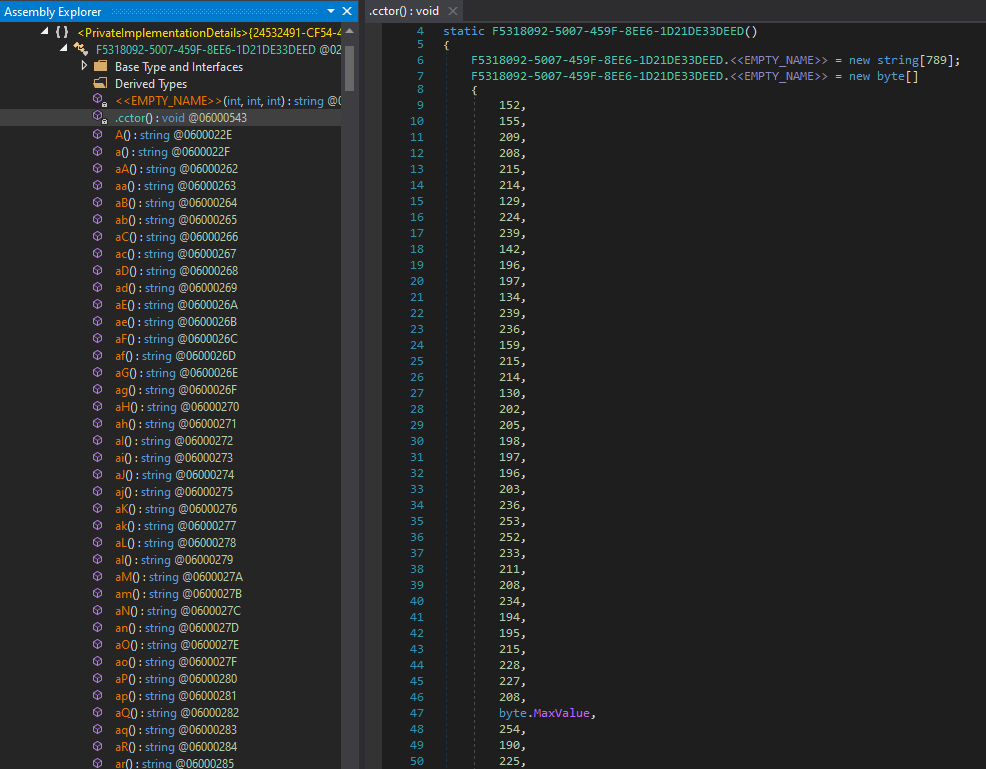
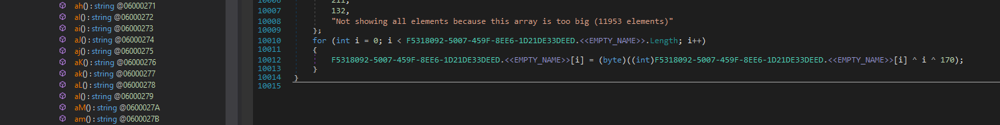
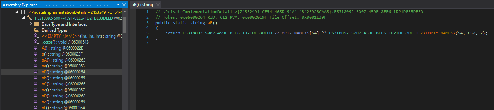

# dncil'ing Agent Tesla String Deobfuscation 

[dncil](https://github.com/mandiant/dncil) is a Common Intermediate Language (CIL) disassembly library from Mandiant that supports parsing the header, instructions, and exception handlers of .NET managed methods.

Agent Tesla malware leverages [Obfuscar](https://github.com/obfuscar/obfuscar) to obfuscate its strings into an encrypted stream. At runtime, these strings are decrypted with single-key XOR. Then, there are dozens of functions which provide an offset and a length value to slice the string stream into the required stream.

|  |
|:--:|
| Fig. 1: Encrypted Stream |

|  |
|:--:|
| Fig. 2: Runtime XOR-decryption |

|  |
|:--:|
| Fig. 3: String Slicing Functions |

This deobfuscator was inspired by [@herrcore](https://twitter.com/herrcore)'s [Twitch](https://www.twitch.tv/oalabslive) stream on [AgentTesla Config Extraction with Automated .NET Parsing (dnlib and Python)](https://research.openanalysis.net/dotnet/python/agenttesla/research/2022/11/17/agenttesla.html).

## String Deobfuscator

The standalone script is available [here](./assets/scripts/noobfuscar.py). Required Python libraries are available in the [requirements.txt](./assets/scripts/requirements.txt) file.

## Usage

```bash
$ python noobfuscar.py --help
usage: noobfuscar.py [-h] -f FILE

optional arguments:
  -h, --help            show this help message and exit
  -f FILE, --file FILE  Path to .NET binary
```

## Examples

* `20f4ec03549be469302c0fcb5f55307680fd189aa733f90eb59cb2fbc34317cc` ([MalShare](https://malshare.com/sample.php?action=detail&hash=20f4ec03549be469302c0fcb5f55307680fd189aa733f90eb59cb2fbc34317cc))

```bash
$ python noobfuscar.py -f /tmp/20f4ec03549be469302c0fcb5f55307680fd189aa733f90eb59cb2fbc34317cc
RVA of int array: 0x242b8, Length of int array:  0x2eb1, XOR key to decrypt strings: 170
['', '20', 'yyyy-MM-dd HH:mm:ss', 'yyyy_MM_dd_HH_mm_ss', '<br>', '<hr>', 'ObjectLength', 'ChainingModeGCM', 'AuthTagLength', 'ChainingMode', 'KeyDataBlob', 'AES', 'Microsoft Primitive Provider', 'CONNECTION', 'KEEP-ALIVE', 'PROXY-AUTHENTICATE', 'PROXY-AUTHORIZATION', 'TE', ..., '[^\\u0020-\\u007F]', 'signons.sqlite', 'moz_logins', 'hostname', 'encryptedUsername', 'encryptedPassword', 'Version=4.0.0.0', 'version=2.0.0.0', 'mscorlib', 'System', 'MailClient.Protocols.Smtp.SmtpAccountConfiguration', 'MailClient.Accounts.TlsType', 'MailClient.Accounts.CredentialsModelTypes', 'MailClient.Accounts.Mail.MailAccountConfiguration', 'MailClient.Accounts.ArchivingScope', 'MailClient.Mail.MailAddress', ';', 'info', 'AccountConfiguration+accountName', 'AccountConfiguration+username', 'AccountConfiguration+password', 'providerName']
```

* `cb3afdb1e17d5bdaf641e633434ac71855e5dcfdd21d66a565f0dc9844d30030` ([MalShare](https://malshare.com/sample.php?action=detail&hash=cb3afdb1e17d5bdaf641e633434ac71855e5dcfdd21d66a565f0dc9844d30030))

```bash
$ python noobfuscar.py -f /tmp/cb3afdb1e17d5bdaf641e633434ac71855e5dcfdd21d66a565f0dc9844d30030
RVA of int array: 0x25278, Length of int array:  0x2ad9, XOR key to decrypt strings: 170
['', '', ': ', '<b>[ ', '</b>', ' <b>]</b> (', ')', 'False', '{BACK}', '{ALT+TAB}', '{ALT+F4}', '{TAB}', '{ESC}', '{Win}', '{CAPSLOCK}', '&uarr;', '&darr;', '&larr;', '&rarr;', '{DEL}', '{END}', '{HOME}', '{Insert}', '{NumLock}', '{PageDown}', '{PageUp}', '{ENTER}', '{F1}', '{F2}', '{F3}', '{F4}', '{F5}', '{F6}', '{F7}', '{F8}', '{F9}', '{F10}', '{F11}', '{F12}', ' ', 'control', '{CTRL}', '&', '&amp;', '<', '&lt;', '>', '&gt;', '"', '&quot;', 'Copied Text: ', ..., '00000002', ' 1.85 (Hash, version 2, native byte-order)', 'Unknow database format', 'key4.db', 'metaData', 'id', 'item1', 'item2', 'nssPrivate', 'a11', 'a102', '2a864886f70d0209', '2a864886f70d010c050103', 'key3.db', 'global-salt', 'Version', 'password-check', 'logins.json', '\\"(hostname|encryptedPassword|encryptedUsername)":"(.*?)"', 'oauth', '[^\\u0020-\\u007F]', 'signons.sqlite', 'moz_logins', 'hostname', 'encryptedUsername', 'encryptedPassword', ';']
```