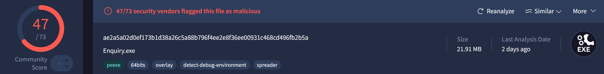
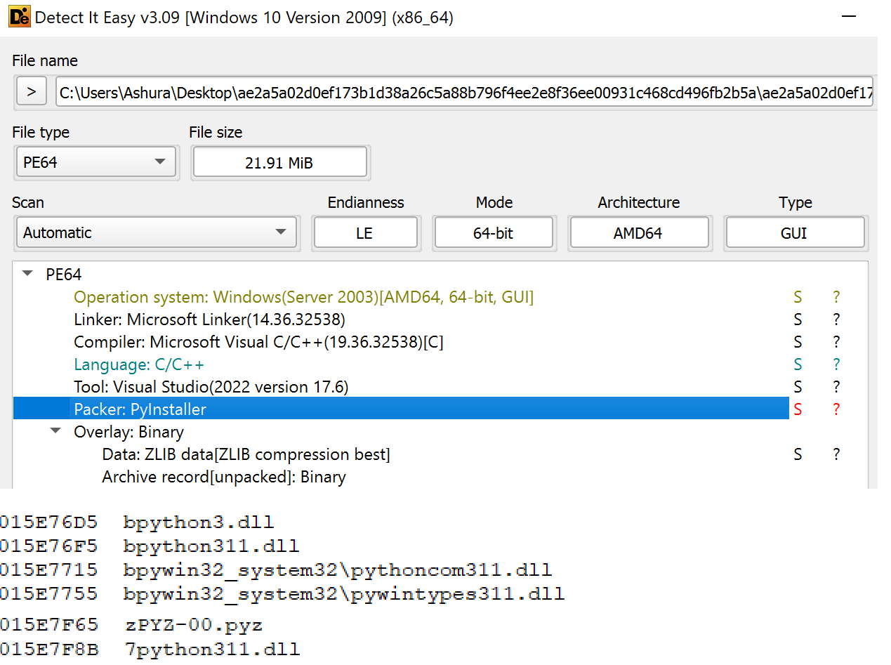
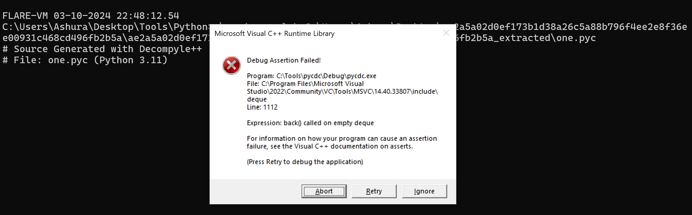
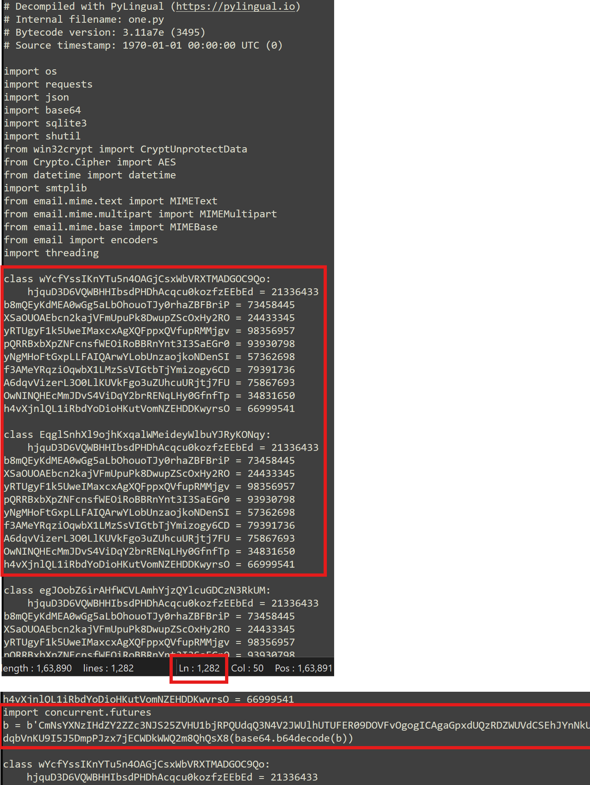
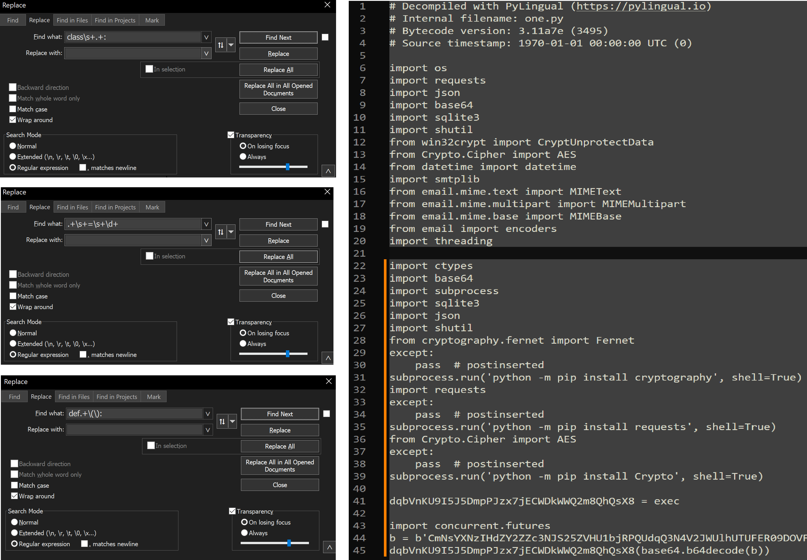
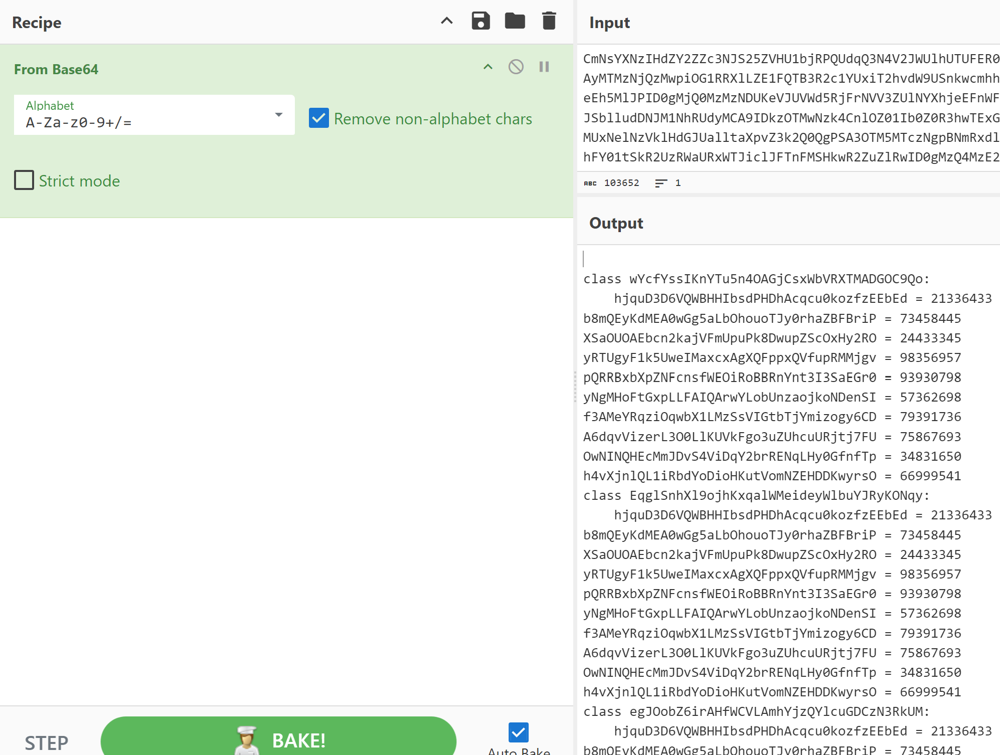
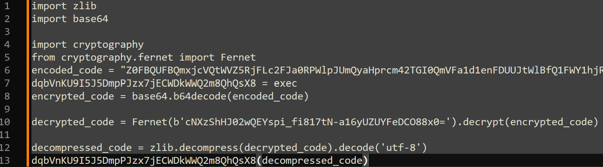
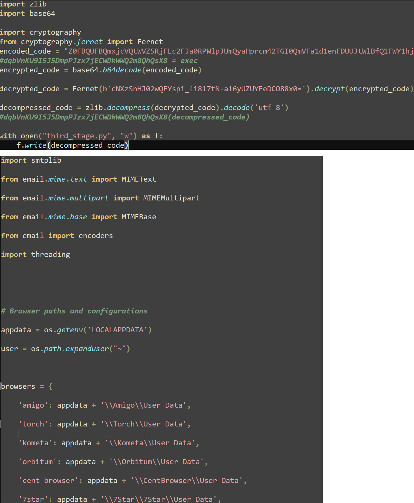
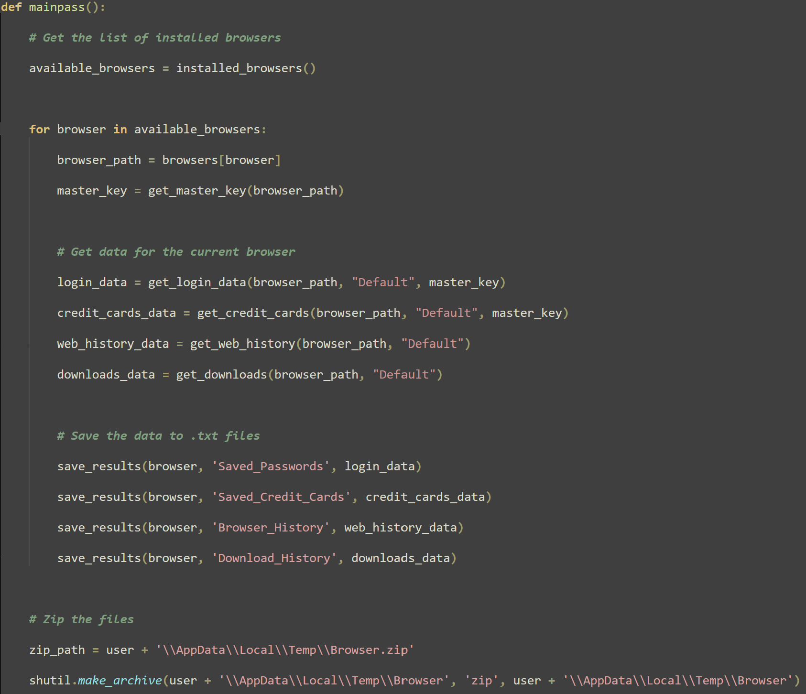

# Emansrepo Infostealer - PyInstaller, Deobfuscation and LLM

## Metadata
* SHA256: ae2a5a02d0ef173b1d38a26c5a88b796f4ee2e8f36ee00931c468cd496fb2b5a



## Table of Contents

* [Introduction](#introduction)
* [Extracting the Python Code](#extract-py-code)
	* [PyInstaller Detection](#pyinstaller-detect)
    * [Extracting the Compiled Python Script](#extract-pyc)
	* [Decompile into Python Script](#decompile-pyc)
* [Deobfuscating the Python Code](#deob)
    * [Deobfuscating the First Stage](#deob-first-stage)
	* [Deobfuscating the Second Stage](#deob-second-stage)
	* [The Third and Final Stage](#third-final-stage)
* [Emansrepo and LLM](#emansrepo-llm)
* [Summary](#summary)

## <a name="introduction"></a>Introduction

Emansrepo is a Python-based information stealer [reported by Fortinet](https://www.fortinet.com/blog/threat-research/emansrepo-stealer-multi-vector-attack-chains) last month. The variant we will examine in this blog is packaged with PyInstaller, enabling it to run on a computer without requiring Python to be installed.

The primary focus of this blog is to extract the Python script from the PyInstaller-based sample and then deobfuscate it to reveal the actual malware code. Finally, I will offer some hypotheses linking Emansrepo to LLMs.

## <a name="extract-py-code"></a>Extracting the Python Code

### <a name="pyinstaller-detect"></a>PyInstaller Detection

The introduction to PyInstaller is best given from their [documentation](https://pyinstaller.org/en/stable/):

> PyInstaller bundles a Python application and all its dependencies into a single package. The user can run the packaged app without installing a Python interpreter or any modules. It is not a cross-compiler; to make a Windows app you run PyInstaller on Windows, and to make a Linux app you run it on Linux, etc.

Since PyInstaller-based packages are self-contained, the file size is expected to be larger than that of typical C/C++-based malware. This is evident in the VirusTotal detections snapshot at the beginning of this blog, with the sample size being ~22 MB.

[Detect It Easy](https://github.com/horsicq/Detect-It-Easy) can identify a PyInstaller-based package. Additionally, by examining the printable strings (such as `_MEIPASS`), you can determine not only that the package is PyInstaller-based but also the Python version used, as shown in Fig. 1. The sample uses Python 3.11.

|  |
|:--:|
| Fig. 1: PyInstaller and Python Version Detection |

PyInstaller bundles [compiled Python scripts](https://pyinstaller.org/en/stable/operating-mode.html#hiding-the-source-code) instead of source code. In the following sections, we will examine how to go from a PyInstaller executable to Python source code.

### <a name="extract-pyc"></a>Extracting the Compiled Python Script

[pyinstxtractor-ng](https://github.com/pyinstxtractor/pyinstxtractor-ng) can be used to extract the compiled Python scripts from the PyInstaller-based sample.

```python
.\pyinstxtractor-ng.exe.lnk C:\Users\Ashura\Desktop\ae2a5a02d0ef173b1d38a26c5a88b796f4ee2e8f36ee00931c468cd496fb2b5a\ae2a5a02d0ef173b1d38a26c5a88b796f4ee2e8f36ee00931c468cd496fb2b5a
[+] Processing C:\Users\Ashura\Desktop\ae2a5a02d0ef173b1d38a26c5a88b796f4ee2e8f36ee00931c468cd496fb2b5a\ae2a5a02d0ef173b1d38a26c5a88b796f4ee2e8f36ee00931c468cd496fb2b5a
[+] Pyinstaller version: 2.1+
[+] Python version: 3.11
[+] Length of package: 22339020 bytes
[+] Found 163 files in CArchive
[+] Beginning extraction...please standby
[+] Possible entry point: pyiboot01_bootstrap.pyc
[+] Possible entry point: pyi_rth_inspect.pyc
[+] Possible entry point: pyi_rth_pkgutil.pyc
[+] Possible entry point: pyi_rth_multiprocessing.pyc
[+] Possible entry point: pyi_rth_setuptools.pyc
[+] Possible entry point: pyi_rth_pkgres.pyc
[+] Possible entry point: pyi_rth_win32comgenpy.pyc
[+] Possible entry point: pyi_rth_pywintypes.pyc
[+] Possible entry point: pyi_rth_pythoncom.pyc
[+] Possible entry point: one.pyc
[+] Found 782 files in PYZ archive
[+] Successfully extracted pyinstaller archive: C:\Users\Ashura\Desktop\ae2a5a02d0ef173b1d38a26c5a88b796f4ee2e8f36ee00931c468cd496fb2b5a\ae2a5a02d0ef173b1d38a26c5a88b796f4ee2e8f36ee00931c468cd496fb2b5a

You can now use a python decompiler on the pyc files within the extracted directory
```

As expected, `pyinstxtractor-ng` also reported the Python version as 3.11. Multiple potential entry points were identified, but `one.pyc` appears to be the most relevant. We will decompile it next.

### <a name="decompile-pyc"></a>Decompile into Python Script

My first choice for a Python decompiler is [pycdc](https://github.com/zrax/pycdc). However, it wasn't able to decompile `one.pyc` due to an assertion error, as shown in Fig. 2. Multiple other issues (see [#230](https://github.com/zrax/pycdc/issues/230), [#262](https://github.com/zrax/pycdc/issues/262), [#298](https://github.com/zrax/pycdc/issues/298), [#405](https://github.com/zrax/pycdc/issues/405)) also reference this error. Perhaps some Python bytecode implementations have not yet been covered.

|  |
|:--:|
| Fig. 2: Error with pycdc |

In situations like these, I turn to [PyLingual](https://pylingual.io/), having had a good experience with the tool. However, note that any submissions to PyLingual will be used by their team for R&D purposes. If you have a sample that you cannot share, avoid using PyLingual.

Fig. 3 shows a snippet of the decompiled code, revealing a significant amount of junk code. Out of the 1282 lines of decompiled code, most are junk, with the relevant code interspersed between them.

|  |
|:--:|
| Fig. 3: Decompilation with PyLingual |

## <a name="deob"></a>Deobfuscating the Python Code

### <a name="deob-first-stage"></a>Deobfuscating the First Stage

Fig. 3 showed the decompiled Python code of the sample, marking the first stage of its infection flow. The obfuscation technique is simple - insert junk code that follows specific patterns. [Notepad++](https://notepad-plus-plus.org/) is sufficient for deobfuscating the code. Fig. 4 demonstrates that using just three patterns to remove the junk code reduces the script from 1282 lines to only 45.

|  |
|:--:|
| Fig. 4: Deobfuscated First Stage |

The code base64-decodes a string and then executes it using `exec`.

[CyberChef](https://gchq.github.io/CyberChef/) can be used to base64-decode the string, as shown in Fig. 5. This reveals the obfuscated second stage. You may notice that the obfuscation technique is identical to the one used in the first stage.

|  |
|:--:|
| Fig. 5: Obfuscated Second Stage |

### <a name="deob-second-stage"></a>Deobfuscating the Second Stage

The deobfuscation in the second stage can be removed in the same way as in the first stage. Fig. 6 shows the deobfuscated code.

|  |
|:--:|
| Fig. 6: Deobfuscated Second Stage |

The code base64-decodes a string and then decrypts it using the [Fernet cipher](https://isc.sans.edu/diary/30146) with the key `cNXzShHJ02wQEYspi_fi817tN-a16yUZUYFeDCO88x0=`. The decrypted code is then executed using `exec`.

### <a name="third-final-stage"></a>The Third and Final Stage

The second stage Python code can be slightly modified to write the decrypted third stage to disk instead of executing it, as shown in Fig. 7. Upon execution, we obtain the final stage: Emansrepo.

|  |
|:--:|
| Fig. 7: Deobfuscated Third Stage |

## <a name="emansrepo-llm"></a>Emansrepo and LLM

I have chosen not to dive into the infostealer aspect of the code, as its scope is limited to stealing data stored in browsers. Additionally, it is a simple Python script, so interested analysts can easily analyze it themselves.

However, upon reviewing the code, I have some observations to make:

1. When I first looked at the code, I noticed unnecessary line breaks. In my experience, I sometimes encounter these when I copy and paste text from one location to another, such as when copying text from the Ubuntu terminal into a GitHub PR description. Perhaps this malware code was copy-pasted from somewhere.

2. The code is extremely readable, with great variable names, function names, and comments. The control flow is easy to follow as well. I've encountered such readable code generated by LLMs like ChatGPT or Claude. Perhaps this malware code was generated with the help of an LLM, which could also explain the copy-pasting.

|  |
|:--:|
| Fig. 8: Well-Written Emansrepo Code |

## <a name="summary"></a>Summary

In this blog, we examined the Emansrepo information stealer, focusing on a variant with capabilities limited to stealing data from browsers. Our primary emphasis was on extracting the Python code from the PyInstaller-based sample and deobfuscating it by removing junk code. Additionally, we hypothesized that Emansrepo may have been developed with the assistance of an LLM, highlighting their potential to lower the barrier to entry into the cybercrime world.