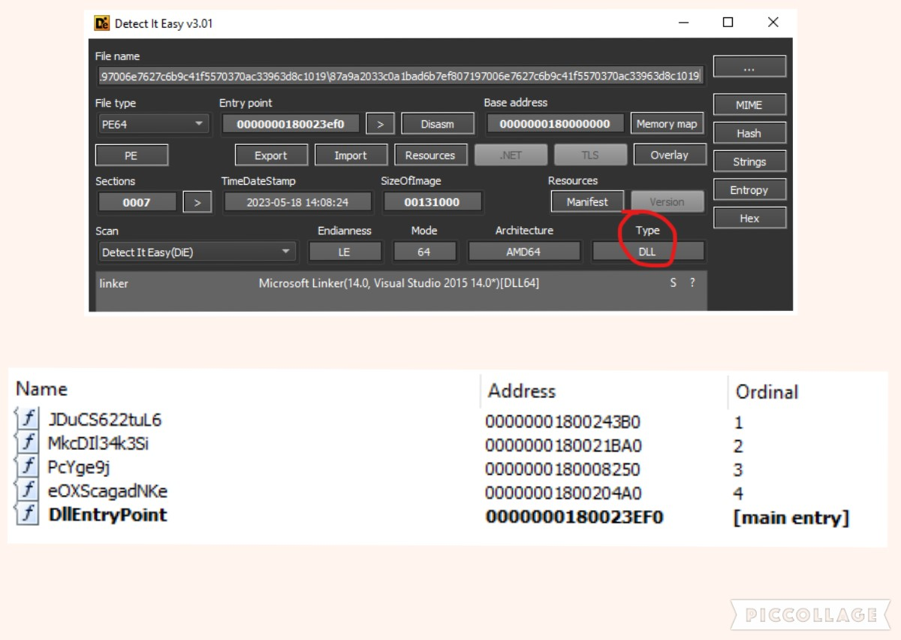

# Fast & Furious Bumblebee Configuration Extraction

## Metadata
* SHA256: 87a9a2033c0a1bad6b7ef807197006e7627c6b9c41f5570370ac33963d8c1019 
	* Malware Bazaar [link](https://bazaar.abuse.ch/sample/87a9a2033c0a1bad6b7ef807197006e7627c6b9c41f5570370ac33963d8c1019/)

## Table of Contents

* [Family Introduction](#family-introduction)
* [Unpacking - Heroes Sometimes Wear CAPEv2](#fast-unpacking)
* [Bumblebee Configuration Extraction](#bumblebee-config-extract)
    * [Thread Execution Hijacking](#thread-exec-hijack)
    * [RC4 Decryption of C2](#c2-decrypt)
* [References](#references)

## <a name="family-introduction"></a>Family Introduction

Directly from [Malpedia](https://malpedia.caad.fkie.fraunhofer.de/details/win.bumblebee):

> This malware is delivered by an ISO file, with an DLL inside with a custom loader. Because of the unique user-agent "bumblebee" this malware was dubbed BUMBLEBEE. At the time of Analysis by Google's Threat Analysis Group (TAG) BumbleBee was observed to fetch Cobalt Strike Payloads.

## <a name="fast-unpacking"></a>Unpacking - Heroes Sometimes Wear CAPEv2

The given sample is a DLL, compiled on May 18, 2023 and has 5 exports. Besides the entry point, `DllEntryPoint`, all other exports have weird names which are indicators of obfuscation.



I found the code in `DllEntryPoint` to be harmless. Of the 4 weird exports, `JDuCS622tuL6`, `MkcDIl34k3Si`, `PcYge9j` accepted function arguments while `eOXScagadNKe` did not. Using cross-references in IDA, I found that the other 3 exports were called at some point within the DLL while `eOXScagadNKe` was not. That was my cue that `eOXScagadNKe` might be the real entry point.


Keeping in mind some Bumblebee-related blog posts that I had read, my assumption was that the code inside `eOXScagadNKe` was obfuscated/packed. So, my next step was to unpack the sample. My go-to automated unpackers are either [UnpacMe](https://www.unpac.me/#/) or [CAPEv2](https://capesandbox.com/). Since we're dealing with a 64-bit DLL with a custom export as entry point, my choice was CAPEv2. AFAIK, UnpacMe cannot handle 64-bit DLLs with custom entry point.

I submitted a CAPEv2 analysis with two options: `dll` analysis package and custom entry point function, `eOXScagadNKe`. The task is available [here](https://capesandbox.com/analysis/391337/).


The analysis extracted 4 payloads. Basic information for each is listed below:

| File Type | SHA256 | CAPEv2 Yara |
|-----------|--------|-------------|
| PE32+ executable (DLL) (GUI) x86-64 | 5050058ece5da2e5b8c8806eb132860b1f67a9216750c3ce87aec8757e477177 | BumbleBee - BumbleBee Payload |
| zlib compressed data | e112afa733d7ba695186e4a33e5845d3c471342f6804147ec89df57208fb9b19 | BumbleBeeShellcode - BumbleBeeLoader Payload |
| PE32 executable (DLL) (GUI) Intel 80386 | c3afa8997e5ddc6ce8aac2302886402a0add243b2169d31a37dceae3d6419c19 | |
| PE32+ executable (DLL) (GUI) x86-64 | f48f87325c21cfb7ba47157d5b3cf196e47450202b9b7a87c8b5b4514f91226e  | | 

The first sample triggered the `Payload` rule, so I picked that up for further analysis. That's our unpacked C++ (see `RTTI` string in functions list) Bumblebee payload. It was compiled on March 6, 2023.


The other two DLL payloads (`c3afa8997e5ddc6ce8aac2302886402a0add243b2169d31a37dceae3d6419c19` and `f48f87325c21cfb7ba47157d5b3cf196e47450202b9b7a87c8b5b4514f91226e`) have internal filenames, `RapportGP.dll`. These are described very well in [The chronicles of Bumblebee: The Hook, the Bee, and the Trickbot connection](https://elis531989.medium.com/the-chronicles-of-bumblebee-the-hook-the-bee-and-the-trickbot-connection-686379311056)

## <a name="bumblebee-config-extract"></a>Bumblebee Configuration Extraction

### <a name="thread-exec-hijack"></a>Thread Execution Hijacking

The `DllMain` function in the payload started off with a bang! An undocumented function, `NtCreateThreadEx` is used to spawn a hidden thread in suspended state with a decoy start address; in this case, `RtlNewSecurityObjectWithMultipleInheritance`. The start address is modified to the true address and the thread is resumed.


### <a name="c2-decrypt"></a>RC4 Decryption of C2

Soon after the thread starts, the C2 configuration is decrypted via RC4 with a hardcoded key, `JSfuURMASs`.


The [configuration extraction script](assets/scripts/bumblebee_config_extract.py) is mostly taken from [BumbleBee notes](https://blog.krakz.fr/articles/bumblebee/). My only addition is the code to extract the campaign ID (in this case, `mc1905`).

The configuration script is known to work on atleast 4 payloads:
* Loader: 87a9a2033c0a1bad6b7ef807197006e7627c6b9c41f5570370ac33963d8c1019
    * Payload: 5050058ece5da2e5b8c8806eb132860b1f67a9216750c3ce87aec8757e477177
* Loader: 4b7612aa648557fc6e224e72effb30836e83adbe8913f9ca5e2acf1d2e233bd4
    * Payload: 1b539b7a3b2a258e52a2a62eeb758c9d70eb9740016be2eb764acb27419669f0
* Loader: c7c3e25459e175c01298b4ac9669862d261d99560c9344f17fbc6c971d6db414
    * Payload: 5050058ece5da2e5b8c8806eb132860b1f67a9216750c3ce87aec8757e477177
* Loader: f476854936fba61ab407be730d4b96d4cf47eb9ba568c22fbde3807d48ae14f4
    * Payload: 7718c3c4a35da7b116195727402530074ce02d371602c28d92ae848f4c04cc8e

I've defanged the C2 IP addresses below:

```bash
$ python3 bumblebee_config_extract.py 5050058ece5da2e5b8c8806eb132860b1f67a9216750c3ce87aec8757e477177
BumbleBee Command and Control IoCs: b'57[.]182[.]80[.]190:461,240[.]80[.]250[.]246:405,214[.]43[.]249[.]250:195,2[.]228[.]251[.]38:346,92[.]119[.]178[.]40:443,62[.]4[.]213[.]138:134,34[.]254[.]140[.]99:338,75[.]176[.]116[.]241:326,21[.]239[.]47[.]216:430,141[.]241[.]221[.]21:492,121[.]64[.]45[.]135:498,128[.]83[.]73[.]163:161,29[.]177[.]24[.]231:435,163[.]143[.]118[.]154:187,32[.]54[.]188[.]44:443,236[.]164[.]96[.]236:276,194[.]135[.]33[.]160:443,241[.]161[.]210[.]127:188,104[.]208[.]91[.]45:381,9[.]16[.]81[.]133:328,149[.]58[.]80[.]14:127,60[.]151[.]98[.]131:283,169[.]61[.]156[.]106:335,192[.]198[.]82[.]59:443,133[.]157[.]46[.]139:264,55[.]184[.]235[.]202:396,134[.]129[.]191[.]175:235,103[.]175[.]16[.]151:443,78[.]150[.]23[.]172:360,28[.]183[.]116[.]2:335,191[.]203[.]244[.]217:113,113[.]8[.]135[.]51:314,161[.]28[.]144[.]61:235,18[.]230[.]114[.]85:402'
Campaign ID: b'mc1905'
```

## <a name="references"></a>References

* [The chronicles of Bumblebee: The Hook, the Bee, and the Trickbot connection](https://elis531989.medium.com/the-chronicles-of-bumblebee-the-hook-the-bee-and-the-trickbot-connection-686379311056)
* [Malware Analysis Report – APT29 C2-Client Dropbox Loader](https://github.com/Dump-GUY/Malware-analysis-and-Reverse-engineering/blob/main/APT29_C2-Client_Dropbox_Loader/APT29-DropboxLoader_analysis.md)
* [Bumblebee Loader](https://research.openanalysis.net/bumblebee/malware/loader/unpacking/2022/05/12/bumblebee_loader.html)
* [Remote Thread Execution in System Process using NtCreateThreadEx for Vista & Windows7](https://securityxploded.com/ntcreatethreadex.php)
* [Anti-Debug NtCreateThreadEx](https://ntquery.wordpress.com/2014/03/29/anti-debug-ntcreatethreadex/)
* [Malpedia](https://malpedia.caad.fkie.fraunhofer.de/details/win.bumblebee)
* [BumbleBee notes](https://blog.krakz.fr/articles/bumblebee/)
