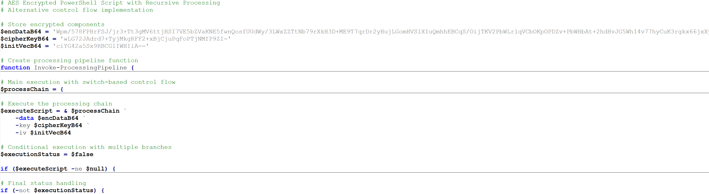
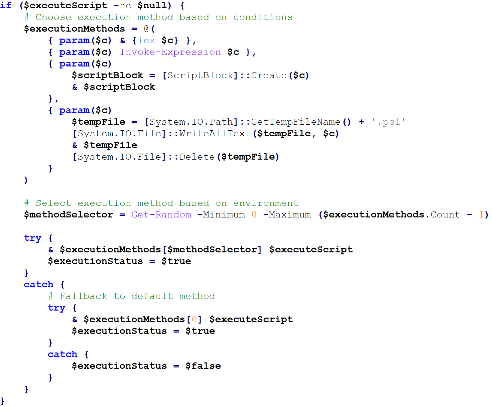
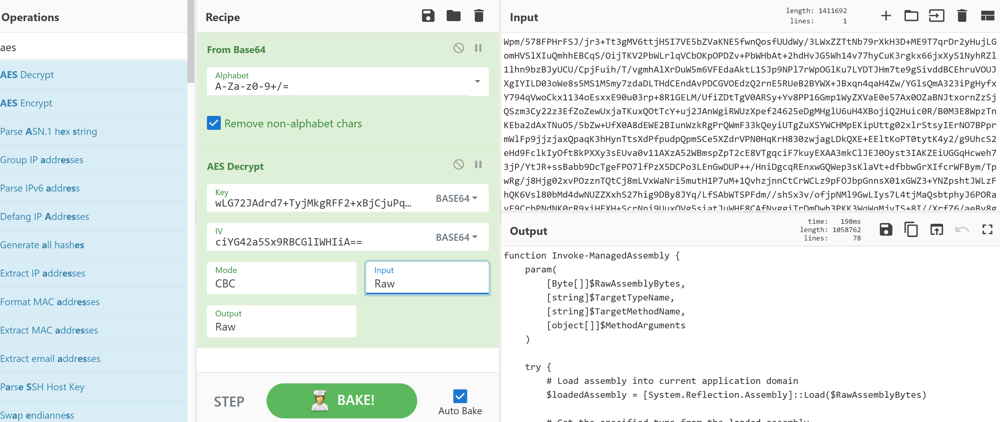
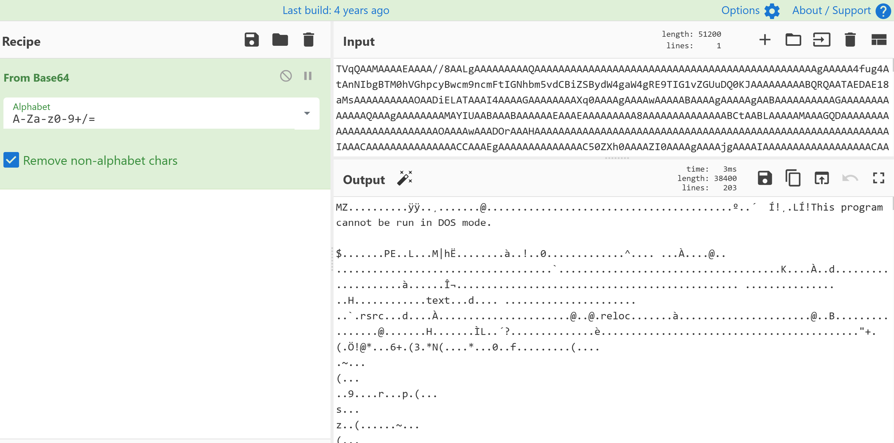
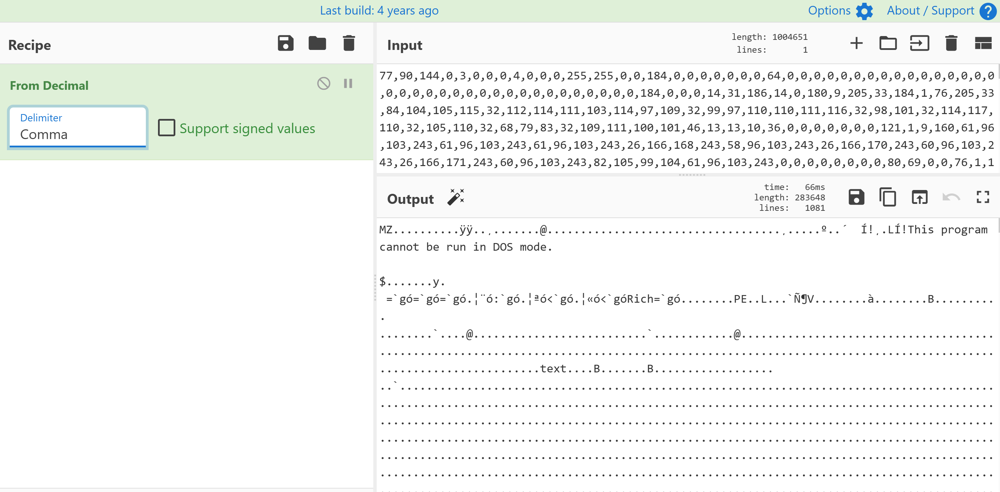
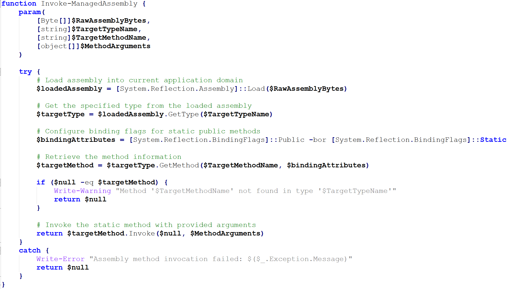
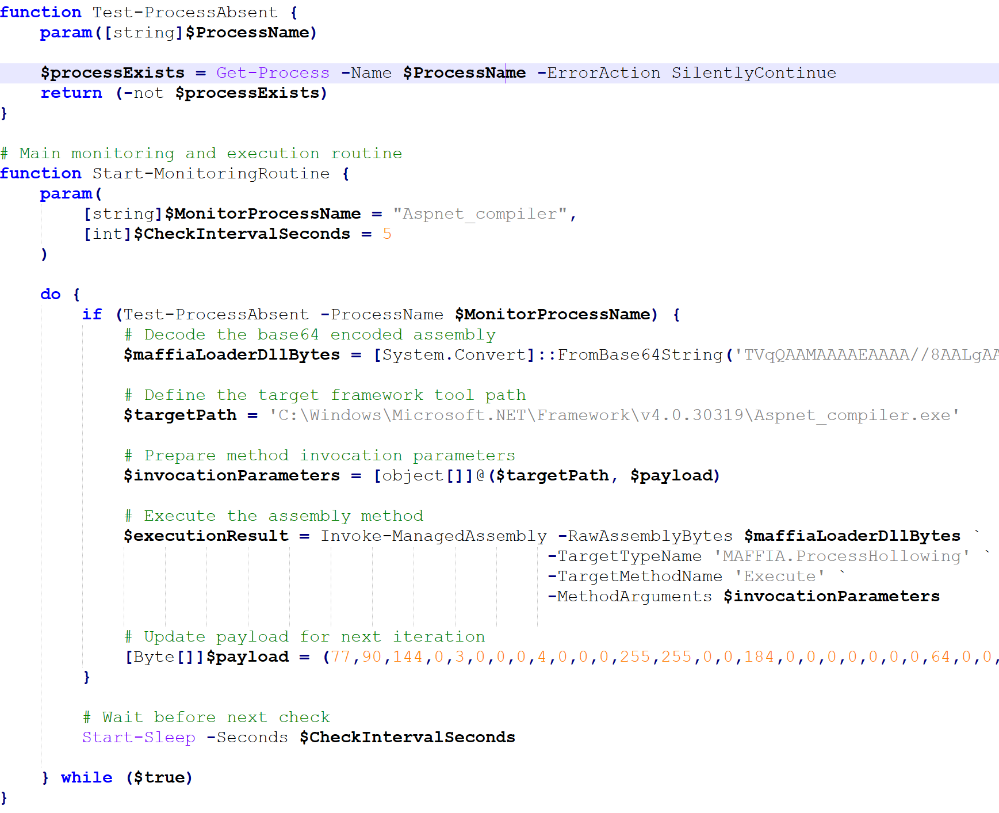
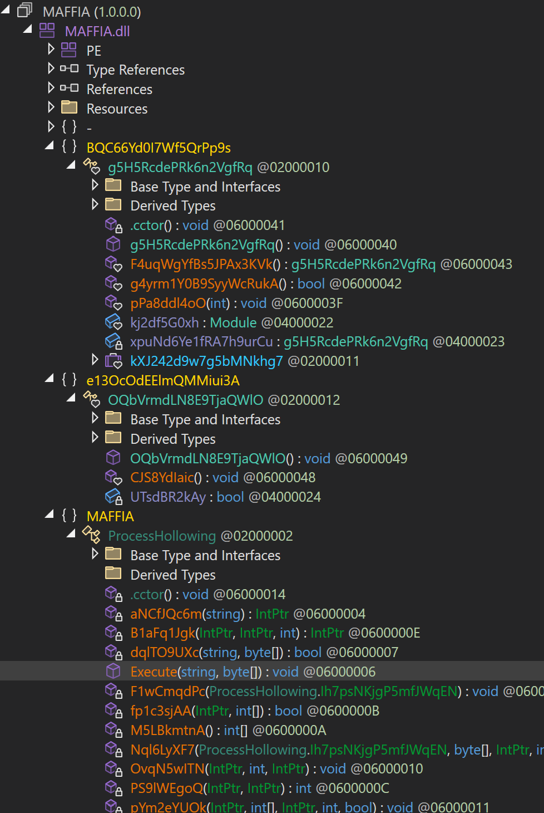
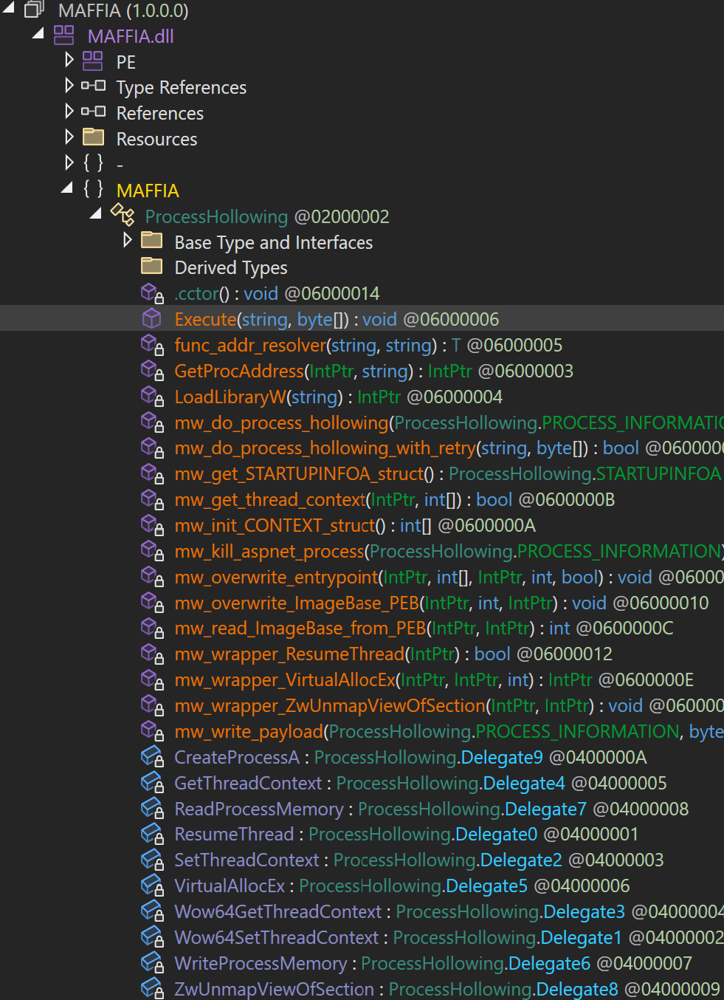
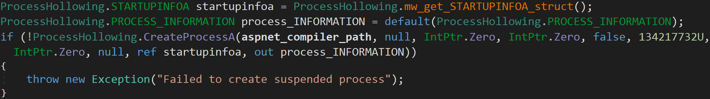

# Randomized PowerShell and MAFFIA: Process Hollowing via `Aspnet_compiler.exe`

_Note: Blog article written by GenAI. Malware analysis, images, content verification by me._

## Metadata

* Family: Formbook
* SHA1: [8a9d4a708845e4ae79fe1656b848ea784ddc38ee](https://bazaar.abuse.ch/sample/990f4fd84ce32890f866a99e5bea2a2d7f0aa64c40aacc28a4c359bff3dff636/)
* Initial stage: PowerShell script with AES-encrypted payload
* Stage 2 payloads:
  * Obfuscated .NET DLL (MAFFIA loader)
  * Executable payload (hollowed into `Aspnet_compiler.exe`)
* Execution style: In-memory PowerShell with randomized delivery methods and process hollowing into a living-off-the-land binary (LOLBin)

## Table of Contents

* [Introduction](#introduction)
* [Initial PowerShell Loader](#initial-powershell-loader)
  * [AES-Encrypted Payload](#aes-encrypted-payload)
  * [Randomized Execution Methods](#randomized-execution-methods)
* [AES Decryption and Stage 2 PowerShell](#aes-decryption-and-stage-2-powershell)
* [MAFFIA Loader DLL and Deobfuscation](#maffia-loader-dll-and-deobfuscation)
* [Process Hollowing via `Aspnet_compiler.exe`](#process-hollowing-via-Aspnet_compilerexe)
* [Summary](#summary)

## <a name="introduction"></a>Introduction

This Formbook sample chains together a familiar set of offensive building blocks:

1. A PowerShell loader with an AES-encrypted payload.
2. Evasive execution using randomized delivery methods.
3. A second-stage PowerShell script embedding:
   * A MAFFIA loader DLL (obfuscated .NET)
   * A binary payload
4. Classic process hollowing into the legitimate `Aspnet_compiler.exe` binary.

The end result is a fairly standard but well-packaged infection chain: PowerShell gets code into memory, MAFFIA's loader handles process hollowing, and the final payload quietly runs under the guise of a trusted .NET utility.

## <a name="initial-powershell-loader"></a>Initial PowerShell Loader

Opening the sample in Notepad++ immediately showed the familiar pattern of a PowerShell script wrapped around an AES-encrypted blob. The script's main job is to:

* Decrypt the AES-protected payload.
* Choose one of several execution techniques.
* Execute the decrypted PowerShell code in an evasive way.

### <a name="aes-encrypted-payload"></a>AES-Encrypted Payload

The loader stores its next stage as AES-encrypted data inside the script. The key and IV values are hardcoded as well. The workflow is the usual:

1. Base64-decode the encrypted bytes.
2. Feed them to an AES routine.
3. Treat the decrypted bytes as PowerShell source (`$executeScript`).

This design keeps the obvious malicious logic out of plain sight and makes static string-based detection harder.



### <a name="randomized-execution-methods"></a>Randomized Execution Methods

The most interesting part is the delivery logic. Instead of using a single `iex` call, the script builds an array of four execution strategies that all eventually run `$executeScript`:

1. Ampersand + `iex` in a script block
   ```powershell
   & { iex $executeScript }
   ```
   Executes using `Invoke-Expression` inside an anonymous script block.

2. Direct `Invoke-Expression`
   ```powershell
   Invoke-Expression $executeScript
   ```
   The classic PowerShell “run this string as code” primitive.

3. `[ScriptBlock]::Create()`
   ```powershell
   $scriptBlock = [ScriptBlock]::Create($executeScript)
   & $scriptBlock
   ```
   Dynamically compiles the string into a `ScriptBlock` object and invokes it.

4. File-based execution
   ```powershell
   $tempFile = [System.IO.Path]::GetTempFileName() + '.ps1'
   [System.IO.File]::WriteAllText($tempFile, $executeScript)
   & $tempFile
   [System.IO.File]::Delete($tempFile)
   ```
   Writes the payload to a temporary `.ps1` file, executes it, and cleans up.

The script randomly picks one of these methods using an index from `0` to `$executionMethods.Count - 1`, so each run may use a different execution path.



To improve reliability, the script doesn't trust its random choice blindly. It wraps the call in a `try/catch`, and if the randomly selected method fails, it falls back to method #1 (the ampersand + `iex` script block).

This gives the operator:

* Signature evasion: Different execution paths complicate simple signatures on `Invoke-Expression` usage.
* Behavioral variance: Each method generates slightly different telemetry (ScriptBlock calls vs. temp file execution).

## <a name="aes-decryption-and-stage-2-powershell"></a>AES Decryption and Stage 2 PowerShell

Using CyberChef, the AES payload was decrypted to reveal the second stage PowerShell script.



This script contained two embedded and encoded blobs:

* A .NET DLL – the MAFFIA loader.



* An executable payload – the code to be injected into a hollowed process.



Passing this script (DLL and payload bytes were replaced with a placeholder) to Claude helped quickly confirm the high-level flow:

* Load the embedded MAFFIA DLL into memory through reflection.



* Use a process hollowing function, `Execute` exposed by that DLL.
* Target the legitimate `Aspnet_compiler.exe` binary as the process to hollow.
* Inject the embedded payload into `Aspnet_compiler.exe`'s memory and run it.
* Check if `Aspnet_compiler` process is running every 5 seconds. If not, reattempt process hollowing.



The key point: the PowerShell is essentially a bootstrapper. The heavy lifting for process injection is delegated to the MAFFIA loader DLL.

## <a name="maffia-loader-dll-and-deobfuscation"></a>MAFFIA Loader DLL and Deobfuscation

Inspecting the MAFFIA loader DLL revealed obfuscation, including control flow flattening. The main entry point of interest was the `Execute()` method.



.NETReactorSlayer was used to deobfuscate the DLL. Then, functions and variables were manually labeled after analysis of the process hollowing control flow.



## <a name="process-hollowing-via-Aspnet_compilerexe"></a>Process Hollowing via `Aspnet_compiler.exe`

With the loader deobfuscated, its core behavior became apparent: hollow a new instance of `Aspnet_compiler.exe` and run the embedded payload inside it. The high-level flow is detailed below:

1. Create the target process in suspended mode



2. Get the PEB address of the spawned `Aspnet_compiler.exe` process and compare it against the `ImageBase` address of the payload. If so, unmap `Aspnet_compiler.exe` from memory. Otherwise, allocate memory at the payload's `ImageBase` virtual address within the `Aspnet_compiler.exe` process.


4. Write headers and sections of the payload into the allocated memory. Overwrite the `ImageBase` address in the PEB and the entry point in the primary thread of the `Aspnet_compiler.exe` process. Finally, resume the primary thread.


From the outside, you see `Aspnet_compiler.exe` running, but internally its memory image is entirely replaced.

## <a name="summary"></a>Summary

This Formbook sample (SHA1 `8a9d4a708845e4ae79fe1656b848ea784ddc38ee`) demonstrates a fairly typical yet well-designed multi-stage infection chain:

* A PowerShell loader uses AES encryption and randomized execution methods to evade static signatures and create behavioral diversity.
* The decrypted PowerShell embeds an obfuscated MAFFIA loader .NET DLL and an executable payload.
* After deobfuscation (with .NETReactorSlayer), the loader's core behavior is revealed as process hollowing into `Aspnet_compiler.exe`, a legitimate .NET utility.