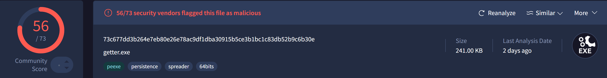
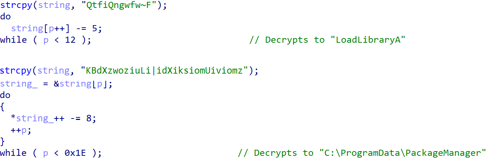
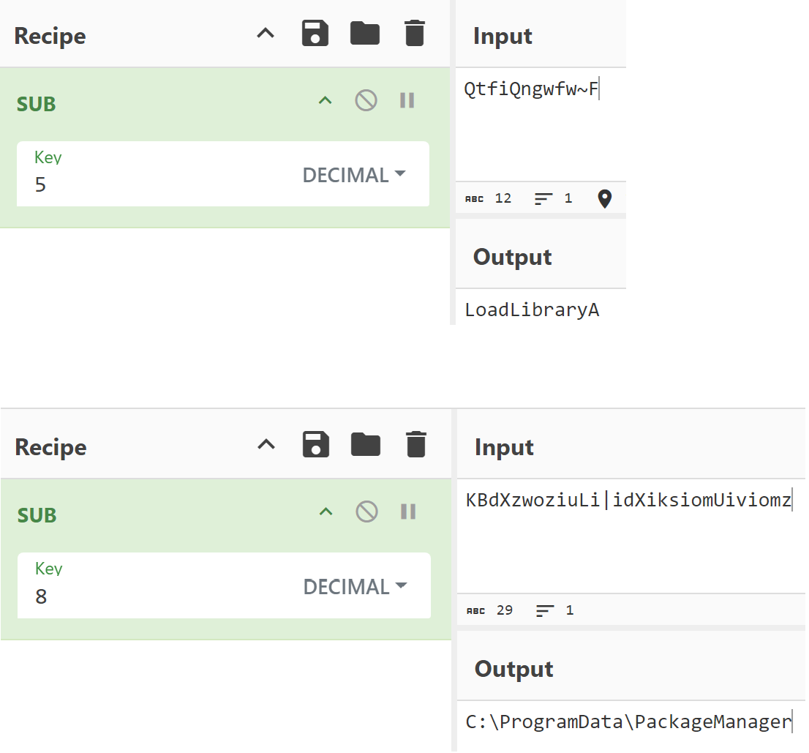
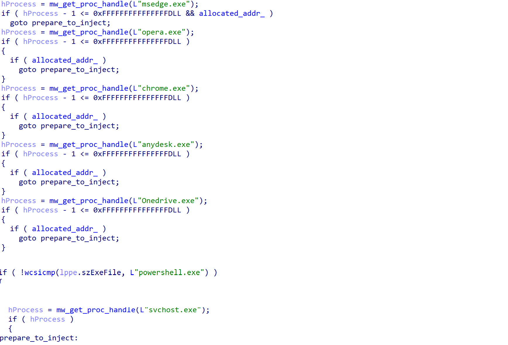
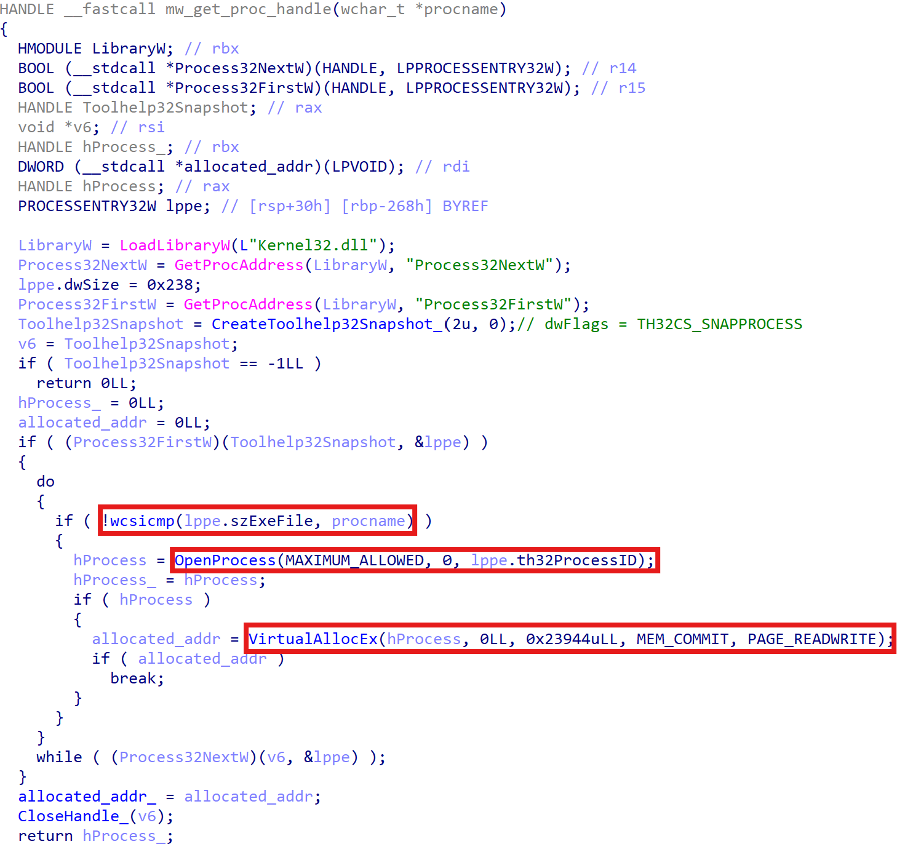
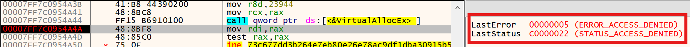
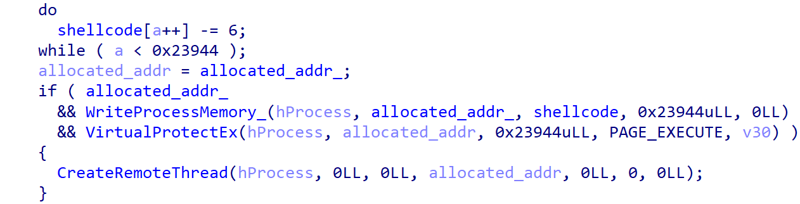

# Process Injection in BugSleep Loader

## Metadata
* SHA256: 73c677dd3b264e7eb80e26e78ac9df1dba30915b5ce3b1bc1c83db52b9c6b30e



## Table of Contents

* [Introduction](#introduction)
* [Strings Decryption](#strings-decrypt)
* [Process Injection](#process-injection)
    * [Walking the PEB](#peb-walk)
	* [Finding a Running Process to Inject Into](#finding-process)
	* [Portable Executable Process Injection](#port-exec-process-injection)
* [Summary](#summary)

## <a name="introduction"></a>Introduction

The BugSleep backdoor was recently reported on by both [Check Point](https://research.checkpoint.com/2024/new-bugsleep-backdoor-deployed-in-recent-muddywater-campaigns/) and [Sekoia](https://blog.sekoia.io/muddywater-replaces-atera-by-custom-muddyrot-implant-in-a-recent-campaign/). It has typical backdoor capabilities, such as establishing persistence, communicating with the C2 and executing commands, among others. BugSleep is attributed to the [MuddyWater](https://attack.mitre.org/groups/G0069/) group which indulges in cyber espionage.

The primary focus of this analysis is on the process injection aspect of the execution flow. The BugSleep loader injects shellcode that subsequently loads the BugSleep backdoor. Process injection can be leveraged for both privilege escalation (for example, injecting into a privileged process) and/or for defense evasion (for example, blending in by injecting into a legitimate process).

## <a name="strings-decrypt"></a>Strings Decryption

Before we get into process injection, we'll take a look at a very simple string encryption algorithm employed by the BugSleep loader.

The decryption algorithm involves subtracting a number (aka key), `k` from the ASCII code of each character in the encrypted string. The sample leverages multiple values of `k`, such as `5` and `8`, among others. This is shown below in Fig. 1. This encryption technique is a type of [substitution cipher](https://en.wikipedia.org/wiki/Substitution_cipher) where each unit of the plaintext is replaced with ciphertext with the help of a key.

|  |
|:--:|
| Fig. 1: String Decryption Algorithm |

For the occasional string decryption, it is straightforward to use [CyberChef](https://gchq.github.io/CyberChef/) as shown in Fig. 2.

|  |
|:--:|
| Fig. 2: String Decryption using CyberChef |

If you need a Python script, then the below one-liner `decode_string` function is sufficient.

```python
def decode_string(encoded_string, k):
    return "".join(chr(ord(s) - k) for s in encoded_string)

In [2]: print(decode_string("QtfiQngwfw~F", 5))
LoadLibraryA

In [3]: print(decode_string("KBdXzwoziuLi|idXiksiomUiviomz", 8))
C:\ProgramData\PackageManager
```

## <a name="process-injection"></a>Process Injection

At a high level, process injection is a technique to insert code into the memory region of a process. If the malware injects into a newly created process of itself, it is called self-injection. If the malware injects into a foreign process, it is called remote injection. While there are multiple ways to perform process injection (see [sub-techniques](https://attack.mitre.org/techniques/T1055/) in MITRE ATT&CK), this blog looks at [Portable Executable Injection](https://attack.mitre.org/techniques/T1055/002/) which the BugSleep loader implements.

### <a name="peb-walk"></a>Walking the PEB

The BugSleep loader walks the PEB to dynamically load functions, such as `CreateRemoteThread` and `WriteProcessMemory`, among others. These functions are then used to perform process injection. I have [previously blogged](https://nikhilh-20.github.io/blog/peb_phobos_ransomware/) about this obfuscation technique, i.e., walking the PEB, so I will not get into it here.

### <a name="finding-process"></a>Finding a Running Process to Inject Into

Earlier, I mentioned that one of the objectives of process injection is defense evasion. The BugSleep loader tries to achieve this by injecting into a legitimate running process. Fig. 3 shows that the loader picks, in order, from the following running processes to inject into:

1. `msedge.exe`: Microsoft Edge browser
2. `opera.exe`: Opera browser
3. `chrome.exe`: Google Chrome browser
4. `anydesk.exe`: AnyDesk remote desktop
5. `Onedrive.exe`: Microsoft OneDrive
6. `powershell.exe`: PowerShell
7. `svchost.exe`: Service Host

|  |
|:--:|
| Fig. 3: Finding Running Processes to Inject Into |

Process injection can be risky. If the injected code is poorly written; for example, if it does not handle exceptions, or if the injected code interferes with critical memory regions (PEB, executable sections, stack, etc.) of the target process, then there is a risk of crashing the target process. Besides stopping the malware execution flow from moving on to the next stage, process crashes will also result in Windows events being generated. Such events may be interpreted by security solutions, such as EDRs, as an indicator of compromise or attack.

The order of processes to inject into suggests that the threat actor deprioritized processes whose crash may have system-wide consequences or seem very abnormal. For example, if injection into `msedge.exe` goes wrong then only the Microsoft Edge browser will crash. However, `svchost.exe` is responsible for running important Windows services and is generally stable. If faulty injection occurs, a `svchost.exe` process crash will look especially abnormal to EDRs or may even result in more severe consequences for system stability.

Fig. 4 shows the decompiled code used to find a running process with a given substring (see `procname` variable) in its file name. When such a process is found, a handle to it is opened (via `OpenProcess`) and read-write memory is allocated in it (via `VirtualAllocEx`).

|  |
|:--:|
| Fig. 4: Decrypt Shellcode and Inject |

A given process cannot simply access any other process on the system. It can only access other processes from the same user *unless* it has `SeDebugPrivilege` enabled. This privilege is assigned disabled (default action) to all Administrator-owned processes and they have to explicitly enable it, if required. Other user-owned processes do not have this privilege assigned (but it can be given through Group Policy). The BugSleep loader does not enable `SeDebugPrivilege`, but it still attempts to access the memory of `svchost.exe`, a privileged process, which results in an `Access Denied` error as expected.

|  |
|:--:|
| Fig. 5: svchost.exe Access Denied |

### <a name="port-exec-process-injection"></a>Portable Executable Process Injection

Assuming that the BugSleep loader was able to allocate memory in the target process, it performs the following operations:

1. Decrypt the shellcode in the same manner as the previously described string decryption algorithm.
2. Write it into the allocated memory in the target process (via `WriteProcessMemory`) and mark it as executable (via `VirtualProtectEx`).
3. Create a thread in the target process (via `CreateRemoteThread`) with the previously injected shellcode as the start address.

|  |
|:--:|
| Fig. 6: Decrypt Shellcode and Inject |

Windows APIs like `WriteProcessMemory` and `CreateRemoteThread` internally call `NtWriteVirtualMemory` and `NtCreateThreadEx` respectively from `ntdll.dll`. These functions are generally hooked by EDRs, i.e., calls to these functions will be inspected and blocked, if appropriate.

## <a name="summary"></a>Summary

In this blog, we looked at the BugSleep loader which has a trivial execution flow to load the next stage. It implements a simple string decryption algorithm, finds a relevant running process to inject into, and then uses high-level Windows APIs to perform portable executable process injection.