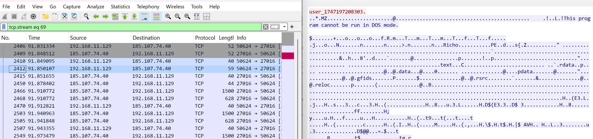
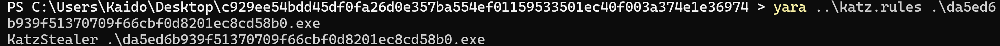
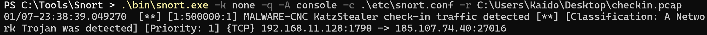
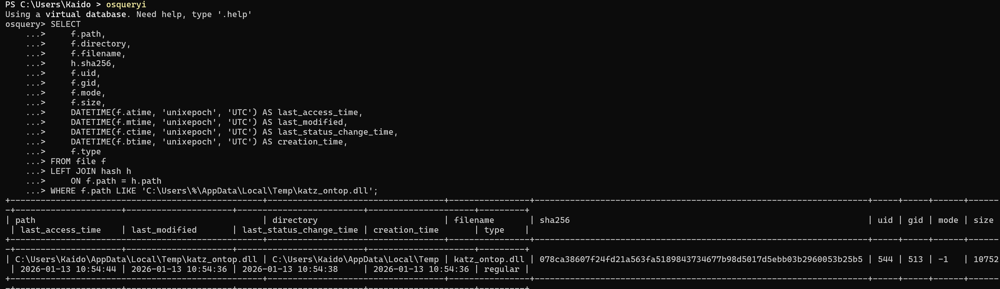

# Getting Hands-On with KatzStealer: YARA, Snort and osquery Detections

_Note: Blog article written by GenAI. Malware analysis, images, content verification by me._

## Metadata

* Family: KatzStealer
* SHA1: `da5ed6b939f51370709f66cbf0d8201ec8cd58b0`
* File type: 64-bit PE, EXE
* Size: ~90 KB
* Packing: Not packed (based on section entropy, abundant cleartext strings)
* Behavior (from VirusTotal):
  * Infostealer: system information, browser data, screenshots, clipboard
  * Steals from Chrome, Edge, and other applications
  * Drops and loads second-stage payload from its C2: `katz_ontop.dll`

## Table of Contents

* [Introduction](#introduction)
* [Static Triage and VirusTotal Insights](#static-triage-and-vt-insights)
* [Sandboxing and Network Behavior](#sandboxing-and-network-behavior)
  * [C2 Check-in Pattern](#c2-checkin-pattern)
  * [Second-stage DLL Delivery](#second-stage-dll-delivery)
* [YARA Detection for KatzStealer](#yara-detection-for-katzstealer)
* [Network Detection with Snort](#network-detection-with-snort)
* [Host Detection with osquery](#host-detection-with-osquery)
  * [Emulating the C2 with FakeNet-NG](#emulating-the-c2-with-fakenetng)
  * [Detecting `katz_ontop.dll` on Disk](#detecting-katz_ontopdll-on-disk)
* [Summary](#summary)

## <a name="introduction"></a>Introduction

This write-up looks at a 64-bit infostealer sample, dubbed KatzStealer. The goal is not to fully reverse the family, but to turn a single sample into practical host and network detections:

* YARA rule for static detection of the executable
* Snort rule for detecting C2 check-in traffic
* osquery detection for the second-stage DLL

The sample is friendly to defenders: it’s unpacked, full of readable strings, and exhibits consistent network behavior as seen through FakeNet-NG.

## <a name="static-triage-and-vt-insights"></a>Static Triage and VirusTotal Insights

From a quick triage:

* 64-bit EXE, ~90 KB, no obvious packing
* Section entropy is normal; strings are abundant and meaningful
* No anomalous resource files

VirusTotal behavior and sandbox metadata highlight:

* Infostealer behavior:
  * Collects system information
  * Steals browser data (Chrome, Edge, others)
  * Takes screenshots
  * Grabs clipboard contents
* Communicates with its C2 server and receives an additional DLL payload named `katz_ontop.dll`

These observations will drive both our YARA strings and host/network detections.

## <a name="sandboxing-and-network-behavior"></a>Sandboxing and Network Behavior

Running the sample behind FakeNet-NG provides us with a controlled view of its C2 behavior. A PCAP captured during execution shows:

* Initial outbound TCP connection to a remote host (C2) on port 27016, and data beginning with a distinctive `user_` prefix

* The C2 responding with a DLL payload (in the real infection: `katz_ontop.dll`)



### <a name="c2-checkin-pattern"></a>C2 Check-in Pattern

The first bytes sent by the malware to the server start with a `user_` prefix that functions as a check-in or identifier/marker. This string becomes a simple and useful network detection anchor for Snort/Suricata signatures.

### <a name="second-stage-dll-delivery"></a>Second-stage DLL Delivery

The second-stage payload is delivered over the same TCP connection, as a length-prefixed DLL:

1. Malware connects to C2.
2. Sends initial `user_...` data.
3. C2 responds with:
   * A 4-byte integer indicating DLL size.
   * The DLL bytes themselves (`katz_ontop.dll` in this case).

On disk, the DLL appears under a temporary path: `C:\Users\<user>\AppData\Local\Temp\katz_ontop.dll`. This is ideal for osquery-based detection.

## <a name="yara-detection-for-katzstealer"></a>YARA Detection for KatzStealer

Because the sample is unpacked and rich in plaintext strings, we can write a direct file-based YARA rule keyed off specific indicators seen in the binary. Notable string anchors in the sample include:

* `"encrypted_key"`
* `"chrome.exe"`
* `"MASTERKEY.txt"`
* `"_copy.db"`
* `"screenshot"`
* `"-headless"`

The following rule uses these strings and ensures we’re matching a PE file. It has been uploaded to YARAify as a community contribution, but no retrohunt was performed on VirusTotal (no subscription), so wider FP/FN characteristics are unknown.

```yara
import "pe"

rule KatzStealer
{
    meta:
        date = "2026-01-13"
        description = "Detects KatzStealer executable"
        author = "Nikhil Hegde"
        yarahub_author_twitter = "@ka1do9"
        yarahub_reference_md5 = "f175f4c2d99cc4f35f9aecdffc3489ed"
        yarahub_uuid = "ebda07ec-beca-45dc-aac7-d2c89bf0052d"
        yarahub_license = "CC0 1.0"
        yarahub_rule_matching_tlp = "TLP:WHITE"
        yarahub_rule_sharing_tlp = "TLP:WHITE"

    strings:
        $s1 = "encrypted_key" nocase
        $s2 = "chrome.exe" nocase
        $s3 = "MASTERKEY.txt" nocase
        $s4 = "_copy.db" nocase
        $s5 = "screenshot" nocase
        $s6 = "-headless" wide ascii nocase

    condition:
        pe.is_pe and
        all of them
}
```



## <a name="network-detection-with-snort"></a>Network Detection with Snort

Using FakeNet-NG and a PCAP capture, we can translate the C2 check-in into a Snort rule. The distinguishing characteristic in this case is the `user_` prefix sent early in the session.

The following minimal Snort rule detects this C2 check-in traffic:

```snort
alert tcp $HOME_NET any -> $EXTERNAL_NET 27016 (msg:"MALWARE-CNC KatzStealer check-in traffic detected"; flow:to_server,established; content:"user_"; depth:5; reference:url,bazaar.abuse.ch/sample/c929ee54bdd45df0fa26d0e357ba554ef01159533501ec40f003a374e1e36974/; classtype:trojan-activity; sid:500000; rev:1;)
```




## <a name="host-detection-with-osquery"></a>Host Detection with osquery

On the host side, the most stable artifacts from a single sample are:

* The second-stage DLL name: `katz_ontop.dll`
* Its drop location: `%LocalAppData%\Temp\katz_ontop.dll`

### <a name="emulating-the-c2-with-fakenetng"></a>Emulating the C2 with FakeNet-NG

To better understand (and later detect) the payload delivery, a small Python TCP handler was used to act as the fake C2 behind FakeNet-NG.

This script:

* Logs incoming connections
* Reads the first data chunk
* Then, it:
  * Opens a local test DLL file (`hello-world-x64.dll`)
  * Sends its 4-byte size
  * Streams the DLL to the client in chunks

```python
import socket
import struct

def HandleTcp(sock):
    local_ip, local_port = sock.getsockname()
    remote_ip, remote_port = sock.getpeername()
    print(f"[C2Provider] Connection: {remote_ip}:{remote_port} <-> {local_ip}:{local_port}")
    
    data = sock.recv(1024)
    if not data:
        return
    
    print(f"[C2Provider] Received data: {data}")

    with open(r"C:\Tools\fakenet\fakenet3.5\defaultFiles\hello-world-x64.dll", "rb") as f:
        file_data = f.read()

    try:
        sock.setsockopt(socket.IPPROTO_TCP, socket.TCP_NODELAY, 1)
    except Exception:
        pass

    size_bytes = struct.pack(">I", len(file_data))
    sock.sendall(size_bytes)
    print(f"[C2Provider] Sent DLL size: {len(file_data)}")

    print(f"[C2Provider] Sending DLL: {len(file_data)}")
	# WinDivert struggles with large chunks
    CHUNK = 1024
    sent = 0
    for i in range(0, len(file_data), CHUNK):
        chunk = file_data[i:i+CHUNK]
        sock.sendall(chunk)
        sent += len(chunk)
    print(f"[C2Provider] Sent DLL bytes: {sent}")
```

### <a name="detecting-katz_ontopdll-on-disk"></a>Detecting `katz_ontop.dll` on Disk

Given the staged DLL name and path from VirusTotal and sandboxing, we can pivot to an osquery detection that joins `file` and `hash` tables and looks for this artifact. This can then be run as a scheduled query in osquery across Windows endpoints and logs can be shipped to a SIEM.

```sql
SELECT
    f.path,
    f.directory,
    f.filename,
    h.sha256,
    f.uid,
    f.gid,
    f.mode,
    f.size,
    DATETIME(f.atime, 'unixepoch', 'UTC') AS last_access_time,
    DATETIME(f.mtime, 'unixepoch', 'UTC') AS last_modified,
    DATETIME(f.ctime, 'unixepoch', 'UTC') AS last_status_change_time,
    DATETIME(f.btime, 'unixepoch', 'UTC') AS creation_time,
    f.type
FROM file f
LEFT JOIN hash h
    ON f.path = h.path
WHERE f.path LIKE 'C:\Users\%\AppData\Local\Temp\katz_ontop.dll';
```



## <a name="summary"></a>Summary

This post walked through turning a single KatzStealer infostealer sample into actionable detections:

* The binary is unpacked, with abundant cleartext strings and no obfuscation.
* VirusTotal behavior and sandbox runs show browser credential theft, screenshots, clipboard access, and delivery of a second-stage DLL named `katz_ontop.dll`.
* A YARA rule based on correlated strings provides static detection of the executable.
* A simple Snort rule keyed on the `user_` C2 check-in string offers lightweight network coverage.
* An osquery query detects the second-stage DLL on disk, enriched with metadata and hash information for triage.

Taken together, these detections form a small but practical defense-in-depth bundle that can be dropped into existing EDR/IDS/osquery pipelines to catch this KatzStealer sample and closely related variants.