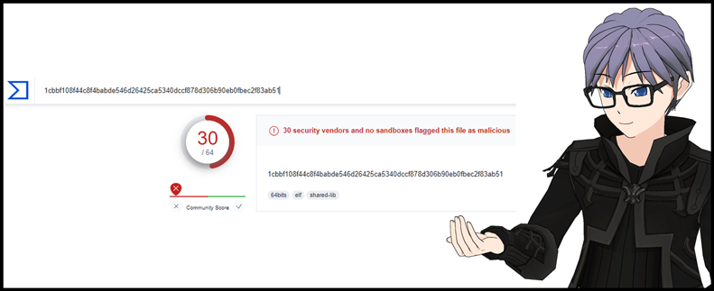
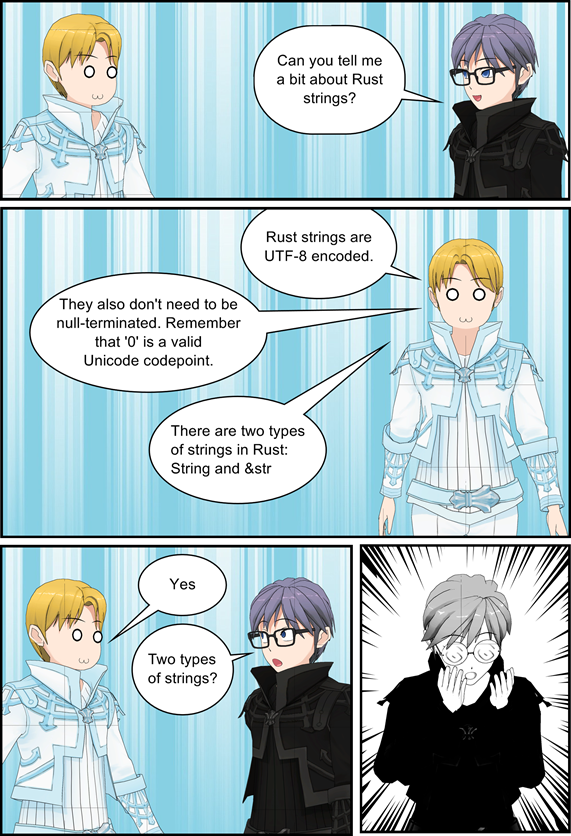
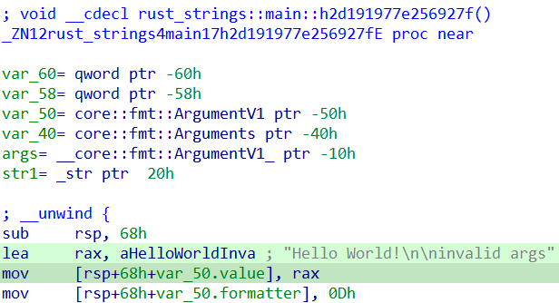
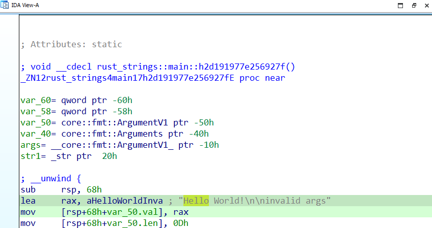
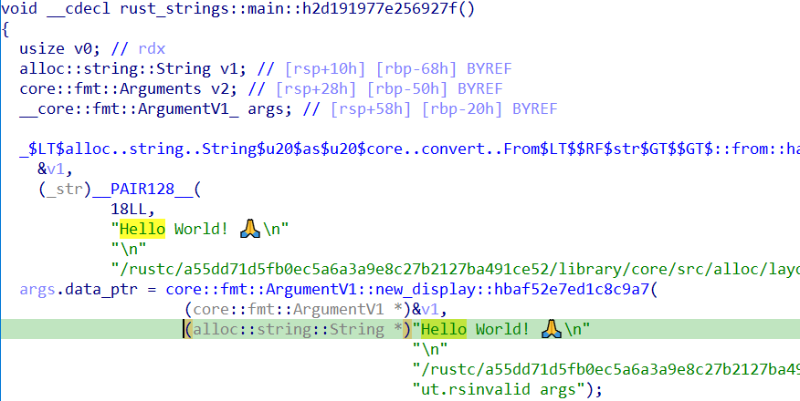
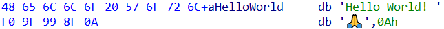
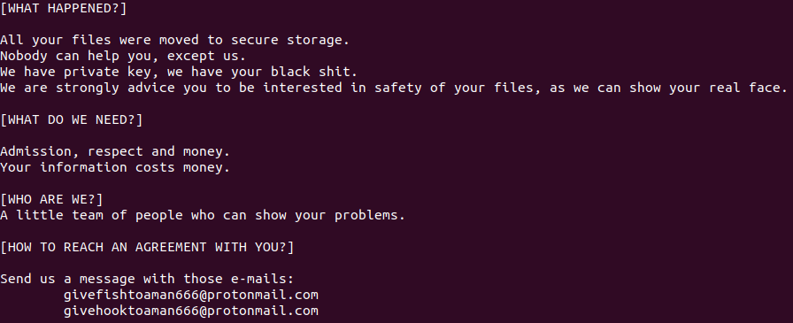
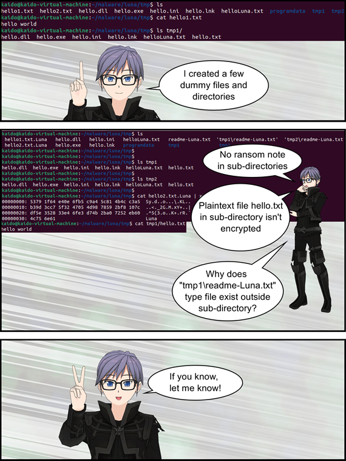

# Getting Rusty and Stringy with Luna Ransomware

## Metadata
* SHA256: 1cbbf108f44c8f4babde546d26425ca5340dccf878d306b90eb0fbec2f83ab51 
	* VT download [link](https://www.virustotal.com/gui/file/1cbbf108f44c8f4babde546d26425ca5340dccf878d306b90eb0fbec2f83ab51)

<center>


</center>

## Table of Contents

* [Family Introduction](#family-introduction)
* [Rust Strings](#rust-strings)
    * [String Slice: &str](#and-str)
	* [String](#string)
	* [Rust Strings Print](#rust-strings-print)
	* [Luna Strings](#luna-strings)
* [IDA Land](#ida-land)
	* [Writing Ransom Note](#ransom-note-write)
    * [Skips Files and Directories](#skips-files-dirs)
	* [Encryption Scheme](#encryption-scheme)
* [Peculiarities](#peculiarities)
	* [Capability Peculiarities](#cap-peculiarities)
	* [Execution Peculiarities](#exec-peculiarities)
* [Summary](#summary)
* [References](#references)

## <a name="family-introduction"></a>Family Introduction

The Luna ransomware appeared in July 2022. Unlike its competitors, this threat targeted VMware ESXi instances from the day it started operating.

## <a name="rust-strings"></a>Rust Strings

In my experience as a malware analyst, I've been used to seeing ASCII and null-terminated strings in binaries. I was content writing IDAPython scripts where I created strings by searching for ASCII and null characters. And one fine day, I had a Rust binary on my plate which broke my scripts. I interviewed the Rust God about strings. Here's how it went:

<center>

|  |
|:--:|
| Fig. 1: Rust Strings |
</center>


### <a name="and-str"></a>String Slice: &str

String slice is the term for `&str` type of strings. These kinds of strings may exist in the binary or on the stack or heap. They always reference UTF-8 characters and are immutable. Let's consider this simple Rust program:

```rust
fn main() {
    let str1: &str = "Hello World!\n"; 
}
```

Fig. 2 shows a snap of the disassembly as seen in IDA Home 7.7:

<center>

|  |
|:--:|
| Fig. 2: String Slice |
</center>

String slices are essentially a data structure containing the address of the slice and its length. Such structures are also called fat pointers because they contain extra data besides just the memory address. Consider the following Rust program which prints the size (in bytes) of the `&str` type:

```rust
use std::mem::size_of;

fn main() {
    println!("A &str size in bytes: {}", size_of::<&str>());
}
```

On execution, it prints:

```bash
A &str size in bytes: 16
```

My system architecture is x64, so the size of `&str`, a fat pointer, is 16 bytes. The first 8 bytes is the memory address of the actual string literal and the next 8 bytes represents the length of that string literal. The following structure represents a string slice:

```C
struct string_slice
{
  _QWORD val;
  _QWORD len;
};
```

IDA detects the above structure as `core::fmt::ArgumentV1` and is defined as:

```C
struct core::fmt::ArgumentV1
{
  core::fmt::_extern_0}::Opaque *value;
  core::result::Result<(),core::fmt::Error> (*formatter)(core::fmt::_extern_0}::Opaque *, core::fmt::Formatter *);
};
```

Although IDA's structure is of the correct size (16 bytes), it is not particularly readable. So, I replaced it with my structure definition for better readability. Fig. 3 shows it in action.

<center>

|  |
|:--:|
| Fig. 3: String Slice IDA Structure |
</center>

### <a name="string"></a>String

The next string type in Rust is `String`. These kinds of strings are allocated only on the heap and they are mutable.

`String` is also a data structure. It contains the address of the slice, its length on the heap and also the capacity of the heap region. Consider the following Rust program which prints the size (in bytes) of the `String` type:

```rust
use std::mem::size_of;

fn main() {
    println!("A String size in bytes: {}", size_of::<String>());
}
```

On execution, it prints:

```bash
A String size in bytes: 24
```

My system architecture is x64, so the size of `String` is 24 bytes. The first 8 bytes is the memory address of the string slice; the next 8 bytes represents the length of that string literal and the last 8 bytes is the capacity of the memory region in the heap. The capacity signifies the maximum number of bytes that the string can hold. If a longer string is required, then reallocation occurs on the heap. The following structure represents a `String`:

```C
struct String
{
  _QWORD val;
  _QWORD len;
  _QWORD cap;
};
```

For example, a `String` may be allocated on the heap having the following structure field values:

```C
val = "Hello!"
len = 6
cap = 10
```

IDA detects the above structure as `alloc::string::String` and is defined as:

```
struct alloc::string::String
{
  alloc::vec::Vec<u8,alloc::alloc::Global> vec;
};
```

Let's consider this simple Rust program:

```rust
fn main() {
    let str1: String = String::from("Hello World! 🙏\n");
}
```

Fig. 4 shows a snap of the disassembly as seen in IDA Home 7.7. Here, `v1` is the `String` variable.

<center>

|  |
|:--:|
| Fig. 4: String IDA Structure |
</center>

Fig 5. shows a snap of the UTF-8 encoding of the string literal:

<center>

|  |
|:--:|
| Fig. 5: String UTF-8 Encoding |
</center>

### <a name="rust-strings-print"></a>Rust Strings Print

It can be seen in Fig. 4 that there is no null character after the `Hello World! 🙏\n` string. This can make reading strings in IDA decompilation difficult as seen in Fig. 2 where the next string has polluted the decompilation. I wrote an IDAPython script which prints Unicode strings found in a Rust-based binary. I've been unable to find an IDAPython function which can create UTF-8 strings.

### <a name="luna-strings"></a>Luna Strings

Using the [IDAPython script](https://github.com/nikhilh-20/nikhilh-20.github.io/blob/main/blog/luna_ransomware/scripts/rust_strings_print_ida.py), I found the following interesting strings:

```
Luna
.ini
.exe
.dll
.lnk
Error while writing encrypted data to: 
Error while writing public key to: 
Error while writing extension to: 
Error while renaming file: 
W1dIQVQgSEFQUEVORUQ/XQ0KDQpBbGwgeW91ciBmaWxlcyB3ZXJlIG1vdmVkIHRvIHNlY3VyZSBzdG9yYWdlLg0KTm9ib2R5IGNhbiBoZWxwIHlvdSwgZXhjZXB0IHVzLg0KV2UgaGF2ZSBwcml2YXRlIGtleSwgd2UgaGF2ZSB5b3VyIGJsYWNrIHNoaXQuDQpXZSBhcmUgc3Ryb25nbHkgYWR2aWNlIHlvdSB0byBiZSBpbnRlcmVzdGVkIGluIHNhZmV0eSBvZiB5b3VyIGZpbGVzLCBhcyB3ZSBjYW4gc2hvdyB5b3VyIHJlYWwgZmFjZS4NCg0KW1dIQVQgRE8gV0UgTkVFRD9dDQoNCkFkbWlzc2lvbiwgcmVzcGVjdCBhbmQgbW9uZXkuDQpZb3VyIGluZm9ybWF0aW9uIGNvc3RzIG1vbmV5Lg0KDQpbV0hPIEFSRSBXRT9dDQpBIGxpdHRsZSB0ZWFtIG9mIHBlb3BsZSB3aG8gY2FuIHNob3cgeW91ciBwcm9ibGVtcy4NCg0KW0hPVyBUTyBSRUFDSCBBTiBBR1JFRU1FTlQgV0lUSCBZT1U/XQ0KDQpTZW5kIHVzIGEgbWVzc2FnZSB3aXRoIHRob3NlIGUtbWFpbHM6DQoJZ2l2ZWZpc2h0b2FtYW42NjZAcHJvdG9ubWFpbC5jb20NCglnaXZlaG9va3RvYW1hbjY2NkBwcm90b25tYWlsLmNvbQ0KDQogICA
Error while writing note
AES-NI not supported on this architecture. If you are using the MSVC toolchain, this is because the AES-NI method's have not been ported, yet
Invalid AES key size.
host unreachable
connection reset
/proc/self/exe
openserver
windows
program files
recycle.bin
programdata
appdata
all users
Encrypting file:
How to use:
 -file /home/user/Desktop/file.txt (Encrypts file.txt in /home/user/Desktop directory)
 -dir /home/user/Desktop/ (Encrypts /home/user/Desktop/ directory)
```

The base64-encoded string decodes to the ransom note:

```
[WHAT HAPPENED?]

All your files were moved to secure storage.
Nobody can help you, except us.
We have private key, we have your black shit.
We are strongly advice you to be interested in safety of your files, as we can show your real face.

[WHAT DO WE NEED?]

Admission, respect and money.
Your information costs money.

[WHO ARE WE?]
A little team of people who can show your problems.

[HOW TO REACH AN AGREEMENT WITH YOU?]

Send us a message with those e-mails:
	givefishtoaman666@protonmail.com
	givehooktoaman666@protonmail.com
```

## <a name="ida-land"></a>IDA Land

When analyzing Rust binaries, there are some notes to keep in mind:
* Unlike C or C++-based binaries, it is not easy to navigate Rust-based binaries in a top-down approach, i.e. start at the top and analyze your way down. This is because Rust adds a bunch of runtime code (error handling, memory-safe management, etc.) that pollutes the disassembly.
* Within the same Rust binary, there can exist multiple calling conventions.
* IDA (atleast Home 7.7) may not have the capability to identify Rust library functions, so they are all marked as regular functions. You might end up analyzing code for 2 hours that ends up being runtime or library code.

The previous IDAPython script comes in handy to identify points from where you can start analysis. I could navigate to the string location in the `.rodata` segment, cross-reference to the source which loads that string and then analyze that piece of code rather than starting at the top. I started my analysis with the code that references the base64-encoded string of the ransom note. I hoped this would position me in the neighborhood of the code that does the encryption.

### <a name="ransom-note-write"></a>Writing Ransom Note

As mentioned before, the binary contains the base64-encoded form of the ransom note. It decodes it and then writes it into a file named `readme-Luna.txt`.

<center>

|  |
|:--:|
| Fig. 6: Luna Ransom Note |
</center>

### <a name="skips-files-dirs"></a>Skips Files and Directories

Luna doesn't encrypt files which have:
* substring `Luna` in their filenames
* one of the following extensions:
    * `.dll`
	* `.exe`
	* `.lnk`
	* `.ini`

Luna doesn't encrypt files under directories which contain one of the following substrings:
* `openserver`
* `windows`
* `program files`
* `recycle.bin`
* `programdata`
* `appdata`
* `all users`

### <a name="encryption-scheme"></a>Encryption Scheme

Luna employs an encryption scheme that is commonly found in the ransomware world. It leverages both asymmetric and symmetric cryptography, i.e., the key for the symmetric cryptography is derived is from asymmetric cryptography. It uses [curve25519-dalek](https://github.com/dalek-cryptography/curve25519-dalek) package for Elliptic-Curve Cryptography (ECC) and [crypto::aes](https://docs.rs/rust-crypto/latest/crypto/aes/index.html) module for AES-256 CTR-mode cryptography.

Luna's encryption scheme can be summarized as follows:
* It generates a public and private key on Curve25519.
* The binary also contains the threat actor's Curve25519 public key. Using the generated private key and the threat actor's public key, the sample derives the 32-byte shared secret.
* The shared secret is used as the key for AES-256 CTR-mode. The IV is a string slice (a 16-byte fat pointer) pointing to a string literal, `Luna`.

Both the shared secret and the generated public key are zero'd in memory to prevent data leak. As I was writing this, I remembered Javier Yuste's [Avaddon ransomware decryption tool](https://github.com/JavierYuste/AvaddonDecryptor) which relied on key information being available in memory. Perhaps, zero'ing key information in memory is Luna's safeguard against such decryption tools.

### <a name="file-encryption"></a>File Encryption

Luna encrypts 50,000 bytes of plaintext file contents at a time. Since AES is in CTR mode, i.e., a stream cipher, the output ciphertext size is equal to the input plaintext size.

For the threat actor's decryption tool to work, the ransomware binary has to store encryption-related information in the encrypted file. In this case, the threat actor would need two points of information per encrypted file:
* Curve25519 32-byte public key generated by the binary to calculate the shared secret used to encrypt the file.
* The IV value used by AES-256 CTR-mode encryption.
To this end, the Luna binary stores the previously generated Curve25519 32-byte public key and the IV string literal, `Luna` to the end of the encrypted file.

Each encrypted file is given the extension, `.Luna`.

## <a name="peculiarities"></a>Peculiarities

### <a name="cap-peculiarities"></a>Capability Peculiarities

When I hear of ransomware targeting VMware ESXi, I usually come across capability in the binary to shut down running VMs. This helps in clean encryption of files. However, Luna doesn't seem to contain any such capability which may result in encrypted files being corrupted and incapable of being recovered.

### <a name="exec-peculiarities"></a>Execution Peculiarities

I was wrapping up this article when I noticed a few peculiarities in Luna's execution.

<center>

|  |
|:--:|
| Fig. 7: Execution Peculiarities |
</center>

## <a name="summary"></a>Summary

In this article, we looked at a sample of Luna ransomware.

* It used an encryption scheme of Curve25519 (asymmetric cryptography) and AES-256 CTR-mode (symmetric cryptography).
* Unlike popular ransomware families like BlackBasta and BlackCat, Luna doesn't use intermittent encryption strategies and encrypts the entire file.
* Curve25519 public key and AES-256 IV values are stored at the end of the encrypted file.
* Like most ransomware families, certain files and directories are not encrypted.
* I also introduced you to strings in Rust. I presented an IDAPython script that prints UTF-8 strings found in the `.rodata` segment of a Rust-based binary. These results gave a start point for our analysis.
* Finally, we looked at a few peculiarities (or bugs) in Luna's code which makes for buggy directory traversal.

In summary, Luna is the typical ransomware but with bugs and no optimizations.

## <a name="references"></a>References

* https://doc.rust-lang.org/rust-by-example/std/str.html
* [What is a fat pointer?](https://www.quora.com/What-is-a-fat-pointer)
* https://docs.rs/c_str/latest/c_str/
* [Exploring Strings in Rust](https://betterprogramming.pub/strings-in-rust-28c08a2d3130)
* [Understanding String and &str in Rust](https://blog.logrocket.com/understanding-rust-string-str/)
* [Strings in Rust FINALLY EXPLAINED!](https://www.youtube.com/watch?v=Mcuqzx3rBWc)
* [A Deep Dive into X25519](https://coinexsmartchain.medium.com/a-deep-dive-into-x25519-7a926e8a91c7)