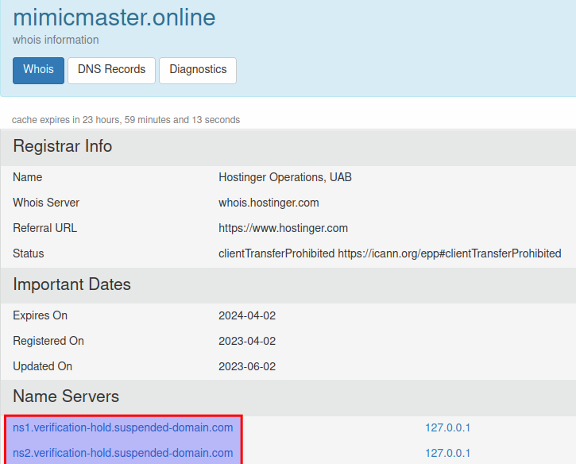

# NoaBot Botnet - Sandboxing with ELFEN and Analysis

## Metadata
* SHA256: `b5e4c78705d602c8423b05d8cd758147fa5bcd2ac9a4fe7eb16a07ab46c82f07`
    * VT [link](https://www.virustotal.com/gui/file/b5e4c78705d602c8423b05d8cd758147fa5bcd2ac9a4fe7eb16a07ab46c82f07/detection)

## Table of Contents

* [Family Introduction](#family-introduction)
* [Sandboxing with ELFEN](#sandboxing-elfen)
    * [Detonation](#detonation)
    * [uClibc Compilation](#uclibc-compilation)
    * [Brute-Forcing Credentials](#brute-force-creds)
    * [Persistence through Cron](#persistence-cron)
    * [Accessing Secrets](#access-secrets)
        * [Accessing Bash History](#access-bash-history)
        * [Accessing SSH Private Keys](#access-ssh-keys)
        * [Accessing User Accounts Information](#access-user-accounts-info)
    * [Process Name Change](#process-name-change)
    * [Network Communications](#network-comms)
        * [Scanning through SSH](#scanning-ssh)
        * [C2 Domain](#c2-domain)
* [Summary](#summary)
* [References](#references)

## <a name="family-introduction"></a>Family Introduction

`NoaBot` is a Mirai-based botnet and possesses most of the original Mirai botnet's capabilities. Its source code contains
noticeable differences like the spreader is based in SSH and not Telnet. Akamai detected the `NoaBot` campaign in early 2023.

The sample analyzed in this post is an ELF executable targeted towards the MIPS 32-bit, little-endian architecture. 

## <a name="sandboxing-elfen"></a>Sandboxing with ELFEN

Generally, a malware analyst performs sandboxing early in their workflow. The purpose of sandboxing is to quickly get a
general idea of the malware sample's capabilities - does it communicate over the network or encrypt files or establish
persistence, etc. This information is useful in determining the next steps in the analysis workflow. I built the
[ELFEN](https://github.com/nikhilh-20/ELFEN) sandbox to analyze Linux malware (file type: `ELF`) and provide this information.
It is open-source and easy to set up.

### <a name="detonation"></a>Detonation

Unless it is known, a sample is usually submitted to a sandbox without any command-line arguments.


The analysis result summary is shown in the snap below:


### <a name="uclibc-compilation"></a>uClibc Compilation

The sample is compiled with [uClibc](https://github.com/kraj/uClibc), and more specifically, with a version between
`v0.9.21`-`v0.9.33.2` as evidenced by the string, `npxXoudifFeEgGaACSncs[`. ELFEN detects this open-source library usage.


### <a name="brute-force-creds"></a>Brute-Forcing Credentials

[ELFEN](https://github.com/nikhilh-20/ELFEN) generates process memory dumps during detonation. Besides extracting printable
strings from the dumps, [ELFEN](https://github.com/nikhilh-20/ELFEN) also applies Yara rules on them. Some in-memory
strings in the analysis hint at credentials brute-forcing


[ELFEN](https://github.com/nikhilh-20/ELFEN) detects the presence of well-known password patterns through a Yara rule.


### <a name="persistence-cron"></a>Persistence through Cron

The sample establishes persistence through a cron job that runs the sample every time the system reboots. The crontab
file per user is located under the directory, `/var/spool/cron/crontabs`. [ELFEN](https://github.com/nikhilh-20/ELFEN)
detects it as a dropped file and makes it available to the user for downloading. In this case, the sample also sets up
command-line parameters when it runs through the cron job.

```bash
$ cat root
@reboot ./8zpeVaQk "$mimic|fuck" noa
```

[ELFEN](https://github.com/nikhilh-20/ELFEN) traces the crontab invocation and detects it:


### <a name="access-secrets"></a>Accessing Secrets

The sample looks for a variety of secret information such as bash history, SSH private keys and user accounts information.
Curiously, the sample does not seem to do anything (read/write) with the found files. _A gap in tracing?_ 
Nevertheless, an analyst can likely make the assumption that the secret information is leveraged in some manner.

[ELFEN](https://github.com/nikhilh-20/ELFEN) detects this behavior:


#### <a name="access-bash-history"></a>Accessing Bash History

The sample looks for `.bash_history` files at various locations. This file records a history of the commands that a user
has entered in the Bash shell. ELFEN traces this behavior.


#### <a name="access-ssh-keys"></a>Accessing SSH Private Keys

The sample looks for user SSH private keys for multiple algorithms: `RSA`, `DSA` and `Ed25519`. These keys are used for
authenticating the user over SSH. ELFEN traces this behavior. 


#### <a name="access-user-accounts-info"></a>Accessing User Accounts Information

The sample looks for the `/etc/passwd` file. This contains information about user accounts on the system. Note that
benign executables access this file as well during runtime. However, context is important. The sample also accesses other
secrets, so access to `/etc/passwd` should not be ignored. ELFEN traces this behavior.


### <a name="process-name-change"></a>Process Name Change

The sample changes its process name to masquerade as a benign process. Specifically, the new process name can be one of
many popular utilities such as `mongod`, `nginx`, `smbd`, `sshd`, etc. ELFEN traces and detects this behavior.


### <a name="network-comms"></a>Network Communications

#### <a name="scanning-ssh"></a>Scanning through SSH

The sample scans ports `22` and `2222` (popular alternate port for SSH) for over 4000 IPv4 addresses. [ELFEN](https://github.com/nikhilh-20/ELFEN)
traces this behavior. The original Mirai botnet spread through Telnet. Researchers at Akamai reported that NoaBot uses SSH. 


[ELFEN](https://github.com/nikhilh-20/ELFEN) also captures network traffic into a PCAP and makes it available to the
user for downloading. If the remote port is accepting connections, the sample sends a malformed SSH packet early in the
SSH handshake. It contains the string, `hi`.


I observed that the sample does not send its SSH identification string first, as is usual in a normal SSH handshake.
Instead, it waits for the server to send its identification string. It then replies with the malformed SSH packet.

My hypothesis is that the sample is trying to capture the server SSH identification string. Perhaps, to check if it's
vulnerable to a known exploit. It then sends the malformed SSH packet (the specific string, `hi` is irrelevant) to
possibly avoid triggering any timeouts or `RST` packets from the server which may draw suspicion on server-side defenses.
As seen in the snap above, the connection gracefully terminates with a `FIN-ACK-ACK` packet sequence.

#### <a name="c2-domain"></a>C2 Domain

The sample reaches out to its C2, `mimicmaster[.]online`, which is currently unavailable.


From its Whois records, it can be seen that the domain is currently suspended.



The last known IPv4 address for the domain was `185[.]193.126.118` as seen on VT.


[ELFEN](https://github.com/nikhilh-20/ELFEN) performs protocol analysis on the captured network traffic. At this point,
only DNS protocol analysis is supported.


## <a name="summary"></a>Summary

The NoaBot is yet another Mirai-based botnet, except it has notable differences in its capabilities like the SSH spreader.
The main goal of this analysis was to demonstrate the usage of the [ELFEN](https://github.com/nikhilh-20/ELFEN) sandbox
to quickly get insights into a given malware sample.

[ELFEN](https://github.com/nikhilh-20/ELFEN) supports features such as:
* Analysis and detection of Linux malware targeting x86-64, ARMv5, MIPS and PowerPC architectures.
* Tracing files, processes, network-related syscalls and `libc` string-related functions.
* PCAP capture and protocol analysis.
* Memory dumps and capturing dropped files
* and more!

If you've not already, give [ELFEN](https://github.com/nikhilh-20/ELFEN) a try!

## <a name="references"></a>References

1. [ELFEN](https://github.com/nikhilh-20/ELFEN)
2. [Malpedia](https://malpedia.caad.fkie.fraunhofer.de/details/elf.noabot)
3. [You Had Me at Hi — Mirai-Based NoaBot Makes an Appearance](https://www.akamai.com/blog/security-research/mirai-based-noabot-crypto-mining)
4. [open, openat - open file](https://pubs.opengroup.org/onlinepubs/9699919799/functions/open.html)
5. [Wiresharking Secure Shell (SSH)](https://www.youtube.com/watch?v=HVWlMNTNcF4)
6. [Whois](https://who.is/whois/mimicmaster.online)
7. [VirusTotal](https://www.virustotal.com/gui/domain/mimicmaster.online/details)
8. [ChatGPT](https://chat.openai.com/)
9. [uClibc](https://github.com/kraj/uClibc)
