# Taking a Midnight Walk with PEB and Phobos Ransomware

## Metadata
* SHA256: 4ff314143f6fea359946a81034ec04a4f515998fc23c6937bc5d032b02f01bea 
	* Malware Bazaar download [link](https://bazaar.abuse.ch/sample/4ff314143f6fea359946a81034ec04a4f515998fc23c6937bc5d032b02f01bea/)

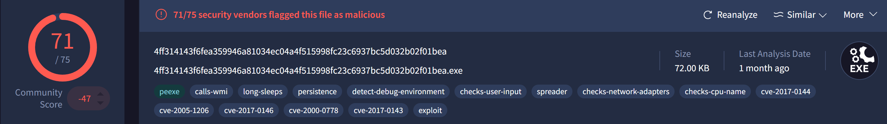

## Table of Contents

* [Introduction](#introduction)
* [Exploring the PEB in WinDbg](#explore-peb-windbg)
    * [Traversing the PEB](#traverse-peb)
	* [Traversing the export address table](#traverse-eat)
* [Walking the PEB with Phobos Ransomware](#walk-peb-phobos)
* [Summary](#summary)

## <a name="introduction"></a>Introduction

The Phobos ransomware is operated as a [Ransomware-as-a-Service (RaaS)](https://circleid.com/posts/20240530-a-dns-investigation-of-the-phobos-ransomware-8base-attack) model. They sell multiple variants of the ransomware, one of which is called Elbie and the subject of our analysis today.

The primary focus of the analysis will be on an obfuscation technique that is encountered quite often in malware.
To make reverse engineering more time consuming, malware can traverse the Process Environment Block (aka, PEB) to find specific loaded modules.
Once found, it traverses their export table to find the addresses of specific functions.
This is an obfuscation technique that is an alternative to determining function addresses through the [GetProcAddress](https://learn.microsoft.com/en-us/windows/win32/api/libloaderapi/nf-libloaderapi-getprocaddress) function.
 
## <a name="explore-peb-windbg"></a>Exploring the PEB in WinDbg

In Geoff Chappell's [words](https://www.geoffchappell.com/studies/windows/km/ntoskrnl/inc/api/pebteb/peb/index.htm):

> The Process Environment Block (PEB) is a process’s user-mode representation. It has the highest-level knowledge of a process in kernel mode and the lowest-level in user mode.

The only understanding we need today is that the PEB contains information about a given process. More specifically, our focus will be on information about DLLs that have been already loaded into the process.

While Microsoft has [some documentation](https://learn.microsoft.com/en-us/windows/win32/api/winternl/ns-winternl-peb) about the structure of the PEB, it is insufficient. So, we will be using [WinDbg](https://learn.microsoft.com/en-us/windows-hardware/drivers/debugger/)
to explore the structure of the PEB. This also allows you to move around in memory and get a better feel for the PEB and structures embedded within it. Ensure that WinDbg can connect to the Internet to download symbol information, or have them downloaded locally beforehand. [Here's](https://stackoverflow.com/a/30019890) a handy StackOverflow resource.

The primary goal of this manual exploration is to traverse the PEB, find the memory address where `kernel32.dll` is loaded, and lastly, traverse its export table to find the address of the [WinExec](https://learn.microsoft.com/en-us/windows/win32/api/winbase/nf-winbase-winexec) function.

### <a name="traverse-peb"></a>Traversing the PEB

The below snap shows the WinDbg window when the first breakpoint was hit after launching the Phobos ransomware through WinDbg. This breakpoint was automatically triggered by WinDbg after loading all relevant DLLs and just before entering the ransomware-specific code.

| 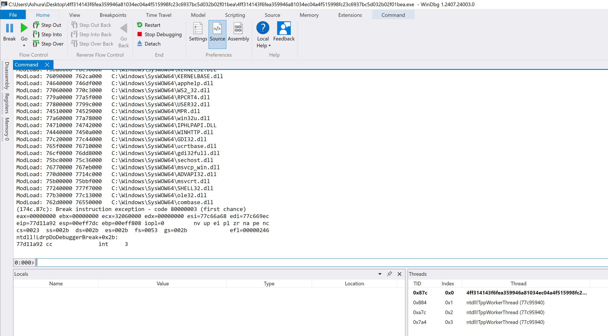 |
|:--:|
| Fig. 1: Launch WinDbg |

In the command field, type `!peb` to summarize the PEB of the current, i.e., the ransomware process. It can be seen that the PEB exists at address, `0xd07000`.

| 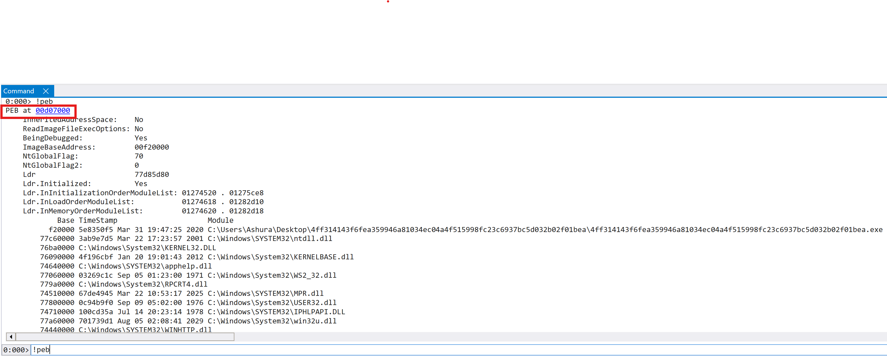 |
|:--:|
| Fig. 2: Address of the PEB |

In the command field, type `dt 0xd07000 _peb` to map the PEB structure to the memory address where the PEB exists. For today's analysis, the `Ldr` field in the PEB structure is the most important. It contains information about all of the loaded DLLs in the current process. It exists at memory address, `0x77d85d80` and points to a `_PEB_LDR_DATA` structure. 

| 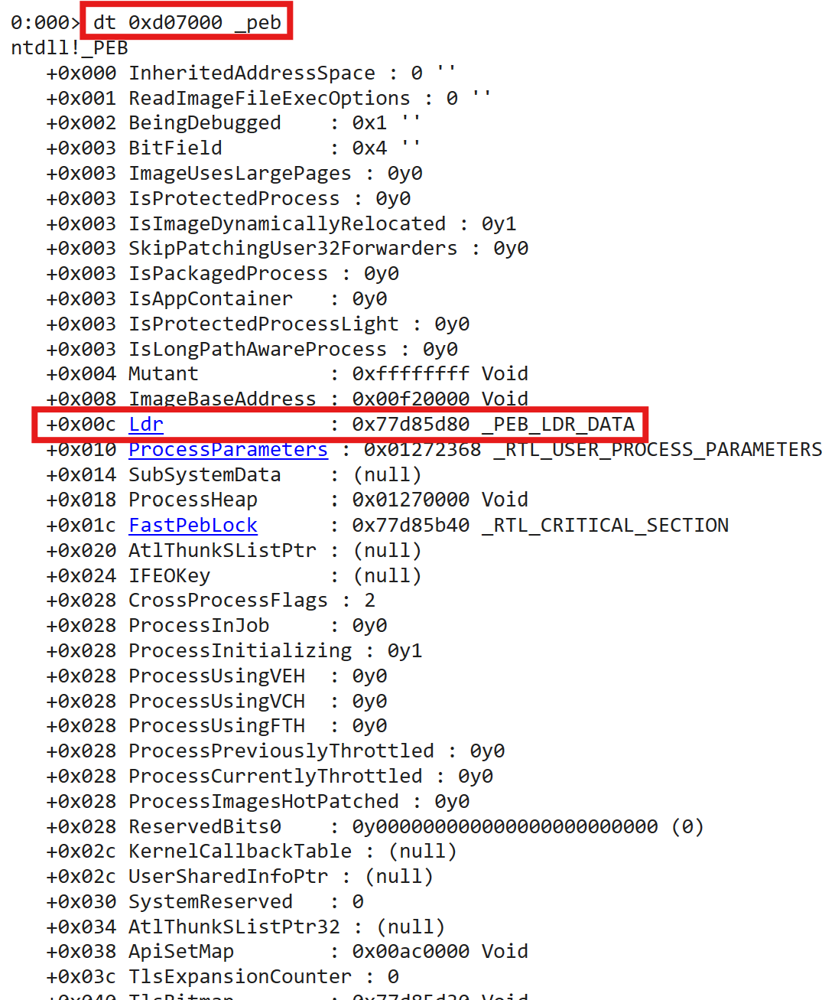 |
|:--:|
| Fig. 3: Structure of the PEB |

In the command field, type `dt 0x77d85d80 _PEB_LDR_DATA` to map the `_PEB_LDR_DATA` structure to the memory address which the `Ldr` field points to.

| 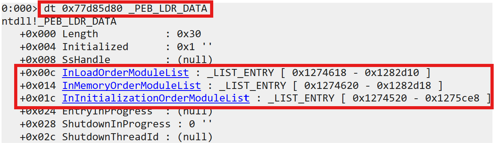 |
|:--:|
| Fig. 4: Structure of _PEB_LDR_DATA |

For today's analysis, the `InLoadOrderModuleList`, `InMemoryOrderModuleList` and `InInitializationOrderModuleList` members are the most relevant. Each of them orders the loaded modules using a specific criteria.
* The `InLoadOrderModuleList` lists modules in the order in which they were loaded by the Windows loader.
* The `InMemoryOrderModuleList` lists modules in the order in which they were mapped into memory.
* The `InInitializationOrderModuleList` lists modules in the order in which their initialization routines (`DllMain`) were called.

As seen in Fig. 4, each of the above members consumes 8 bytes. That is because each field is a `_LIST_ENTRY` structure containing two members, `Flink` and `Blink`.

| 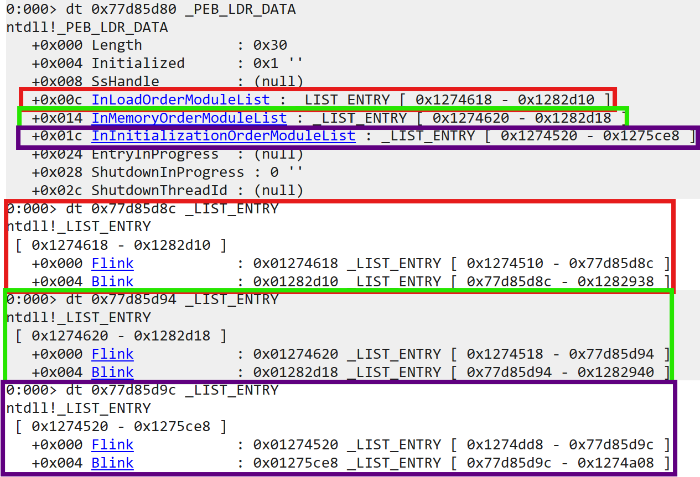 |
|:--:|
| Fig. 5: Structure of _LIST_ENTRY |

Information about each loaded DLL exists in the `_LDR_DATA_TABLE_ENTRY` structure. In Fig. 6 below, note the first three members. Each `Flink` member in the previously mentioned `InLoadOrderModuleList`, `InMemoryOrderModuleList` and `InInitializationOrderModuleList` members points to the *corresponding `Flink` member* in the `_LDR_DATA_TABLE_ENTRY` structure of the next DLL in the list. Similarly, the `Blink` member points to the *corresponding `Blink` member* in the `_LDR_DATA_TABLE_ENTRY` structure of the previous DLL in the list. Thus, the `InLoadOrderModuleList`, `InMemoryOrderModuleList` and `InInitializationOrderModuleList` members are each a doubly linked list.

*Note: Remember that the `Flink` and `Blink` members point to the corresponding `Flink` and `Blink` members in the next or previous `_LDR_DATA_TABLE_ENTRY` structure respectively. This knowledge will be critical to calculate offsets correctly when traversing the PEB.*

| 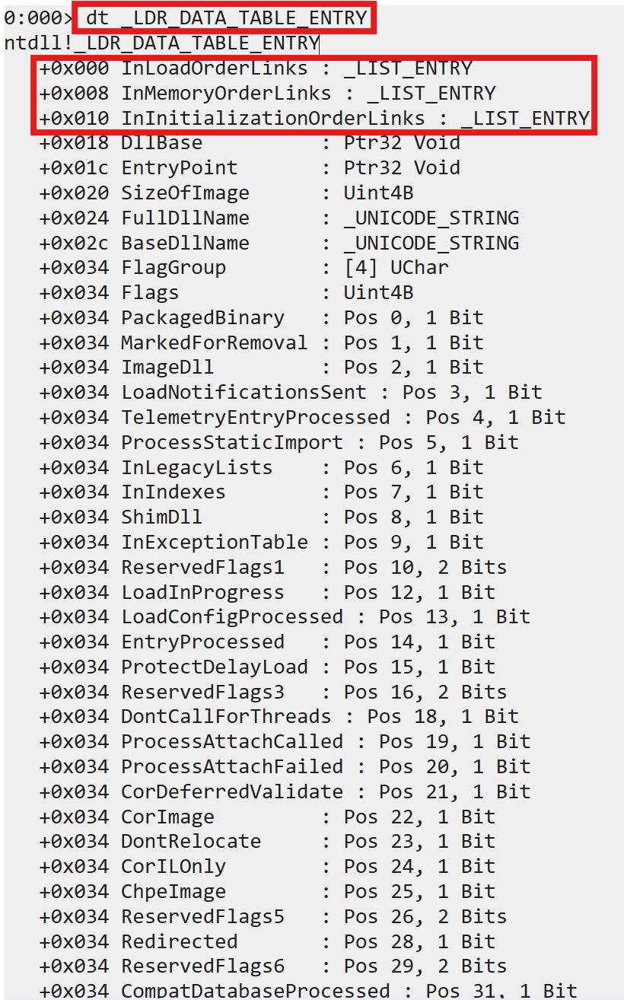 |
|:--:|
| Fig. 6: Structure of _LDR_DATA_TABLE_ENTRY |

Fig. 7-9 show the first four entries in the `InLoadOrderModuleList`, `InMemoryOrderModuleList` and `InInitializationOrderModuleList`.

In `InLoadOrderModuleList` listing, the first 4 modules are:
1. The executed filepath
2. `ntdll.dll`
3. `kernel32.dll`
4. `KernelBase.dll`

It means that the Windows loader loaded the above modules in that order.

| 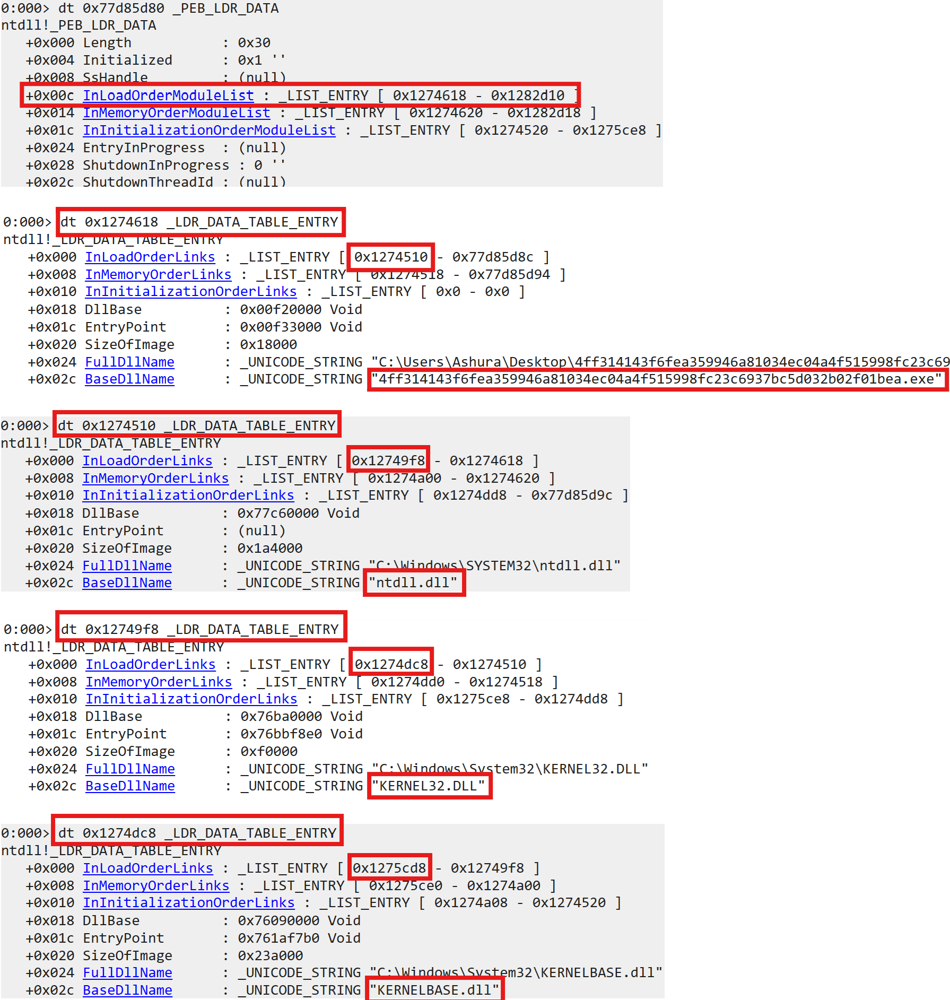 |
|:--:|
| Fig. 7: First 4 entries in InLoadOrderModuleList |

In `InMemoryOrderModuleList` listing, the first 4 modules are:
1. The executed filepath
2. `ntdll.dll`
3. `kernel32.dll`
4. `KernelBase.dll`

While not shown in Fig. 8, the `LoadTime` member of the `_LDR_DATA_TABLE_ENTRY` structure indicates the Windows FILETIME at which the given module was loaded into memory. The Windows FILETIME is an epoch that starts at `1601-01-01T00:00:00Z`. It is `11644473600` seconds before the UNIX/Linux epoch (`1970-01-01T00:00:00Z`). The Windows ticks are in `100` nanoseconds. The following [function](https://stackoverflow.com/a/6161842) can be used to convert Windows FILETIME into UNIX/Linux epoch seconds:

```python
def windows_tick_to_unix_seconds(loadtime_value):
    return (loadtime_value / 10000000) - 11644473600
```

The modules at the start of the `InMemoryOrderModuleList` were loaded at Windows FILETIME `133708665141160757` (`September 15, 2024 9:35:14.116 AM UTC`) while those at the end were loaded at `133708665141473422` (`September 15, 2024 9:35:14.147 AM UTC`)

| 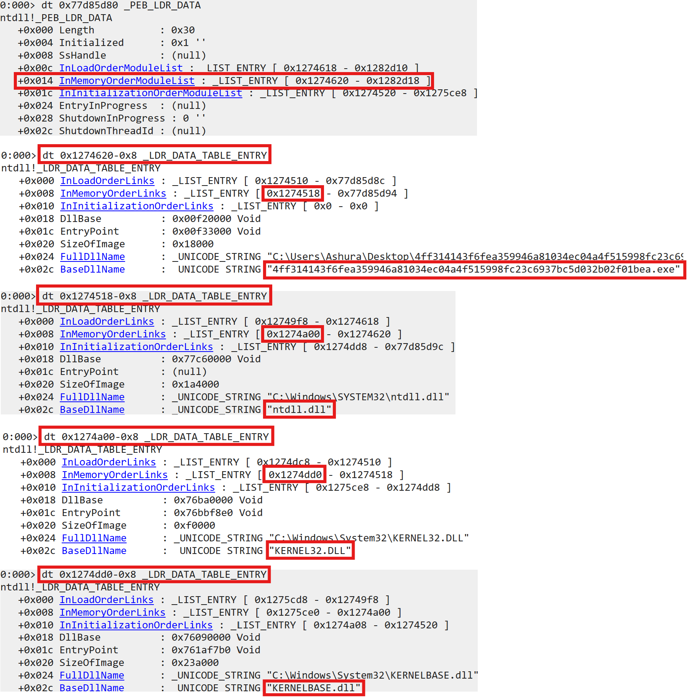 |
|:--:|
| Fig. 8: First 4 entries in InMemoryOrderModuleList |

In `InInitializationOrderModuleList` listing, the first 4 modules are:
1. `ntdll.dll`
2. `KernelBase.dll`
3. `kernel32.dll`
3. `apphelp.dll`

It means that the initialization routines (`DllMain`) of the above modules were called in that order.

| 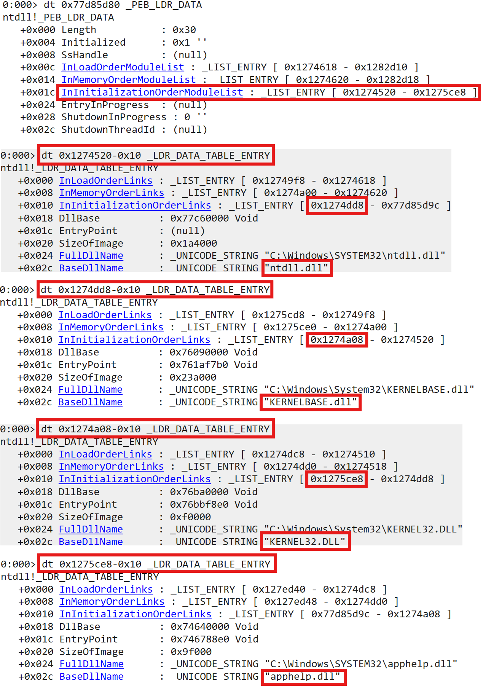 |
|:--:|
| Fig. 9: First 4 entries in InInitializationOrderModuleList |

### <a name="traverse-eat"></a>Traversing the export address table

Let's consider the base address of `kernel32.dll` which is `0x76ba0000`. The next step is to traverse the Export Address Table (EAT) of kernel32.dll to find the address of the `WinExec` function.

|  at kernel32.dll base address") |
|:--:|
| Fig. 10: DOS signature (little-endian) at kernel32.dll base address |

One aspect which is interesting to note is the File System Redirection in 64-bit Windows. The Phobos ransomware executable was 32-bit and executed on a 64-bit Windows host. Astute readers will have noticed that the `_LDR_DATA_TABLE_ENTRY` entry for `kernel32.dll` showed its full path as `C:\Windows\System32\kernel32.dll`, which is the 64-bit DLL instead of the 32-bit DLL which resides at `C:\Windows\SysWOW64\kernel32.dll`. This is because the `_LDR_DATA_TABLE_ENTRY` structure's `FullDllName` member stored the original path (from `System32`) that the Windows loader used to locate `kernel32.dll`. However, because the process is 32-bit, the WOW64 subsystem intervenes and redirects the actual load to `C:\Windows\SysWOW64\kernel32.dll`, where the 32-bit version of `kernel32.dll` resides.

|  at kernel32.dll base address") |
|:--:|
| Fig. 11: DOS signature (little-endian) at kernel32.dll base address |

Coming back to our original objective...

The EAT lies in the optional header data directory. The `Offset` value is particularly important to us. It's the distance (in bytes) from the base address of the module, aka Relative Virtual Address (RVA). At this offset, the RVA of the EAT itself is specified. In this case, the EAT RVA is specified at an offset `0x160` and is equal to `0x92CA0`.

The optional header is part of the NT header. The offset to the NT header is pointed to by the `e_lfanew` field (offset: `0x3C`) of the DOS header. In this case, the NT header lies at an RVA of `0xE8`

| 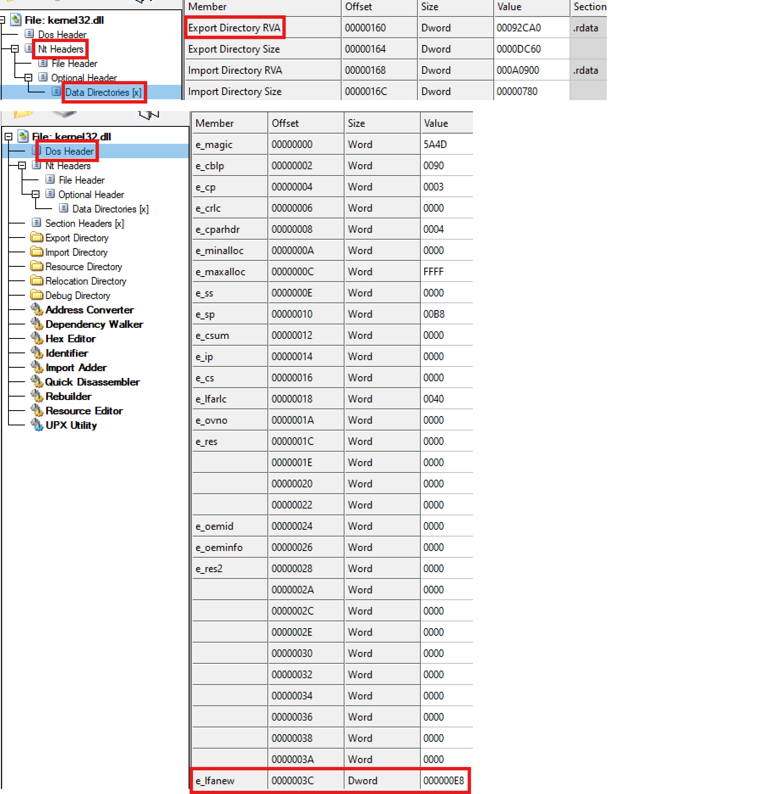 |
|:--:|
| Fig. 12: Finding the export address table |

Thus, given the base address of a module the RVA of the EAT is stored at the offset `Module base address + RVA NT_header + 0x78` bytes, where `0x78` bytes is the distance from the start of the NT header to the `Export Directory RVA` field. The Virtual Address (VA) of the EAT can then be calculated as `Module base address + Export Directory RVA`

| 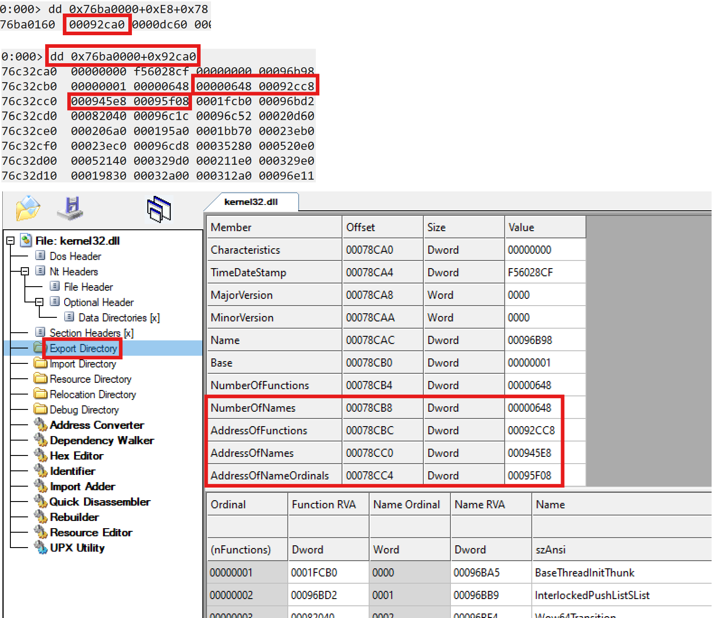 |
|:--:|
| Fig. 13: Base of the export address table |

In Fig. 13 above, the `NumberOfNames`, `AddressOfFunctions`, `AddressOfNames` and `AddressOfNameOrdinals` fields are relevant to us.
* The `NumberOfNames` field indicates the number of exports in the module.
* The `AddressOfFunctions` field points to an array of pointers, each of which points to the RVA of an exported function.
* The `AddressOfNames` field points to an array of pointers, each of which points to the name of an exported function.
* The `AddressOfNameOrdinals` field points to an array of 2-byte ordinals, where each ordinal represents an exported function. The ordinal value can be used as an index into the `AddressOfFunctions` and `AddressOfNames` arrays to get the address and name of the associated function.
    * An interesting aspect of this array is that the ordinal values may not be in ascending order. As seen in Fig. 14, the array starts with ordinal value `0x3`. The ordinal value `0x0` appears later in the array and values `0x1` and `0x2` even further.

| 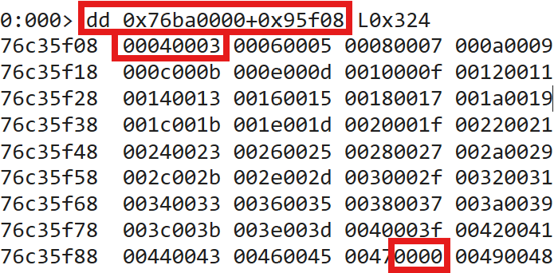 |
|:--:|
| Fig. 14: Ordinals array may not be in order |

Finally, the below algorithm can be used to find the address of `WinExec`:

```python
# Max number of exported functions == NumberOfNames.
for i in range(NumberOfNames):
	# Traverse the AddressOfNameOrdinals.
	# Each element in the array is 2-bytes.
	ordinal = AddressOfNameOrdinals[i]
	# The ordinal value is an index into AddressOfNames array.
	# Each element in the array is 4-bytes.
	# Check the function name.
	func_name = AddressOfNames[ordinal]
	if func_name == "WinExec":
		# If function name is WinExec, we have found our target.
		# The ordinal value is an index into AddressOfFunctions array.
		# Each element in the array is 4-bytes.
		# The accessed value will be the function RVA which when added
		# to the base address of kernel32.dll will give the VA.
		func_addr = kernel32_BaseAddress + AddressOfFunctions[ordinal]
		break
```

## <a name="walk-peb-phobos"></a>Walking the PEB with Phobos Ransomware

Fig. 15-16 shows the decompilation of a snippet of code in the Phobos ransomware sample. This code is responsible for walking the PEB, finding the base address of kernel32.dll and parsing its export table to find the address of the `WinExec` function. Essentially, it's the programmatic version of what we did manually in the previous sections. In addition, there are some interesting artifacts which we will look at.

| 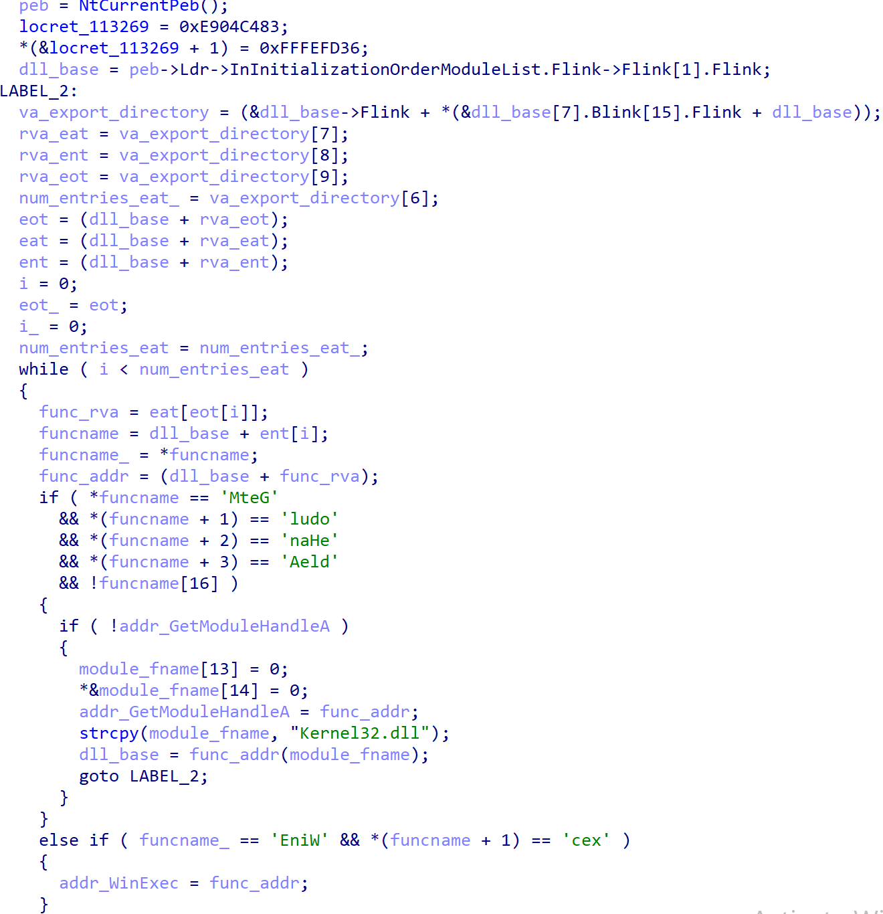 |
|:--:|
| Fig. 15: IDA Freeware decompilation of PEB walk in Phobos ransomware - Part 1 |

| 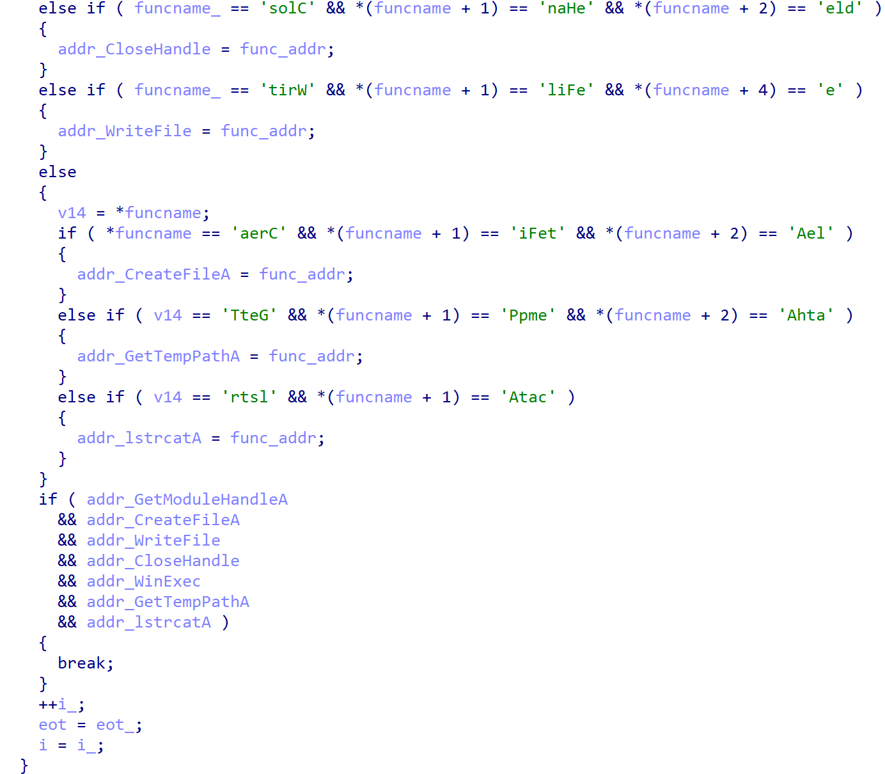 |
|:--:|
| Fig. 16: IDA Freeware decompilation of PEB walk in Phobos ransomware - Part 2 |

Consider the following decompiled code, its associated assembly and explanatory comments. This snippet of code finds the base address of `KernelBase.dll` by walking the PEB.

```
Decompiled:
	peb = NtCurrentPeb();
	dll_base = peb->Ldr->InInitializationOrderModuleList.Flink->Flink[1].Flink;

Assembly:
	mov     eax, large fs:30h									; In 32-bit processes, the PEB address is stored in the fs register at offset 0x30
	mov     [ebp+peb], eax
	mov     eax, [ebp+peb]										; eax stores the PEB address
	mov     eax, [eax+0Ch]										; eax+0xc points to the Ldr member. Refer to Fig. 3. [eax+0Ch] stores the value at eax+0xc in eax. 
	mov     eax, [eax+1Ch]										; eax+0x1c points to the Flink field in the InInitializationOrderModuleList array. Refer to Fig. 5.
													; [eax+0x1c] stores the value at eax+0x1c in eax. This value is the address to the first initialized DLL in the InInitializationOrderModuleList array.
	mov     eax, dword ptr ds:(locret_113269 - 113269h)[eax]					; This instruction looks weird, but is equivalent to mov eax, [eax]. Thus, [eax] points to the second initialized DLL in the InInitializationOrderModuleList array.
													; Considering the usual initialized DLLs sequence, this is the entry for KernelBase.dll. This is an assumption.
	mov     eax, [eax+8]										; eax+8 points to the DllBase member. Refer to Fig. 9. [eax+8] stores the value at eax+8 in eax. This is the base address of KernelBase.dll
```

Consider the following decompiled code, its associated assembly and explanatory comments. This snippet of code finds the export directory address in `KernelBase.dll` address space.

```
Decompiled:
	va_export_directory = (&dll_base->Flink + *(&dll_base[7].Blink[15].Flink + dll_base));

Assembly:
	mov     ecx, [eax+3Ch]										; At this point eax points to the base address of KernelBase.dll. eax+0x3c points to the e_lfanew field in the DOS header. Refer to Fig. 12.
													; [eax+0x3c] stores the address at eax+0x3c in ecx.
	mov     ecx, [ecx+eax+78h]									; ecx+eax+78h points to the Export Directory RVA field in the optional header data directory. Refer to the calculation below Fig. 12.
													; [ecx+eax+78h] stores the value at ecx+eax+78h in ecx.
	add     ecx, eax										; KernelBase.dll base address is added to the export directory RVA to get the export directory VA.
```

Consider the following decompiled code and explanatory comments. This snippet of code finds the address of `GetModuleHandleA` function for loading `kernel32.dll`.

```
RECALCULATE_EXPORT_DIRECTORY_VALUES:
rva_eat = va_export_directory[7];				// Points to the AddressOfFunctions field in the export directory. Refer Fig. 13.
rva_ent = va_export_directory[8];				// Points to the AddressOfNames field in the export directory. Refer Fig. 13.
rva_eot = va_export_directory[9];				// Points to the AddressOfNameOrdinals field in the export directory. Refer Fig. 13.
num_names = va_export_directory[6];				// Points to the NumberOfNames field in the export directory. Refer Fig. 13.
eot = (dll_base + rva_eot);					// Calculates the VA of export ordinals table that contains the ordinal values of each exported function.
eat = (dll_base + rva_eat);					// Calculates the VA of export address table that contains RVA of exported functions.
ent = (dll_base + rva_ent);					// Calculates the VA of export names table that contains the address of exported function names.
i = 0;
while ( i < num_names )						// Iterate over each exported function until GetModuleHandleA is found. Refer to the export directory traversal algorithm described in the previous section.
{
	func_rva = eat[eot[i]];
	funcname = dll_base + ent[i];
	funcname_ = *funcname;
	func_addr = (dll_base + func_rva);
	if ( *funcname == 'MteG'				// Another obfuscation technique, specifically for strings, involves
	  && *(funcname + 1) == 'ludo'				// breaking it up into multiple pieces and embedding it in the code, i.e., the
	  && *(funcname + 2) == 'naHe'				// .text section itself. This technique can evade detection signatures
	  && *(funcname + 3) == 'Aeld' 				// that rely on looking at contiguous strings.
	  && !funcname[16] )
	{
	  if ( !addr_GetModuleHandleA )
	  {
		module_fname[13] = 0;
		*&module_fname[14] = 0;
		addr_GetModuleHandleA = func_addr;
		strcpy(module_fname, "Kernel32.dll");
		dll_base = func_addr(module_fname);		// Load kernel32.dll using GetModuleHandleA
		goto RECALCULATE_EXPORT_DIRECTORY_VALUES;	// Recalculate offsets to EAT, ENT, EOT, etc. considering base address of kernel32.dll.
	  }
	}
	...
	i++;
}
```

Consider the following decompiled code. It's pretty straightforward, so I've not added any explanatory comments. It just stores the addresses of specific functions that were parsed from the export directory of `kernel32.dll` (previously loaded through `GetModuleHandleA`.

```
while ( i < num_entries_eat )
{
	...
	else if ( funcname_ == 'EniW' && *(funcname + 1) == 'cex' )
	{
		addr_WinExec = func_addr;
	}
	else if ( funcname_ == 'solC' && *(funcname + 1) == 'naHe' && *(funcname + 2) == 'eld' )
	{
		addr_CloseHandle = func_addr;
	}
	else if ( funcname_ == 'tirW' && *(funcname + 1) == 'liFe' && *(funcname + 4) == 'e' )
	{
		addr_WriteFile = func_addr;
	}
	else
	{
		v14 = *funcname;
		if ( *funcname == 'aerC' && *(funcname + 1) == 'iFet' && *(funcname + 2) == 'Ael' )
		{
		addr_CreateFileA = func_addr;
		}
		else if ( v14 == 'TteG' && *(funcname + 1) == 'Ppme' && *(funcname + 2) == 'Ahta' )
		{
		addr_GetTempPathA = func_addr;
		}
		else if ( v14 == 'rtsl' && *(funcname + 1) == 'Atac' )
		{
		addr_lstrcatA = func_addr;
		}
	}
	if ( addr_GetModuleHandleA
	  && addr_CreateFileA
	  && addr_WriteFile
	  && addr_CloseHandle
	  && addr_WinExec
	  && addr_GetTempPathA
	  && addr_lstrcatA )
	{
		break;
	}
	i++;
}
...
```

## <a name="summary"></a>Summary

In this blog, we went into great detail about an obfuscation technique that malware often use to determine function addresses. We also saw an implementation of the technique in Phobos ransomware.