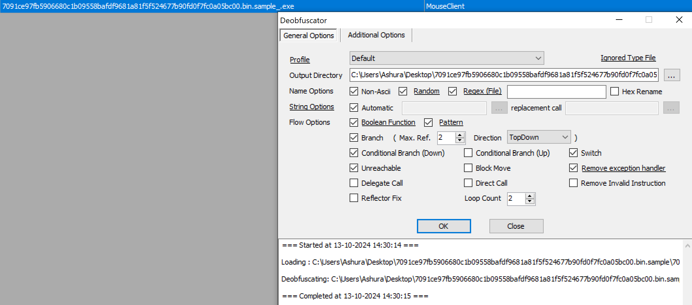
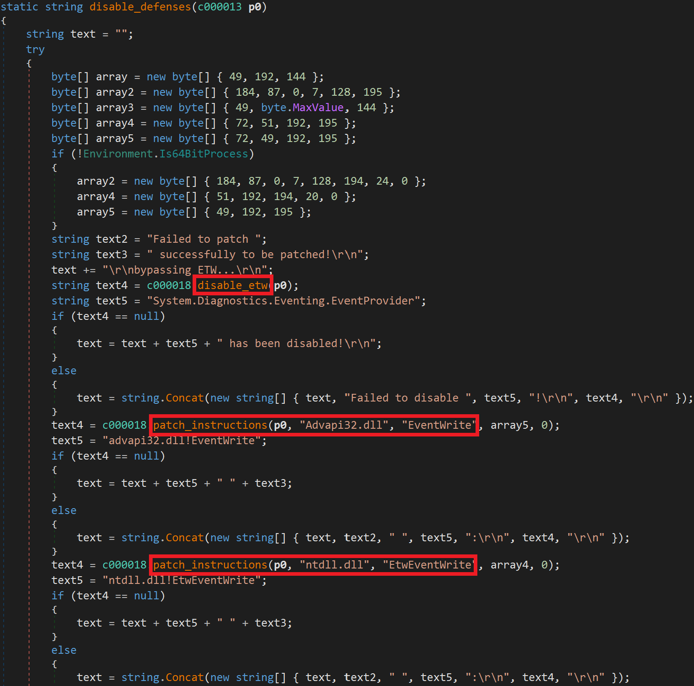
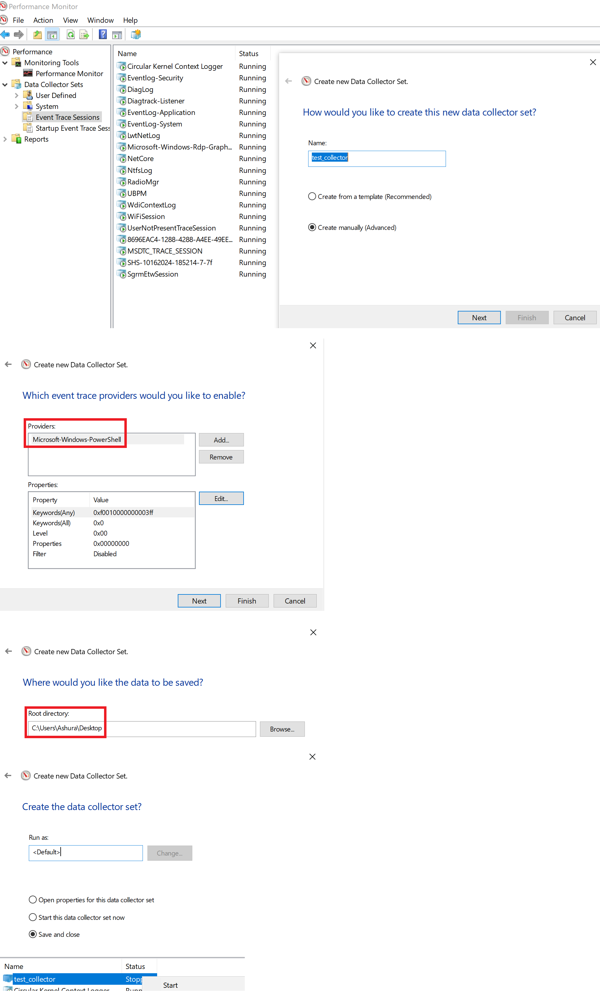
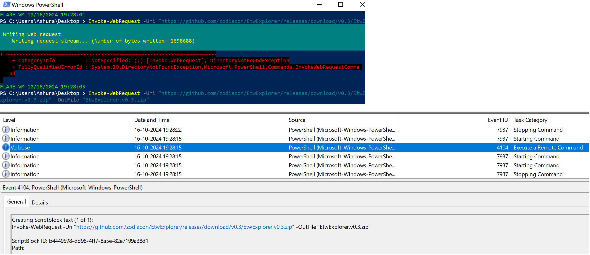
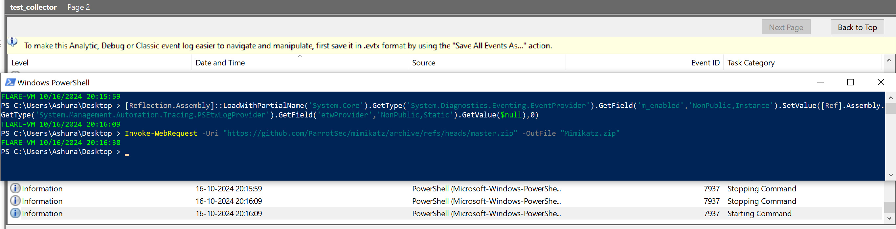
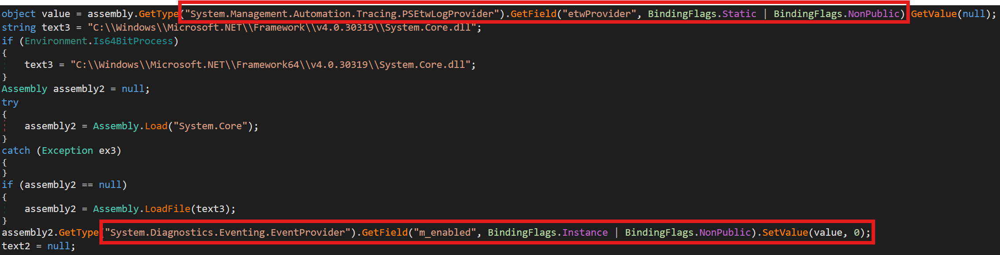
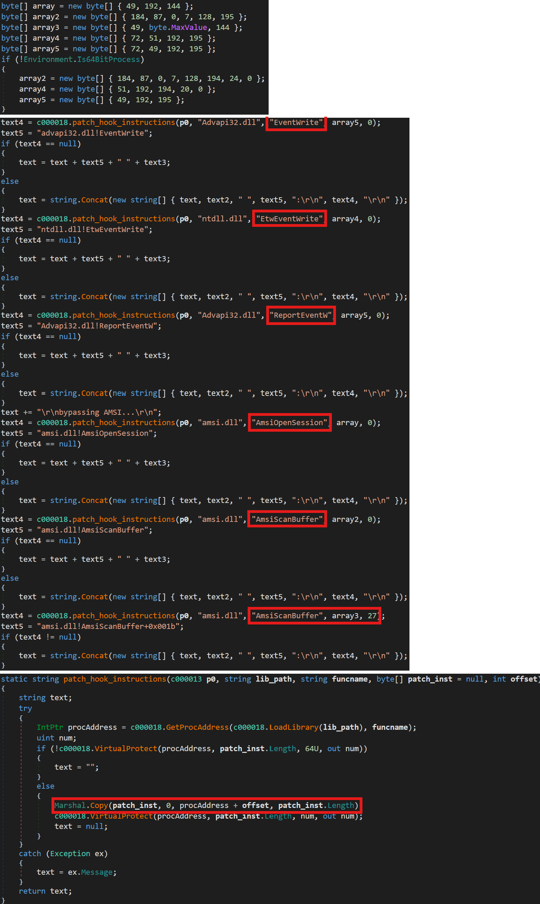
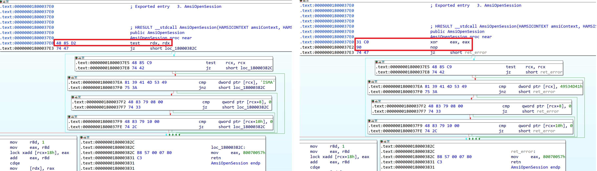
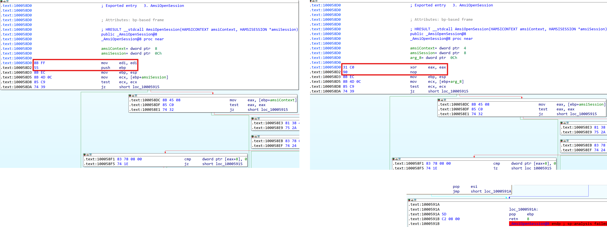

# Turla Backdoor Bypasses ETW, EventLog and AMSI But It's Buggy

## Metadata
* SHA256: 7091ce97fb5906680c1b09558bafdf9681a81f5f524677b90fd0f7fc0a05bc00


## Table of Contents

* [Introduction](#introduction)
* [.NET Deobfuscation](#deob)
* [Defense Evasion](#defense-evasion)
    * [ETW Evasion](#bypass-etw)
	    * [ETW Logging](#logging-etw)
		* [ETW Evasion in Turla Backdoor](#logging-etw)
	* [Patching ETW, EventLog, AMSI Functions](#bypass-etw-eventlog-amsi)
	    * [Patching ETW Functions](#patch-etw)
		* [Patching EventLog Functions](#patch-eventlog)
		* [Patching AMSI Functions](#patch-amsi)
* [Summary](#summary)

## <a name="introduction"></a>Introduction

[Turla](https://attack.mitre.org/groups/G0010/) is a cyber espionage threat group attributed to Russia's Federal Security Service (FSB). This blog focuses on the defense evasion capabilities of a 32-bit fileless backdoor variant attributed to Turla and reported by [Hybrid Analysis](https://hybrid-analysis.blogspot.com/2024/09/analyzing-newest-turla-backdoor-through.html). Specifically, we'll examine how this variant evades ETW, EventLog, and AMSI. Additionally, we'll review two faulty patches that the variant implements.

## <a name="deob"></a>.NET Deobfuscation

The backdoor is a .NET executable packed with [SmartAssembly](https://www.red-gate.com/products/smartassembly/). As described by Hybrid Analysis, deobfuscation requires the sequential use of [dumbassembly](https://github.com/huds0nx/dumbassembly), [Simple Assembly Explorer](https://github.com/wickyhu/simple-assembly-explorer), and [de4dot](https://github.com/kant2002/de4dot), as shown below.

1. Deobfuscation with `dumbassembly`:

```
> .\dumbassembly.lnk C:\Users\Ashura\Desktop\7091ce97fb5906680c1b09558bafdf9681a81f5f524677b90fd0f7fc0a05bc00.bin.sample\7091ce97fb5906680c1b09558bafdf9681a81f5f524677b90fd0f7fc0a05bc00.bin.sample.exe
         DumbAssembly 0.5.8
{smartassembly} unpacking tool by arc_
--------------------------------------

Loading input file...
Assembly is [Powered by SmartAssembly 8.0.0.4562].
Module has 429 methods.
Fixing spliced code...
Resolving indirect imports...
Decrypting and extracting resources...
Completed unpacking in 6 ms
```

2. Deobfuscation with `Simple Assembly Explorer`:



3. Deobfuscation with `de4dot`:

```
>.\de4dot-net48-x86.lnk C:\Users\Ashura\Desktop\7091ce97fb5906680c1b09558bafdf9681a81f5f524677b90fd0f7fc0a05bc00.bin.sample\7091ce97fb5906680c1b09558bafdf9681a81f5f524677b90fd0f7fc0a05bc00.bin.sample_.Deobf.exe

de4dot v3.2.0.0

Detected SmartAssembly 8.0.0.4562 (C:\Users\Ashura\Desktop\7091ce97fb5906680c1b09558bafdf9681a81f5f524677b90fd0f7fc0a05bc00.bin.sample\7091ce97fb5906680c1b09558bafdf9681a81f5f524677b90fd0f7fc0a05bc00.bin.sample_.Deobf.exe)
Cleaning C:\Users\Ashura\Desktop\7091ce97fb5906680c1b09558bafdf9681a81f5f524677b90fd0f7fc0a05bc00.bin.sample\7091ce97fb5906680c1b09558bafdf9681a81f5f524677b90fd0f7fc0a05bc00.bin.sample_.Deobf.exe
Renaming all obfuscated symbols
Saving C:\Users\Ashura\Desktop\7091ce97fb5906680c1b09558bafdf9681a81f5f524677b90fd0f7fc0a05bc00.bin.sample\7091ce97fb5906680c1b09558bafdf9681a81f5f524677b90fd0f7fc0a05bc00.bin.sample_.Deobf-cleaned.exe
```

## <a name="defense-evasion"></a>Defense Evasion

This blog focuses on the defense evasion aspects of the backdoor. Specifically, the sample tampers with AMSI (AntiMalware Scan Interface) scanning, EventLog, and ETW (Event Tracing for Windows) logging.



### <a name="bypass-etw"></a>ETW Evasion

#### <a name="logging-etw"></a>ETW Logging

At this point, I'll digress briefly to demonstrate what ETW logging looks like. As shown in Fig. 1, I created an ETW *consumer* called `test_collector` through the `Event Trace Sessions` tab in [Performance Monitor](https://techcommunity.microsoft.com/t5/ask-the-performance-team/windows-performance-monitor-overview/ba-p/375481). It consumes logs from the `Microsoft-Windows-PowerShell` (aka `PSEtwLogProvider`) *provider*, which logs PowerShell-related activity such as script execution, command execution, and more. The logs are configured to be stored on the `Desktop` in a file called `test_collector.etl`.

|  |
|:--:|
| Fig. 1: Creating an ETW consumer |

As an example, I used a PowerShell cmdlet to download a remote file. This activity was logged in the ETW log file, as seen in [Event Viewer](https://learn.microsoft.com/en-us/shows/inside/event-viewer) (see Fig. 2).

|  |
|:--:|
| Fig. 2: ETW Logs in Event Viewer |

I found a [public resource](https://ppn.snovvcrash.rocks/pentest/infrastructure/ad/av-edr-evasion/etw-block) that outlines the PowerShell command for disabling the `PSEtwLogProvider` provider. Once it was disabled, as shown in Fig. 3, PowerShell activity was no longer logged.

|  |
|:--:|
| Fig. 3: `PSEtwLogProvider` disabled |

The PowerShell command used to disable the `PSEtwLogProvider` provider is shown below. It sets the `m_enabled` field of the `EventProvider` instance of the `PSEtwLogProvider` class to `0`.
```
[Reflection.Assembly]::LoadWithPartialName('System.Core').GetType('System.Diagnostics.Eventing.EventProvider').GetField('m_enabled','NonPublic,Instance').SetValue([Ref].Assembly.GetType('System.Management.Automation.Tracing.PSEtwLogProvider').GetField('etwProvider','NonPublic,Static').GetValue($null),0)
```

#### <a name="logging-etw"></a>ETW Evasion in Turla Backdoor

Fig. 4 shows the code used by the sample to disable the `PSEtwLogProvider` provider, following the same logic as the PowerShell command used in the previous section.

|  |
|:--:|
| Fig. 4: `PSEtwLogProvider` disabled |

### <a name="bypass-etw-eventlog-amsi"></a>Patching ETW, EventLog, AMSI Functions

According to the Hybrid Analysis blog, when executing any PowerShell scripts, the Turla backdoor creates a PowerShell Runspace. This means that the PowerShell engine runs within the malware process itself, implying that ETW, EventLog, and AMSI functions are also within the malware process space. The Turla backdoor patches instructions in specific ETW functions (`EventWrite`, `EtwEventWrite`), EventLog function (`ReportEventW`), and AMSI functions (`AmsiOpenSession`, `AmsiScanBuffer`).

Fig. 5 below shows the opcodes of the patch instructions, the names of the patched functions, and the function responsible for performing the patching. As shown, the patch instructions may vary depending on whether the malware process is 32-bit or 64-bit.

|  |
|:--:|
| Fig. 5: Patching ETW, EventLog, AMSI Functions |

#### <a name="patch-etw"></a>Patching ETW Functions

The `EventWrite` and `EtwEventWrite` functions are used by ETW to forward events to the appropriate trace sessions or consumers. The [EventWrite](https://learn.microsoft.com/en-us/windows/win32/api/evntprov/nf-evntprov-eventwrite) function is a documented public function, while [EtwEventWrite](https://learn.microsoft.com/en-us/windows/win32/devnotes/etweventwrite) is an undocumented function that is [internally called by EventWrite](https://www.geoffchappell.com/studies/windows/win32/ntdll/api/etw/evntapi/write.htm).


If the malware process is 64-bit, the Turla backdoor patches the entry point of the `EventWrite` and `EtwEventWrite` functions with the byte sequences `\x48\x31\xc0\xc3` and `\x48\x33\xc0\xc3`, respectively. 

1. The disassembly of `\x48\x31\xc0\xc3` is shown below. By patching the `EventWrite` function, it forces it to always return `0`, which is the [return code for success](https://learn.microsoft.com/en-us/windows/win32/api/evntprov/nf-evntprov-eventwrite#return-value).

```
0:  48 31 c0                xor    rax,rax
3:  c3                      ret
```
2. The disassembly of `\x48\x33\xc0\xc3` is shown below. By patching the `EtwEventWrite` function, it forces it to always return `0`, which is the [return code for success](https://www.geoffchappell.com/studies/windows/win32/ntdll/api/etw/evntapi/write.htm).

```
0:  48 33 c0                xor    rax,rax
3:  c3                      ret
```

If the malware process is 32-bit, the Turla backdoor patches the entry point of the `EventWrite` and `EtwEventWrite` functions with the byte sequences `\x31\xc0\xc3` and `\x33\xc0\xc2\x14\x00`, respectively.

1. The disassembly of `\x31\xc0\xc3` is shown below. By patching the `EventWrite` function, it forces it to always return `0`, which is the [return code for success](https://learn.microsoft.com/en-us/windows/win32/api/evntprov/nf-evntprov-eventwrite#return-value).

```
0:  31 c0                   xor    eax,eax
2:  c3                      ret
```
2. The disassembly of `\x33\xc0\xc2\x14\x00` is shown below. By patching the `EtwEventWrite`, it forces it to always return `0`, which is the [return code for success](https://www.geoffchappell.com/studies/windows/win32/ntdll/api/etw/evntapi/write.htm).

```
0:  33 c0                   xor    eax,eax
2:  c2 14 00                ret    0x14
```

Patching the `EventWrite` and `EtwEventWrite` functions prevents providers from supplying logs to consumers. This effectively disables logging for any events that would normally be recorded, allowing the malware to operate without generating detectable logs.

#### <a name="patch-eventlog"></a>Patching EventLog Functions

The [ReportEventW](https://learn.microsoft.com/en-us/windows/win32/api/winbase/nf-winbase-reporteventw) function is used to write an event to the event log.

If the malware process is 64-bit, the Turla backdoor patches the entry point of the `ReportEventW` function with the byte sequence `\x48\x31\xc0\xc3`. The disassembly is shown below. By patching the `ReportEventW` function, it forces it to always return `0`, which interestingly, is the [return code for failure](https://learn.microsoft.com/en-us/windows/win32/api/winbase/nf-winbase-reporteventw#return-value).

```
0:  48 31 c0                xor    rax,rax
3:  c3                      ret
```

If the malware process is 32-bit, the Turla backdoor patches the entry point of the `ReportEventW` function with the byte sequence `\x31\xc0\xc3`. The disassembly is shown below. By patching the `ReportEventW` function, it forces it to always return `0`, which is the [return code for failure](https://learn.microsoft.com/en-us/windows/win32/api/winbase/nf-winbase-reporteventw#return-value).

```
0:  31 c0                   xor    eax,eax
2:  c3                      ret
```

Patching the `ReportEventW` function causes events to not be written to the EventLog. However, I don't understand the design decision to always report a failure rather than success through an arbitrary non-zero return code. Or did the malware author falsely presume that a return code of `0` meant success?

#### <a name="patch-amsi"></a>Patching AMSI Functions

The `AmsiOpenSession` and `AmsiScanBuffer` functions are used by AMSI to scan the content of buffers for malware.

For both 32-bit and 64-bit processes, the Turla backdoor patches the entry point of the `AmsiOpenSession` function with the byte sequence `\x31\xc0\x90`. The disassembly is shown below.

```
0:  31 c0                   xor    eax,eax
2:  90                      nop
```

In 64-bit processes, the patch causes the `ZF` flag to be set after executing the xor instruction. Control will then take the branch and return with the error code `0x80070057` (`E_INVALIDARG`). This can be seen in Fig. 6, where the snapshot on the left shows the unaltered `AmsiOpenSession`, while the patched version is displayed on the right. (This image layout also applied to subsequent disassembly-related snapshots in this blog.)

|  |
|:--:|
| Fig. 6: Comparison between unpatched and patched 64-bit `AmsiOpenSession` function |

In 32-bit processes, the patch appears to be faulty. After executing the patched instructions, there is no immediate return instruction; instead, control continues executing subsequent instructions in the function. AFAICT, the only effect of the patch is that it "forgets" the frame pointer (i.e., `ebp`) of the caller function. As a result, when `AmsiOpenSession` is about to return, it doesn't actually return to the caller. Instead, it returns to an unintended location because the `pop ebp` instruction at the end of the `AmsiOpenSession` function does not pop the caller's frame pointer. This can be seen in Fig. 7.

|  |
|:--:|
| Fig. 7: Comparison between unpatched and patched 32-bit `AmsiOpenSession` function |

I used the following code to test the faulty patch. As seen in Fig. 8, Windows threw an `Access Violation` (`0xc0000005`) error.

```cpp
#include <windows.h>
#include <amsi.h>
#include <iostream>
#include <string>

typedef HRESULT(WINAPI* AmsiInitializeFunc)(LPCWSTR, HAMSICONTEXT*);
typedef HRESULT(WINAPI* AmsiOpenSessionFunc)(HAMSICONTEXT, HAMSISESSION*);
typedef HRESULT(WINAPI* AmsiScanBufferFunc)(HAMSICONTEXT, PVOID, ULONG, LPCWSTR, HAMSISESSION, AMSI_RESULT*);


int main()
{
    // Load amsi.dll and get addresses of AMSI functions
    std::wstring customAmsiPath = L"C:\\path\\to\\amsi.dll";
    HMODULE hAmsiDll = LoadLibrary(customAmsiPath.c_str());
    AmsiInitializeFunc AmsiInitialize = (AmsiInitializeFunc)GetProcAddress(hAmsiDll, "AmsiInitialize");
    AmsiOpenSessionFunc AmsiOpenSession = (AmsiOpenSessionFunc)GetProcAddress(hAmsiDll, "AmsiOpenSession");
    AmsiScanBufferFunc AmsiScanBuffer = (AmsiScanBufferFunc)GetProcAddress(hAmsiDll, "AmsiScanBuffer");

    HAMSICONTEXT amsiContext;
    AMSI_RESULT amsiRes;
    HAMSISESSION session = nullptr;

    // Initialize AMSI
    HRESULT hResult = AmsiInitialize(L"AMSI_TEST", &amsiContext);
    printf("AmsiInitialize result: 0x%08X\n", hResult);

    // Open a session
    hResult = AmsiOpenSession(amsiContext, &session);
    printf("AmsiOpenSession result: 0x%08X\n", hResult);

    // Scan content
    const char* testScript = "Write-Host 'Hello World'";
    UINT contentSize = strlen(testScript);
    hResult = AmsiScanBuffer(amsiContext, (PVOID)testScript, contentSize, L"test.ps1", session, &amsiRes);
    printf("AmsiScanBuffer result: 0x%08X\n", hResult);
    
    // Print scan result
    printf("Scan result: 0x%08X\n", amsiRes);

    return 0;
}
```

|  |
|:--:|
| Fig. 8: Faulty `AmsiOpenSession` Patch in 32-bit Processes  |

The `AmsiScanBuffer` function is patched at two locations: the entry point of the function and `27` bytes into the function.

In the first patch, for 64-bit processes, the entry point bytes are replaced with the byte sequence `\xb8\x57\x00\x07\x80\xc3`, while for 32-bit processes, the byte sequence is `\xb8\x57\x00\x07\x80\xc2\x18\x00`. The disassembly is shown below. This modification forces any calls to `AmsiScanBuffer` and `AmsiScanString` (which internally calls `AmsiScanBuffer`) to return with the error code `0x80070057` (`E_INVALIDARG`).

```
# 64-bit
0:  b8 57 00 07 80          mov    eax,0x80070057
5:  c3                      ret

# 32-bit
0:  b8 57 00 07 80          mov    eax,0x80070057
5:  c2 18 00                ret    0x18
```

In the second patch, both 32-bit and 64-bit processes use the byte sequence `\x31\xff\x90` to patch the location `27` bytes into the `AmsiScanBuffer` function. The disassembly is shown below.

```
0:  31 ff                   xor    edi,edi
2:  90                      nop
```

In 64-bit processes, this patch clears the `EDI` register. In the 64-bit calling convention, the `EDI` register holds the third function argument, which in this case is the length of the buffer to scan. By setting the length to `0`, `AmsiScanBuffer` returns with the error code `0x80070057` (`E_INVALIDARG`). This is illustrated in Fig. 9.

|  |
|:--:|
| Fig. 9: Comparison between unpatched and patched 64-bit `AmsiScanBuffer` function |

In 64-bit processes, the purpose of the patch was to set the content buffer length to `0`. However, on 32-bit processes, the patch doesn't satisfy that purpose. The patch for 32-bit processes is faulty. As seen in Fig. 11, Windows threw an `Access Violation` (`0xc0000005`) error.

|  |
|:--:|
| Fig. 10: Comparison between unpatched and patched 32-bit `AmsiScanBuffer` function |

|  |
|:--:|
| Fig. 11: Faulty `AmsiScanBuffer` Patch in 32-bit Processes |

The faulty patches to `AmsiOpenSession` and `AmsiScanBuffer` can be fixed (see Fig. 12) but that's out of scope for this blog.

|  |
|:--:|
| Fig. 12: Working Patches for `AmsiOpenSession` and `AmsiScanBuffer` in 32-bit Processes |

## <a name="summary"></a>Summary

In this blog, we examined the defense evasion aspects of the Turla backdoor reported by Hybrid Analysis. We found that while most of the patches are functional, two of the patches related to 32-bit processes are faulty. It's a reminder to all of us that malware authors write buggy code too.