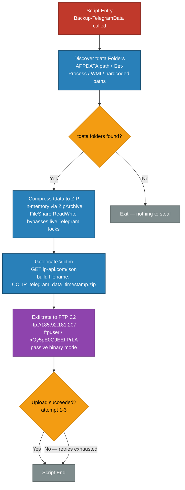

# Source

* Malware Bazaar: https://bazaar.abuse.ch/sample/1fcd76aba39621c66c834538fc37a8d9249b4004e62343d594334ff40d9269ab/
* File type: Powershell
* Size: ~353 KB

# Analysis

## Obfuscation

A quick skim through the script indicated that there was lots of junk code, which bloated the file size. I'll get through each of them individually. AST-based deobfuscation was the primary weapon of choice.

### Loop Constructs - Junk Code

```
...
for ($i = 0; $i -lt 8; $i++) { $nextvar = $i }
...
$counter = 0; while ($counter -lt 3) { $counter++ }
...
for ($j = 0; $j -lt 4; $j++) { $final += $j }
...
for ($i = 0; $i -lt 1; $i++) { $nextvar = $i }
...
$counter = 0; while ($counter -lt 7) { $counter++ }
...
```

### Try-Catch Constructs - Junk Code

```
...
try { $y = 5 } catch { $error }
...
try { $y = 2 } catch { $error }
...
```

### Backticks - Junk Code

```
...
$randIndex = Get-Ran`dom -Minimum 0 -Maximum 13
...
while ($binpath) { Start-`Sleep -Seconds 1 }
...
```

### Variable Renaming Trick + Split Base64 Strings

```
...
${Write-Output -ArgumentList -DestinationPath .\Archive && ($opr)} = "CgoKZnVuY3Rpb";${Clear-RecycleBin -InputFormat -Path %APPDATA% && ($afrre)} = "24gR2V0LVRl";
...
${Get-Date -ErrorAction Stop -Name OneDrive && ($sdicna)} = "ID0gTmV3LU";${Get-Location -ArgumentList -InformationLevel Minimal && ($slt)} = "9iamV";${Get-NetAdapter -ErrorAction SilentlyContinue -Class Win32_Process && ($akasgo)} = "jdCBTeXN0ZW0uQ";
...
```

### Split Strings

```
...
${Get-Hotfix -InformationAction Continue -Seconds 4 && ($genifg)} = [Convert]::FromBase64String(${Start-Sleep -ArgumentList -DestinationPath .\Data && ($lagfi)}); [Text.Encoding]::("U" +           "TF" +           "8").("G" +   "e" +   "t" +   "S" +   "trin" +   "g")(${Get-Hotfix -InformationAction Continue -Seconds 4 && ($genifg)}) | iex; ${Import-Module -Force -LogName 
...
```

### Split Array Elements

During the process of de-obfuscation, the below form of obfuscation was also seen.

```
${Get-Date -InputFormat -ComputerName $server_ip_08 && ($pprpmn)} += @('CgoKZnVuY3Rpb', '24gR2V0LVRl', 'bGVncmFtV', 'GRhdG', 'FGb2', 'xkZXJzIHsKICAg')
...
${Get-Date -InputFormat -ComputerName $server_ip_08 && ($pprpmn)} += @('ICRsaXN0', 'ID0gTmV3LU', '9iamV', 'jdCBTeXN0ZW0uQ', '29sbGVjdG')
...
```

## Deobfuscation

Deobfuscation of the above elements was performed through Abstract Syntax Tree (AST) analysis. These utilities are available in the [blog repo](https://github.com/nikhilh-20/nikhilh-20.github.io/tree/main/blog/weekly_malware_analysis/utils/powershell/).

```
> .\PsRemove-DeadCode.ps1

cmdlet PsRemove-DeadCode.ps1 at command pipeline position 1
Supply values for the following parameters:
InputFile: C:\Users\Ashura\Desktop\1fcd76aba39621c66c834538fc37a8d9249b4004e62343d594334ff40d9269ab\1fcd76aba39621c66c834538fc37a8d9249b4004e62343d594334ff40d9269ab.ps1
OutputFile: C:\Users\Ashura\Desktop\1fcd76aba39621c66c834538fc37a8d9249b4004e62343d594334ff40d9269ab\1fcd76aba39621c66c834538fc37a8d9249b4004e62343d594334ff40d9269ab_pass1.ps1
{"changed":3917,"output_path":"C:\\Users\\Ashura\\Desktop\\1fcd76aba39621c66c834538fc37a8d9249b4004e62343d594334ff40d9269ab\\1fcd76aba39621c66c834538fc37a8d9249b4004e62343d594334ff40d9269ab_pass1.ps1","output_bytes":263671,"by_reason":"317x unreachable loop, 550x dead if (unreachable/empty), 435x non-functional loop, 286x dead try block, 2329x dead store","input_bytes":361366}

> .\PsInline-Constants.ps1

cmdlet PsInline-Constants.ps1 at command pipeline position 1
Supply values for the following parameters:
InputFile: C:\Users\Ashura\Desktop\1fcd76aba39621c66c834538fc37a8d9249b4004e62343d594334ff40d9269ab\1fcd76aba39621c66c834538fc37a8d9249b4004e62343d594334ff40d9269ab_pass1.ps1
OutputFile: C:\Users\Ashura\Desktop\1fcd76aba39621c66c834538fc37a8d9249b4004e62343d594334ff40d9269ab\1fcd76aba39621c66c834538fc37a8d9249b4004e62343d594334ff40d9269ab_pass2.ps1
MaxUses: 0
{"input_bytes":263671,"output_path":"C:\\Users\\Ashura\\Desktop\\1fcd76aba39621c66c834538fc37a8d9249b4004e62343d594334ff40d9269ab\\1fcd76aba39621c66c834538fc37a8d9249b4004e62343d594334ff40d9269ab_pass2.ps1","output_bytes":71256,"changed":1426,"occurrences_replaced":1426,"assignments_removed":1426,"skipped":3}

> .\PsFold-ArrayJoins.ps1

cmdlet PsFold-ArrayJoins.ps1 at command pipeline position 1
Supply values for the following parameters:
InputFile: C:\Users\Ashura\Desktop\1fcd76aba39621c66c834538fc37a8d9249b4004e62343d594334ff40d9269ab\1fcd76aba39621c66c834538fc37a8d9249b4004e62343d594334ff40d9269ab_pass2.ps1
OutputFile: C:\Users\Ashura\Desktop\1fcd76aba39621c66c834538fc37a8d9249b4004e62343d594334ff40d9269ab\1fcd76aba39621c66c834538fc37a8d9249b4004e62343d594334ff40d9269ab_pass3.ps1
{"changed":1,"output_path":"C:\\Users\\Ashura\\Desktop\\1fcd76aba39621c66c834538fc37a8d9249b4004e62343d594334ff40d9269ab\\1fcd76aba39621c66c834538fc37a8d9249b4004e62343d594334ff40d9269ab_pass3.ps1","output_bytes":45253,"input_bytes":71256}
```

## Payload

After deobfuscation, a base64-encoded string remained, which was then base64-decoded and executed through `iex` Powershell alias. Below is a Claude-generated analysis (verified) of the payload.

### Flowchart



### Summary

**Classification:** Data Stealer — Telegram Session Exfiltrator (PowerShell)

`payload.ps1` is a purpose-built credential/session theft tool that extracts Telegram Desktop's local session store (`tdata`) and silently exfiltrates it to an attacker-controlled FTP server. The script requires no user interaction after execution, leaves no staging artifact on disk under normal conditions, and operates without requiring elevated privileges.

**Why `tdata` is catastrophic to lose:** The folder contains MTProto session keys that reconstitute an authenticated Telegram session on any device. An attacker in possession of this folder achieves full account takeover — reading all messages, impersonating the victim, and accessing contact graphs — without ever knowing the account password or bypassing 2FA.

#### Execution Chain

| # | Phase | Description |
|---|-------|-------------|
| 1 | **Discovery** | Four parallel strategies locate every `tdata` path on the host: the standard `%APPDATA%` install path; live process inspection via `Get-Process telegram`; WMI `Win32_Process WHERE name LIKE '%telegram%'`; and four hardcoded common install locations. All results are case-insensitively deduplicated. |
| 2 | **Collection** | `New-ZipBytes` compresses discovered folders entirely in memory using `System.IO.Compression.ZipArchive`. Root-level tdata files are taken wholesale; subdirectories are filtered to the 16-alphanumeric-char naming pattern (`[A-Za-z0-9]{16}`) used by Telegram's internal session key folders. Files are opened with `FileShare.ReadWrite` to bypass locks held by a concurrently running Telegram process. No temporary files touch disk on the primary path. |
| 3 | **Victim Enrichment** | An HTTP GET to `http://ip-api.com/json/` (with a spoofed `Mozilla/5.0` User-Agent) geolocates the victim. Country code and public IP are embedded in the exfiltration filename, enabling the attacker to sort victims by geography. |
| 4 | **Exfiltration** | The in-memory ZIP is uploaded via FTP (passive mode, binary transfer) to hardcoded C2 `185.92.181[.]207`. Filename format: `{CC}_{IP}_telegram_data_{dd_MM_yyyy_HH_mm}.zip`. Three retry attempts with linear back-off; 30-second connect timeout; 5-minute read/write timeout. |
| 5 | **Exit** | Terminates cleanly on success. Any unhandled exception surfaces through a top-level `catch` that calls `exit 1`. |

#### Evasion & Resilience Techniques

| Technique | Implementation | Effect |
|-----------|---------------|--------|
| **No disk staging** | ZIP built in `MemoryStream`, never written to disk (primary path) | Defeats file-based forensic recovery and AV on-write scanning |
| **File lock bypass** | `FileShare.ReadWrite` when opening tdata files | Steals data while Telegram is actively running |
| **Silent exception handling** | Pervasive `try { } catch { }` with no logging | No console output, no Event Log entries, no error indicators |
| **UA spoofing** | `Mozilla/5.0` header on geolocation HTTP request | Blends network traffic with normal browser activity |
| **Dependency-free parsing** | Regex extraction of HTTP JSON instead of `ConvertFrom-Json` | Avoids module dependencies; harder to fingerprint by static import analysis |
| **COM fallback** | `Shell.Application CopyHere` if .NET Compression is unavailable | Ensures ZIP creation on stripped or locked-down systems |
| **Multi-method discovery** | APPDATA path + `Get-Process` + WMI + hardcoded paths | Succeeds across portable installs, system installs, and non-default-path Telegram instances |
| **Non-fatal geolocation** | Falls back to `UnknownCountry`/`UnknownIP` on API failure | Exfiltration proceeds regardless of outbound HTTP restrictions |

#### Indicators of Compromise

* Network

| Type | Value |
|------|-------|
| IPv4 — C2 FTP server | `185.92.181[.]207` |
| Protocol / Port | FTP / TCP 21 |
| HTTP endpoint | `http://ip-api.com/json/` |
| Spoofed User-Agent | `Mozilla/5.0` |
| Exfil filename pattern | `{CC}_{IP}_telegram_data_{dd_MM_yyyy_HH_mm}.zip` |

* Credentials (hardcoded)

| Field | Value |
|-------|-------|
| FTP Username | `ftpuser` |
| FTP Password | `xOy5pE0GJEEhPrLA` |

* Filepath

| Path | Notes |
|------|-------|
| `%APPDATA%\Telegram Desktop\tdata` | Primary standard install |
| `%LOCALAPPDATA%\Telegram\Telegram Desktop\tdata` | Alternate install path |
| `%ProgramFiles%\Telegram Desktop\tdata` | 64-bit system-wide install |
| `%ProgramFiles(x86)%\Telegram Desktop\tdata` | 32-bit system-wide install |
| `C:\Users\{USERNAME}\AppData\Local\Telegram Desktop\tdata` | Hardcoded explicit user path |
| Subdirectory regex `[A-Za-z0-9]{16}` | Telegram internal session key folder naming pattern |
